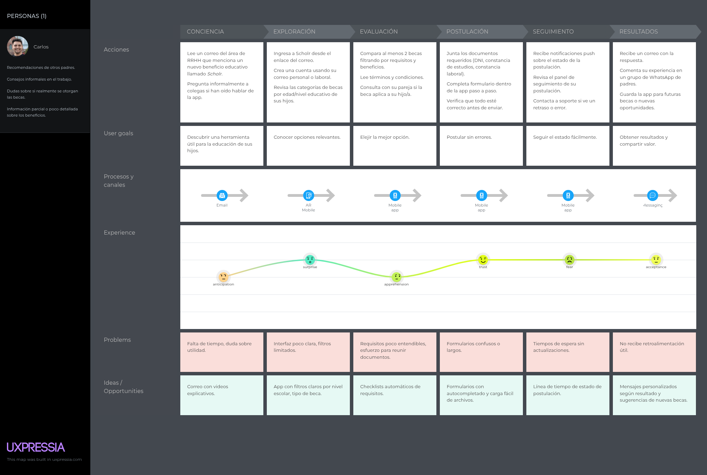
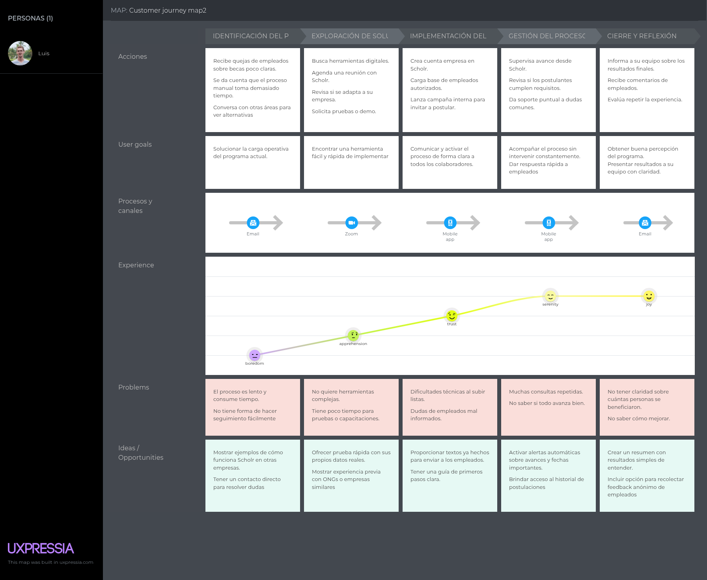
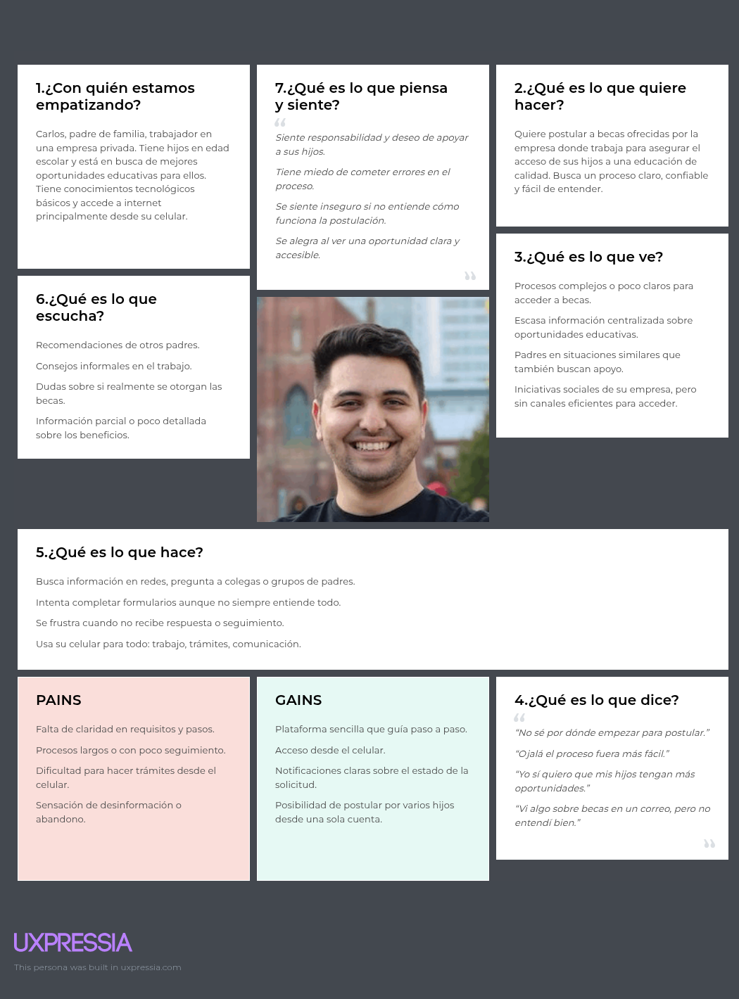
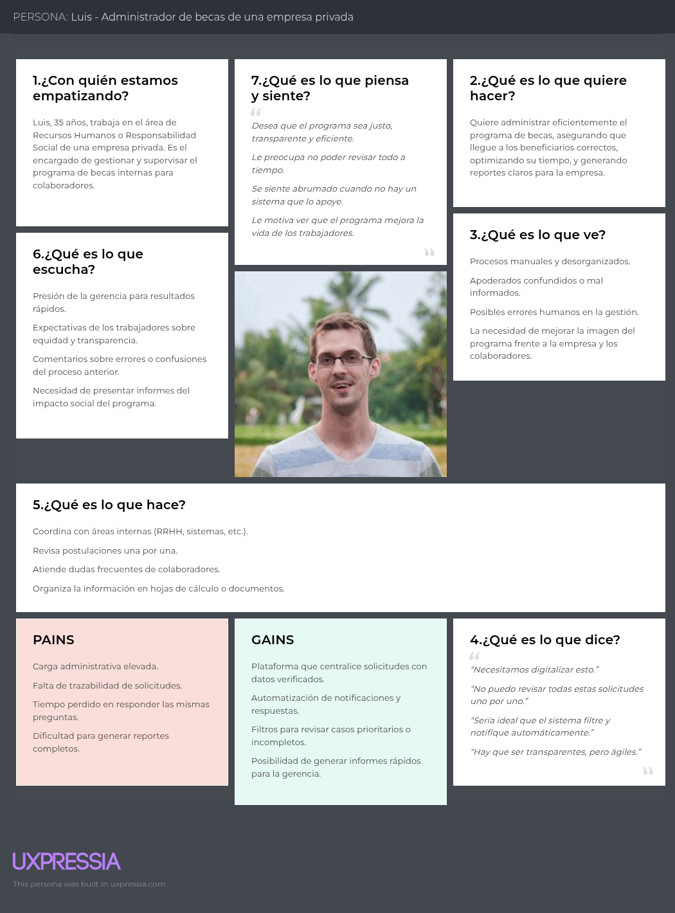

# Aventis

Product: "Scholr"

# UNIVERSIDAD PERUANA DE CIENCIAS APLICADAS

  

## Ingenieria de Software

## 6to ciclo

## Aplicaciones para Dispositivos Móviles

### **Sección(NRC):** 358

### **Profesor:** Eduardo Martin Reyes Rodriguez

### Informe de Trabajo Final

### "Aventis"

### "Scholr"

### **Integrantes:**

- Estefano Oscar Jaque Peña - u202225466
- John Telesforo Arevalo Meza - u202117377
- Sebastian Omar Real Calderón - u20221d964
- Diego Alonso Rosado Iporre - u201620127

### Abril, 2025

### Url del proyecto: https://github.com/Aventis-Scholr

## Registro de Versiones del Informe

| Version | Fecha      | Autor                    | Descripcion                                                                                                                                                                                                                                                                                 |
| ------- | ---------- | ------------------------ | ------------------------------------------------------------------------------------------------------------------------------------------------------------------------------------------------------------------------------------------------------------------------------------------- |
| TB1     | 06/04/2025 | Estefano Jaque  | Desarrollé el Lean UX Problem Statements,Lean UX Assumptions,Diseño de entrevistas,Coompetidores y Estrategias y tácticas frente a competidores|
| TB1     | 06/04/2025 | Estefano Jaque | Desarrollé las User Stories,Product Backlog, Class Diagrams, Class Dictionary, Database Diagram, Sprint Planning 1, Sprint Backlog 1|
| TB1     | 06/04/2025 | Sebastian Real Calderón | Desarrollé la Descripción de la Startup, Solution Profile, el regitro de una entrevista a un usuario del segmento 1 y 2, y realicé una entrevista.|
| TB1     | 06/04/2025 | Sebastian Real Calderón | Desarrollé el Empathy Mapping, User Task Matrix, Style Guidelines y Software configuration Management |
| TB1     | 06/04/2025 | John Arévalo | Desarrolle los as-is y to-be scenarios, además del registro de 1 entrevista por segmento objetivo. |
| TB1     | 06/04/2025  | John Arévalo | Desarrolle los wireframes y mockups de la landing page, además de los wireframes, mockups, wireflows y user flows diagrams para la aplicación web.|
| TB1     | 18/04/2025  | Diego Rosado | Desarrolle las preguntas para los segmentos objetivos e hice una entrevista.|

## Project Report Collaboration Insights

|  URL de la organización del proyecto  |          URL del repositorio del reporte          |
| :-----------------------------------: | :-----------------------------------------------: |
| https://github.com/Aventis-Scholr | https://github.com/Aventis-Scholr/reporte |

 **Vista de commits: Landing page:**  

[IMAGENES]
- Estefano Oscar Jaque Peña: X
- Sebastian Omar Real Calderón: X
- John Telesforo Arevalo Meza: X
- Diego Alonso Rosado Iporre: X

 **Issues**

[IMAGENES]

 **Report:**

[IMAGENES]

- Estefano Oscar Jaque Peña: X
- Sebastian Omar Real Calderón: X
- John Telesforo Arevalo Meza: X
- Diego Alonso Rosado Iporre: X

TB1: 
|Integrante|Tarea Asignada|
|-|-|
|Jaque Peña, Estefano Oscar|Lean UX Problem Statements,Lean UX Assumptions,Diseño de entrevistas,Coompetidores,Estrategias y tácticas frente a competidores,User Stories,Product Backlog, Class Diagrams, Class Dictionary, Database Diagram, Sprint Planning 1, Sprint Backlog 1|
| Sebastian Omar Real Calderón | Startup Profile, Descripción de la Startup, Antecedentes y problemática, Entrevistas, Registro de entrevistas, User Personas, Ubiquitous Language, Domain-Driven Software Architecture, Software Architecture Context Diagram, Software Architecture Container Diagrams, Software Architecture Components Diagrams, Sprint 1, Sprint Planning 1, Testing Suite Evidence for Sprint Review, Execution Evidence for Sprint Review, Services Documentation Evidence for Sprint Review, Software Deployment Evidence for Sprint Review, Team Collaboration Insights during Sprint. |
| Arévalo Meza John | Segmentos objetivos, registro de entrevistas, as-is scenario mapping, to-be scenario mapping, landing page wireframes, landing page mockups, web application wireframes, web application mockups, web applications wireflow diagrams, web applications user flow diagrams, desarrollo de la landing page. |
| Rosado Iporre, Diego | Diseño de entrevistas, web application wireframes, desarrollo de la landing page. |

## Contenido

### Tabla de contenidos

  - [Student Outcome](#student-outcome)
  - [Capítulo I: Presentación](#capítulo-i-presentación)
    - [1.1. Startup Profile](#11-startup-profile)
    - [1.1.1. Descripción de la Startup](#111-descripción-de-la-startup)
    - [1.1.2. Perfiles de integrantes del equipo](#112-perfiles-de-integrantes-del-equipo)
    - [1.2. Solution Profile](#12-solution-profile)
    - [1.2.1. Antecedentes y problemática](#121-antecedentes-y-problemática)
    - [1.2.2. Lean UX Process](#122-lean-ux-process)
    - [1.2.2.1. Lean UX Problem Statements](#1221-lean-ux-problem-statements)
    - [1.2.2.2. Lean UX Assumptions](#1222-lean-ux-assumptions)
    - [1.2.2.3. Lean UX Hypothesis Statements](#1223-lean-ux-hypothesis-statements)
    - [1.2.2.4. Lean UX Canvas](#1224-lean-ux-canvas)
    - [1.3. Segmentos objetivo](#13-segmentos-objetivo)
  - [Capítulo II: Requirements Elicitation \& Analysis](#capítulo-ii-requirements-elicitation--analysis)
    - [2.1. Competidores](#21-competidores)
    - [2.1.1. Análisis competitivo](#211-análisis-competitivo)
    - [2.1.2. Estrategias y tácticas frente a competidores](#212-estrategias-y-tácticas-frente-a-competidores)
    - [2.2. Entrevistas](#22-entrevistas)
    - [2.2.1. Diseño de entrevistas](#221-diseño-de-entrevistas)
    - [2.2.2. Registro de entrevistas](#222-registro-de-entrevistas)
    - [2.2.3. Análisis de entrevistas](#223-análisis-de-entrevistas)
    - [2.3. Needfinding](#23-needfinding)
    - [2.3.1. User Personas](#231-user-personas)
    - [2.3.2. User Task Matrix](#232-user-task-matrix)
    - [2.3.3. User Journey Mapping](#233-user-journey-mapping)
    - [2.3.4. Empathy Mapping](#234-empathy-mapping)
    - [2.3.5. As-is Scenario Mapping](#235-as-is-scenario-mapping)
    - [2.4. Ubiquitous Language](#24-ubiquitous-language)
  - [Capítulo III: Requirements Specification](#capítulo-iii-requirements-specification)
    - [3.1. To-Be Scenario Mapping](#31-to-be-scenario-mapping)
    - [3.2. User Stories](#32-user-stories)
    - [3.3. Impact Mapping](#33-impact-mapping)
    - [3.4. Product Backlog](#34-product-backlog)
  - [Capítulo IV: Product Design](#capítulo-iv-product-design)
    - [4.1. Strategic-Level Domain-Driven Design.](#41-strategic-level-domain-driven-design)
    - [4.1.1. EventStorming.](#411-eventstorming)
    - [4.1.1.1. Candidate Context Discovery.](#4111-candidate-context-discovery)
    - [4.1.1.2. Domain Message Flows Modeling.](#4112-domain-message-flows-modeling)
    - [4.1.1.3. Bounded Context Canvases.](#4113-bounded-context-canvases)
    - [4.1.2. Context Mapping.](#412-context-mapping)
    - [4.1.3. Software Architecture.](#413-software-architecture)
    - [4.1.3.1. Software Architecture Context Level Diagrams.](#4131-software-architecture-context-level-diagrams)
    - [4.1.3.2. Software Architecture Container Level Diagrams.](#4131-software-architecture-context-level-diagrams)
    - [4.1.3.3. Software Architecture Deploymnet Diagrams.](#4133-software-architecture-deploymnet-diagrams)
    - [4.2. Tactical-Level Domain-Driven Design.](#42-tactical-level-domain-driven-design)
    - [4.2.1. Bounded Context: IAM](#421-bounded-context-iam)
    - [4.2.1.1 Domain Layer](#4211-domain-layer)
    - [4.2.1.2 Interface Layer](#4212-interface-layer)
    - [4.2.1.3 Application Layer](#4213-application-layer)
    - [4.2.1.4 Infrastructure Layer](#4214-infrastructure-layer)
    - [4.2.1.5 Bounded Context Software Architecture Component Level Diagrams](#4215-bounded-context-software-architecture-component-level-diagrams)
    - [4.2.1.6 Bounded Context Software Architecture Code Level Diagrams](#4216-bounded-context-software-architecture-code-level-diagrams)
    - [4.2.1.6.1 Bounded Context Domain Layer Class Diagrams](#42161-bounded-context-domain-layer-class-diagrams)
    - [4.2.1.6.2 Bounded Context Database Design Diagram](#42162-bounded-context-database-design-diagram)
    - [4.2.2. Bounded Context: Applications](#422-bounded-context-applications)
    - [4.2.2.1 Domain Layer](#4221-domain-layer)
    - [4.2.2.2 Interface Layer](#4222-interface-layer)
    - [4.2.2.3 Application Layer](#4223-application-layer)
    - [4.2.2.4 Infrastructure Layer](#4224-infrastructure-layer)
    - [4.2.2.5 Bounded Context Software Architecture Component Level Diagrams](#4225-bounded-context-software-architecture-component-level-diagrams)
    - [4.2.2.6 Bounded Context Software Architecture Code Level Diagrams](#4226-bounded-context-software-architecture-code-level-diagrams)
    - [4.2.2.6.1 Bounded Context Domain Layer Class Diagrams](#42261-bounded-context-domain-layer-class-diagrams)
    - [4.2.2.6.2 Bounded Context Database Design Diagram](#42262-bounded-context-database-design-diagram)
    - [4.2.3. Bounded Context: Management](#423-bounded-context-management)
    - [4.2.3.1 Domain Layer](#4231-domain-layer)
    - [4.2.3.2 Interface Layer](#4232-interface-layer)
    - [4.2.3.3 Application Layer](#4233-application-layer)
    - [4.2.3.4 Infrastructure Layer](#4234-infrastructure-layer)
    - [4.2.3.5 Bounded Context Software Architecture Component Level Diagrams](#4235-bounded-context-software-architecture-component-level-diagrams)
    - [4.2.3.6 Bounded Context Software Architecture Code Level Diagrams](#4236-bounded-context-software-architecture-code-level-diagrams)
    - [4.2.3.6.1 Bounded Context Domain Layer Class Diagrams](#42361-bounded-context-domain-layer-class-diagrams)
    - [4.2.3.6.2 Bounded Context Database Design Diagram](#42362-bounded-context-database-design-diagram)
    - [Conclusiones](#conclusiones)
    - [Bibliografia](#bibliografia)
    - [Anexos](#anexos)

## Student Outcome

_ABET – EAC - Student Outcome 3_  
**Criterio:** Capacidad de comunicarse efectivamente con un rango de audiencias.

En el siguiente cuadro se describen las acciones realizadas y enunciados de conclusiones por parte del grupo, que permiten sustentar el haber alcanzado el logro del ABET - EAC - Student Outcome 3.

| Criterio especifico | Acciones Realizadas| Conclusiones|
| :-- | :-- | -- |
| 1. Comunica oralmente con efectividad a diferentes rangos de audiencia   | TB1: **Estefano Oscar Jaque Peña** TB1: Realice el Lean UX Prolem statements y los assumptions luego de ello apoye con el diseño de la pregunta para las entrevistas .Para los siguientes capitulos realice el diagrama de base de dato y de diagrama de clase, asi como el database dictionary.Para finalizar con mi aporte en el grupo realice el Sprint planning y el Sprint Backlog **Diego Rolin Acuña Tomas**  TB1: Durante mi participación en la creación del TB1, tuvimos muchas reuniones por Dioscord para separar tareas, elegir los user stories que implementaremos, además de elegir que herramientas usaremos en la jornada. Tuve que hablar claro y demostrar mis ideas. Además de practicar la comunicación para ayudar en la exposición del trabajo.**Valentino Sandoval Paiva**  TB1: Para esta entrega, realicé una matriz de tareas de usuario para entender mejor las necesidades y prioridades de nuestros usuarios. También desarrollé un mapa de empatía para identificar sus emociones y comportamientos clave. Establecí directrices de estilo generales y específicas para la web para garantizar una presentación coherente y efectiva. Configuré el entorno de desarrollo, gestioné el código fuente y definí normas para su estilo y convenciones. Finalmente, preparé la configuración para el despliegue del software, asegurando una implementación fluida y exitosa.  **John Arévalo Meza**  TB1: Para esta entrega realicé los segmentos objetivos, asis scenario mapping, tobe scenario mapping, landing page wireframes y mockups, web application wireframes, mockups, wireflow and user flow diagrams y el registro de 1 entrevista por cada segmento objetivo. **Sergio André Gómez Vallejos** TB1:Presenté de manera clara y adaptada los avances y resultados del proyecto, asegurándome de que todos los miembros del equipo y las audiencias externas comprendieran los aspectos técnicos y estratégicos, lo que facilitó la toma de decisiones informadas.|**Estefano Oscar Jaque Peña** TB1:Durante mi participación, comuniqué de manera clara los aspectos técnicos y estratégicos en reuniones y planificación. Presenté los diagramas y el Sprint Backlog adaptando mi lenguaje a audiencias con diferentes niveles de experiencia, asegurando que todos comprendieran la lógica del proyecto.  **John Telesforo Arevalo Meza**  TB1:  A lo largo de la TB1, la comnunicación oral fue de suma importancia, ya que gracias a esta pudimos empatizar con los segmentos objetivos, así como dar a conocer de manera correcta nuestras ideas, además logramos compenetrar mejor como equipo y así realizar un trabajo exitoso. **Sergio André Gómez Vallejos** TB1:Durante mi participación desarrollé de manera puntual y clara con algunas secciones del documento, como los Mockoups, testing, etc. Me asegure de cumplir y transmitir los avances del documento del TB1. **Valentino Sandoval Paiva** TB1:En esta TB1, durante la exposición de los resultados del desarrollo de Lean UX Hypothesis Statements, Lean UX Canvas, y el análisis de entrevistas, se demostró una habilidad sólida para comunicar oralmente con efectividad a diferentes audiencias. Para los líderes, se presentó el impacto estratégico del To-Be Scenario Mapping y el Impact Mapping, destacando cómo estos instrumentos contribuyen al éxito del proyecto. Con el equipo de desarrollo, se hizo énfasis en las User Stories y la Information Architecture, explicando su relevancia en términos técnicos y prácticos para la ejecución del proyecto. **Diego Rolin Acuña Tomas**  TB1: Durante mi participación en la creación del TB1, tuvimos muchas reuniones por Dioscord para separar tareas, elegir los user stories que implementaremos, además de elegir que herramientas usaremos en la jornada. Tuve que hablar claro y demostrar mis ideas. Además de practicar la comunicación para ayudar en la exposición del trabajo.|
| 2. Comunica por escrito con efectividad a diferentes rangos de audiencia | TB1:  **Estefano Oscar Jaque Peña** TB1: Realice el Lean UX Prolem statements y los assumptions luego de ello apoye con el diseño de la pregunta para las entrevistas .Para los siguientes capitulos realice el diagrama de base de dato y de diagrama de clase, asi como el database dictionary.Para finalizar con mi aporte en el grupo realice el Sprint planning y el Sprint Backlog **Diego Rolin Acuña Tomas**  TB1: Durante mi participación comprendí la importancia de dejar un documento con las pruebas de tu trabajo en el primer sprint, también aprendí a usar herramienta para crear los modelos C4. Escribirlo para mis compañeros ayudara a una comunicación menos repetitiva, pues podrán conocer sin necesidad de esperar a las reuniones. **Sergio André Gómez Vallejos** TB1:Redacté el informe sobre el proyecto, ajustando el lenguaje y la estructura para que fueran accesibles tanto para compañeros técnicos como para audiencias no técnicas, garantizando la comprensión y utilidad de la información compartida. **John Telesforo Arevalo Meza**  Para esta entrega realicé los segmentos objetivos, asis scenario mapping, tobe scenario mapping, landing page wireframes y mockups, web application wireframes, mockups, wireflow and user flow diagrams y el registro de 1 entrevista por cada segmento objetivo. Además de la creación de la landgin page en base a el us asignado **Valentino Sandoval Paiva**  TB1: "Al abordar esta entrega, analicé las tareas y necesidades de los usuarios para optimizar la experiencia del software. Desarrollé directrices de estilo para asegurar una presentación coherente, configuré el entorno de desarrollo y gestioné el código fuente. Además, preparé la configuración necesaria para un despliegue exitoso del software.|   **Valentino Sandoval Paiva**  TB1:  En esta TB1, la comunicación escrita ha sido clave para asegurar que todas las partes involucradas, desde líderes hasta miembros del equipo, comprendan claramente los objetivos, estrategias y decisiones tomadas. Se utilizó un lenguaje claro y conciso en la planificación y documentación, ajustando el nivel de detalle según la audiencia: proporcionando explicaciones estratégicas para los líderes y directrices más técnicas para el equipo de desarrollo. Esto garantizó una alineación efectiva entre todos los participantes, fomentando la colaboración y facilitando la toma de decisiones informadas basadas en datos compartidos y análisis grupales. **Estefano Oscar Jaque Peña** TB1:A lo largo del proyecto, redacté documentación clara y precisa, como los problem statements, assumptions, y el database dictionary, ajustando el nivel de detalle según la audiencia. Esto garantizó la comprensión y alineación de todo el equipo para una ejecución eficiente del proyecto.  **Sergio André Gómez Vallejos** TB1:Durante el proyecto coloque y redacté documentación de manera clara y efectiva, como el testing, landing page, entre muchas otras secciones. Con el fin de mejorar y asegurar al documento para un proceso garantizado del proyecto.   **John Telesforo Arevalo Meza**  TB1:  Durante la Tb1, la comunicación escrita ha se de suma importancia, puesto que gracias a esta pudimos reconocer las necesidades de nuestros segmentos objetivos ,además de mejorar el trabajo en grupo y la organización en general **Diego Rolin Acuña Tomas**  TB1: Durante mi participación comprendí la importancia de dejar un documento con las pruebas de tu trabajo en el primer sprint, también aprendí a usar herramienta para crear los modelos C4. Escribirlo para mis compañeros ayudara a una comunicación menos repetitiva, pues podrán conocer sin necesidad de esperar a las reuniones. |

## Capítulo I: Presentación

### 1.1. Startup Profile

### 1.1.1. Descripción de la Startup

Aventis es una startup innovadora creada por estudiantes de la Facultad de Ingeniería de la Universidad Privada de Ciencias Aplicadas (UPC), la cual ha desarrollado la aplicación móvil Scholr con el propósito de conectar a los apoderados o representantes de alumnos con oportunidades de becas ofrecidas por empresas privadas líderes. Bajo el contexto actual, donde el acceso a educación de calidad sigue siendo un desafío para muchas familias en el Perú y a nivel global, Scholr busca ser la plataforma que facilite el proceso de búsqueda y postulación a becas para estudiantes, además de brindar una herramienta de vanguardia para asi ayudar a las instituciones privadas que brindan las becas a gestionar las postulaciones y asi agilizar el proceso de estas.

Misión: Nuesta misión es democratizar el acceso a la educación, ofreciendo a las familias herramientas que faciliten la conexión con becas y programas educativos de empresas privadas. A través de Scholr, buscamos empoderar a los apoderados para que puedan tomar decisiones informadas sobre el futuro académico de sus hijos, apoyando el desarrollo profesional de jóvenes talentosos y contribuyendo a una sociedad más inclusiva.

Visión: Aspiramos a ser la principal plataforma de conexión entre apoderados y becas educativas ofrecidas por empresas privadas, siendo reconocidos por nuestra capacidad de facilitar el acceso a oportunidades educativas de calidad. Queremos convertirnos en el aliado estratégico de las familias que buscan asegurar el futuro académico de sus hijos, con soluciones innovadoras que respondan a las necesidades actuales y anticipen las tendencias del sector educativo. A través de Scholr, queremos crear un impacto positivo en la sociedad, mejorando las posibilidades de éxito y desarrollo de los jóvenes mediante el acceso a una educación superior accesible y apoyada por el sector privado.

### 1.1.2. Perfiles de integrantes del equipo

- Estefano Oscar Jaque Peña - U202225466

| 

 | Soy Estefano Oscar Jaque Peña, tengo 23 años y soy estudiante de la carrera de Ingeniería de Software,  una disciplina enfocada en el diseño, desarrollo y gestión de software para solucionar problemas  complejos. Desde temprana edad, he sentido fascinación por la tecnología y he buscado aprender  constantemente sobre las últimas tendencias en programación. He ampliado mis conocimientos a  través de cursos en Python, SQL, y C++, así como también explorando otros lenguajes de programación  por mi cuenta. Además, tengo habilidades en el uso avanzado de Excel para análisis de datos y gestión  de información. Mi experiencia trabajando en equipos me ha brindado habilidades de comunicación y  colaboración que considero fundamentales para contribuir de manera efectiva a proyectos innovadores  en el área de la Ingeniería de Software. |
|-|:-|

- John Telésforo Arévalo Meza - U202117377

| 
 
 | Soy John Arévalo, tengo 20 años y soy estudiante de la carrera de Ingeniería de Software. Tengo conocimiento en lenguajes de programación como python y c++, y bases de datos como SQLServer y MongoDB. Desde pequeño me sentí atraído por la tecnología, por lo que me decidí a estudiar la carrera, además disfruto de jugar videojuegos con amigos en mi tiempo libre. |
|:-|-|

- Sebastián Omar Real Calderón - U20221D964

| 
 
 | Soy Sebastián Real Calderón, tengo 19 años y soy estudiante de la carrera de Ingeniería de Software. Tengo conocimientos sobre lenguajes de programación como C++, C# y Java. Principalmente me dedico al desarrollo de proyectos que me permitan desarrollar mis habilidades de programación, tales como videojuegos o programas sencillos, ya que apunto a volverme desarrollador. Dentro de mis hobbies están los videojuegos, las series, el baile y el fútbol.
|-|:-|

- Diego Alonso Rosado Iporre - U201620127

| 
 
 | Mi nombre es Diego Rosado, tengo 25 años. Mi interés en las base de datos y arquitectura de páginas web me impulsó a estudiar Ingeniería de Software. Tengo conocimiento de lenguajes como C#, C++, JavaScript, Python, base de datos como MySQL y me atrae el diseño de páginas web con HTML y CSS. Me considero una persona positiva, tolerante y creativa. Mi aporte al grupo es mi total compromiso, apoyo mutuo y el esfuerzo por asegurar que todos tengamos una visión compartida del proyecto a elaborar. Mis habilidades son resolución de problemas, adaptabilidad, trabajo en equipo y toma de decisiones. |
|-|:-|

### 1.2. Solution Profile

### 1.2.1. Antecedentes y problemática

Los apoderados de estudiantes o posibles estudiantes enfrentan grandes desafíos cuando se trata de acceder a oportunidades educativas y de apoyo financiero. En particular, las familias tienen dificultades para encontrar información clara y actualizada sobre las becas ofrecidas por empresas privadas, lo que puede generar estrés y confusión durante el proceso de postulación. Por otro lado la mayoria de empresas privadas que brindan este tipo de ayudas, no cuentan con un sistema moderno, lo que puede ralentizar el proceso de postulación. Esta falta de una plataforma centralizada y fácil de usar para gestionar las becas agrava el problema, limitando las oportunidades para los estudiantes que necesitan apoyo financiero. Sin una herramienta eficaz que conecte a los apoderados con las becas disponibles, muchas oportunidades se pierden, y los estudiantes no logran acceder a los recursos que podrían mejorar su educación y futuro profesional.

**What?**

**¿Qué problema hay?**  
El principal problema radica en la falta de una plataforma centralizada y eficiente que permita a los apoderados gestionar de manera adecuada la búsqueda y postulación a becas ofrecidas por empresas privadas. A pesar de la creciente disponibilidad de becas, muchos apoderados tienen dificultades para encontrar información relevante, seguir plazos de inscripción y gestionar todas las etapas del proceso de postulación. Esta falta de organización y visibilidad incrementa el riesgo de perder oportunidades educativas y genera un alto nivel de estrés en las familias.

**¿Qué relación tiene el problema con el usuario/cliente?**  
Para los apoderados y estudiantes, este problema se traduce en una experiencia frustrante y desorganizada al intentar acceder a becas educativas. La falta de una plataforma unificada obliga a los apoderados a recorrer múltiples sitios web y fuentes de información, lo que genera una pérdida de tiempo valioso y aumenta el riesgo de no postular a las becas adecuadas o de perder fechas importantes.

**When?**

**¿Cuándo sucede el problema?**  
El problema se presenta durante todo el proceso de búsqueda, selección y postulación a becas. Desde el momento en que los apoderados comienzan a buscar opciones, hasta el seguimiento de los plazos y la gestión de los documentos necesarios. La falta de una plataforma centralizada y de fácil acceso agrava estos desafíos en cada fase del proceso.

**¿Cuándo utiliza el cliente el producto?**  
Los clientes utilizarán Scholr desde el momento en que comienzan a buscar oportunidades de becas, pasando por la postulación y hasta el seguimiento de los plazos y el estado de las solicitudes.

**Where?**

**¿Dónde ocurre el problema?**  
Este problema ocurre en cualquier lugar donde los apoderados buscan y gestionan becas, como en sus hogares, oficinas o durante desplazamientos. La falta de una plataforma eficiente hace que los usuarios deban consultar múltiples fuentes de información dispersas, lo que provoca desorganización y pérdida de tiempo.

**¿Dónde está el cliente cuando usa el producto?**  
Los clientes pueden usar Scholr en cualquier lugar con acceso a internet, como en casa, en el trabajo o durante viajes, utilizando dispositivos móviles que les permitan acceder a la plataforma de manera rápida y sencilla.

**Who?**

**¿Quiénes son los involucrados en este problema?**  
Los principales involucrados son los apoderados que buscan oportunidades educativas para sus hijos, así como los estudiantes que desean acceder a becas. También se ven afectadas las empresas privadas que ofrecen becas, ya que una plataforma más eficiente incrementaría su visibilidad y participación en los programas.

**¿Quiénes están afectados por el problema?**  
Los apoderados y los estudiantes son los principales afectados, ya que enfrentan dificultades para encontrar y gestionar becas. Las empresas que ofrecen becas también se ven afectadas, ya que una menor visibilidad de las oportunidades limita su alcance.

**Why?**

**¿Por qué ocurre el problema?**  
El problema ocurre debido a la dispersión de la información sobre becas a través de múltiples plataformas y la falta de una solución que centralice todas las oportunidades disponibles. Además, la gestión del proceso de postulación es ineficiente sin herramientas que organicen plazos, requisitos y estado de las solicitudes de manera clara y accesible.

**How?**

**¿En qué condiciones los clientes usan nuestro producto?**  
Los usuarios utilizan Scholr en un contexto de alta demanda, cuando necesitan organizar y gestionar múltiples solicitudes de becas. Los apoderados emplean la app durante todo el proceso de búsqueda, postulación y seguimiento de becas, lo que les permite mantenerse organizados y aprovechar al máximo las oportunidades disponibles.

**¿Cómo nos conocieron los compradores?**  
Los compradores potenciales conocen Scholr a través de recomendaciones de otros apoderados, marketing digital, colaboraciones con universidades y empresas que ofrecen becas, y contenidos informativos en redes sociales o blogs relacionados con el acceso a la educación.

**¿Qué llevó a la persona a llegar a esta situación?**  
Las personas llegaron a la situación de buscar una solución como Scholr debido a la falta de plataformas que centralicen de manera eficiente las becas disponibles, especialmente en el contexto de becas ofrecidas por empresas privadas. Muchos apoderados han enfrentado frustración por la dificultad de encontrar información actualizada, los plazos vencidos y la escasa organización del proceso de postulación. Buscan una herramienta que les permita acceder a todas las becas en un solo lugar, simplificar la gestión de los documentos y plazos, y garantizar que sus hijos no pierdan oportunidades educativas clave debido a la falta de una estructura clara.

**How much?**

**¿Cuánto cuesta este problema?**  
La falta de acceso eficiente a becas puede resultar en una oportunidad educativa perdida. En América Latina, un 60% de los estudiantes no están al tanto de las becas disponibles, lo que les impide aprovechar oportunidades clave para su desarrollo académico. Además, los apoderados pueden invertir hasta 10-15 horas mensuales buscando y gestionando becas, lo que se traduce en una pérdida significativa de tiempo y recursos.

Los costos operativos también se ven incrementados significativamente. Sin una herramienta adecuada para gestionar las becas, las familias pueden enfrentar gastos adicionales asociados con la búsqueda de información, la recopilación de documentación y el seguimiento manual de las fechas límite. Un análisis de estudios sobre el tema indica que, en promedio, las personas que no utilizan plataformas de gestión adecuadas pierden hasta un 30% de oportunidades debido a la falta de seguimiento eficiente.

### 1.2.2. Lean UX Process

El proceso Lean UX se adapta especialmente bien a startups como Aventis que buscan crear soluciones innovadoras y efectivas en el mercado. Este enfoque se caracteriza por su agilidad y centrado en el usuario, lo que significa que estamos constantemente buscando validar nuestras ideas y prototipos con los usuarios para garantizar que estamos abordando sus necesidades de manera adecuada.

### 1.2.2.1. Lean UX Problem Statements

El aplicativo móvil Scholr busca centralizar y simplificar el proceso de postulación a becas educativas ofrecidas por empresas privadas y ONGs en Perú, permitiendo a los trabajadores de estas acceder a oportunidades de financiamiento educativo de manera ágil y transparente.
Hemos identificado que Los trabajadores de empresas privadas u ONGs enfrentan dificultades para encontrar, comparar y aplicar a convocatorias de becas para sus hijos debido a la dispersión de información, requisitos complejos y plazos poco claros, lo que reduce sus posibilidades de acceder a beneficios educativos para su familia.
¿Cómo podríamos optimizar el proceso de búsqueda y postulación a becas dirigidas a hijos de trabajadores, para que los padres/apoderados aumenten sus oportunidades de éxito y reduzcan las barreras de acceso a la información?

### 1.2.2.2. Lean UX Assumptions

Assumptions:

1. Creo que mis clientes necesitan un acceso centralizado y simplificado a convocatorias de becas educativas en Perú.

2. Estas necesidades se pueden resolver con una plataforma móvil que agrupe, filtre y notifique oportunidades de becas según el perfil del usuario.

3. Mis clientes iniciales son padres o apoderados (trabajadores de empresas/ONGs) que buscan becas educativas para sus hijos en edad escolar o universitaria.

4. El valor #1 es garantizar que los padres encuentren becas compatibles con el perfil académico de sus hijos y postulen a tiempo, sin perder oportunidades por desconocimiento o trámites engorrosos.

5. El cliente también puede obtener estos beneficios adicionales: asesoría personalizada(atencion al cliente) y recordatorios de plazos(notificaciones).

6. Voy a adquirir la mayoría de mis clientes a través de alianzas con Empresas Privadas y ONGs, redes sociales (Facebook, Instagram, LinkedIn) y recomendaciones de usuarios satisfechos.

7. Haré dinero a través de comisiones por becas gestionadas con éxito y publicidad.

8. Mi competencia principal en el mercado será portales educativos genéricos y plataformas de empleo que incluyen secciones de becas.

9. Los venceremos debido a nuestra especialización en becas peruanas, interfaz intuitiva y herramientas de seguimiento de postulaciones.

10. Mi mayor riesgo de producto es que las instituciones no actualicen sus convocatorias a tiempo o que los usuarios no confíen en la veracidad de la información.

11. Resolveremos esto a través de alianzas formales con las empresas y ONGs oferentes, además de un sistema de verificación en tiempo real.

12. ¿Quién es el usuario?
Los usuarios principales son padres/apoderados (trabajadores de empresas/ONGs) que gestionan becas para sus hijos. Los usuarios secundarios son administradores de becas en esas instituciones.

13. ¿Dónde encaja nuestro producto en su trabajo o vida?
Scholr se integra en la vida de , facilitando su acceso a oportunidades educativas y eliminando las barreras de tiempo y complejidad en el proceso de postulación a becas.

14. ¿Qué problemas tiene nuestro producto y cómo se pueden resolver?
Falta de claridad sobre qué becas son exclusivas para hijos de trabajadores, y dificultad para comprobar el vínculo padre-empresa/hijo-estudiante.

15. ¿Cuándo y cómo es usado nuestro producto?
El producto se usa principalmente durante períodos de búsqueda activa de becas (inicios de semestre, fin de año) y durante el proceso de postulación. Los usuarios acceden a través de la app móvil para consultar oportunidades, subir documentos y recibir notificaciones.

16. ¿Qué características son importantes?
Las características clave incluyen: un buscador inteligente de becas que puedan ser filtradas, alertas personalizadas respecto a la beca que buscas, seguimiento de postulaciones y tutoriales para completar requisitos. 

17. ¿Cómo debe verse nuestro producto y cómo debe comportarse?
Scholr debe tener un diseño limpio y profesional, con colores institucionales (azules/blancos) que inspiren confianza. Debe ser rápido en cargar información actualizada, con una navegación intuitiva y funciones claras para postular en pocos pasos. El comportamiento debe ser proactivo (notificaciones útiles) pero no intrusivo.

Business Outcomes:

- Incrementar en un 40% el número de postulaciones exitosas a becas mediante la plataforma en el primer año.

- Lograr que el 70% de los usuarios recurran a Scholr como principal fuente de información sobre becas educativas en Perú.

- Establecer alianzas con al menos 6 empresas y ONGs para integrar sus convocatorias de manera exclusiva.

- Posicionar la app entre las 3 plataformas más descargadas en educación en Perú durante los primeros 18 meses.

User Outcomes:

- Encontrar todas las becas disponibles que coincidan con mi perfil académico en un solo lugar.

- Simplificar el proceso de postulación con guías paso a paso y recordatorios de plazos importantes.

- Recibir alertas personalizadas sobre nuevas convocatorias que se ajusten a mis intereses y necesidades.

- Ahorrar tiempo y esfuerzo al gestionar múltiples postulaciones de manera centralizada y organizada.

- Aumentar mis posibilidades de obtener una beca gracias a información actualizada y herramientas de seguimiento.

### 1.2.2.3. Lean UX Hypothesis Statements

- **Hipótesis 1 (Enfoque: Postulaciones exitosas)**  
  *Creemos que* al centralizar y simplificar el proceso de postulación a becas en una sola plataforma *Sabremos que hemos tenido éxito cuando* el 40% de padres/trabajadores que usan Scholr logren postular a becas para sus hijos (vs. 10% en el método tradicional) en el primer año.

- **Hipótesis 2 (Enfoque: Fuente principal de información)**  
  *Creemos que* ofrecer información verificada y actualizada sobre becas en tiempo real *Sabremos que hemos tenido éxito cuando* el 70% de trabajadores de empresas aliadas usen Scholr como canal oficial para becas familiares.

- **Hipótesis 3 (Enfoque: Alianzas estratégicas)**  
  *Creemos que* al formalizar alianzas con empresas y ONGs para integrar sus convocatorias de manera exclusiva *Sabremos que hemos tenido éxito cuando* al menos 6 empresas/ONGs integren sus programas de becas familiares en Scholr con validación automática de empleados.

- **Hipótesis 4 (Enfoque: Posicionamiento en el mercado)**  
  *Creemos que* al optimizar la experiencia del usuario con funciones intuitivas y notificaciones personalizadas *Sabremos que hemos tenido éxito cuando* Scholr se ubique como App #1 en becas corporativas/familiares en Perú.

### 1.2.2.4. Lean UX Canvas

| Sección | Contenido |
|---------|-----------|
| **Business Problem** | Padres/trabajadores de empresas/ONGs no encuentran becas educativas para sus hijos de manera ágil, o pierden oportunidades por trámites complejos y falta de información centralizada. |
| **Business Outcomes** | - 40% de padres/trabajadores logran postular exitosamente para sus hijos - 70% de trabajadores de empresas aliadas usan Scholr como canal principal - 6+ empresas/ONGs integran sus becas familiares - Posicionarse como app líder en becas corporativas |
| **Users and Customers** | Trabajadores de empresas privadas y ONGs (padres/apoderados) que buscan becas para sus hijos en edad escolar/universitaria. |
| **User Benefits** | - Acceso a becas exclusivas para hijos de colaboradores - Validación automática del vínculo padre-empresa - Postulación simplificada con documentos prevalidados (credencial laboral + notas del hijo) |
| **Solution Ideas** | - Filtro "Becas para hijos de trabajadores de [tu empresa]" - Integración con RRHH para verificación de empleo - Sección de "Becas patrocinadas por tu empleador" - Alertas personalizadas por perfil académico del hijo |
| **Hypotheses** | 1. Postulaciones exitosas aumentarán 40% 2. 70% adoptarán Scholr como canal principal 3. 6+ alianzas con instituciones 4. Liderazgo en becas familiares |
| **What's the most important thing we need to learn first?** | - Necesidades reales de padres/trabajadores - Barreras actuales en postulaciones familiares - Requisitos de empresas/ONGs para integrar sus programas |
| **What's the least amount of work we need to do to learn the next most important thing?** | - Entrevistas con padres trabajadores - Reuniones piloto con departamentos de RRHH - Pruebas de concepto con 1-2 empresas aliadas |

### 1.3. Segmentos objetivo

**Segmento objetivo 1: Padres trabajadores (empleados/colaboradores de empresas y ONGs):**  
Descripción:  
Trabajadores formales de empresas medianas/grandes o ONGs en Perú, con hijos en edad escolar o universitaria, que buscan acceder a becas educativas exclusivas para familiares de empleados.  

Necesidades:  
- Encontrar información confiable y actualizada sobre becas disponibles para sus hijos.

- Simplificar el proceso de postulación (especialmente para acreditar su vínculo laboral).

- Evitar perder oportunidades por plazos desconocidos o requisitos poco claros.

Aspiraciones:

- Garantizar la mejor educación posible para sus hijos sin asumir costos elevados.

- Sentir que su empleador les ofrece beneficios valiosos y fáciles de usar.

- Reducir el estrés y tiempo invertido en trámites burocráticos.

**Segmento objetivo 2: Coordinadores de bienestar laboral/RSE (en empresas y ONGs):**    
Descripción:  
Profesionales en departamentos de RRHH, Bienestar o Responsabilidad Social, encargados de gestionar programas de becas educativas para hijos de empleados.  

Necesidades:  

- Reducir la carga administrativa de validar postulantes manualmente.   

- Mejorar la comunicación interna sobre beneficios disponibles.  

- Generar métricas claras sobre el impacto de los programas de becas.  

Aspiraciones:  

- Posicionar a su organización como un empleador socialmente responsable.  

- Implementar soluciones escalables que ahorren tiempo y recursos.  

- Demostrar el valor de los programas de bienestar a la alta dirección.  

## Capítulo II: Requirements Elicitation & Analysis

### 2.1. Competidores

- SABE :  
El Sistema de Administración de Beneficios Educativos, se trata de una plataforma creada por la institución Escalo sin fines de lucro. La plataforma se encarga de apoyar en la gestión de postulantes y beneficiarios para becas privadas.

- Pronabec APP:  
La plataforma del programa nacional de becas y crédito educativo del gobierno peruano que se encarga de facilitar la postulación a diferentes becas o ayudas económicas.

- Universia:  
Se trata de una red de universidades de Iberoamérica con un programa de becas y ayudas económicas para estudiantes

### 2.1.1. Análisis competitivo

Competitive Analysis Landscape

¿Por qué llevar a cabo este análisis?  
Para poder tener un análisis completo sobre nuestro modelo de negocio además de poder comprender a nuestros competidores.

| Nombre de  los Startups   o Empresas | | Scholr | SABE | Pronabec App | Universia |
| -- | -- | -- | -- | -- | -- |
| *Perfil* | *Overview*                                                      |                                                                                                                                                                                         | Es una plataforma sin fines de lucro que busca apoyar a la gestión de postulantes y beneficiarios para becas y ayudas económicas.                                                                                                                                                                                                                                                | Es una aplicación para el programa del gobierno peruano que facilita la postulación a las becas o ayudas económicas para los estudiantes de bajos recursos.                                                                                                                                | Una red de universidades con conexiones en iberoamérica que cuenta con un programa de becas y ayudas económicas para estudiantes.                                                                                                                                |
| | *Ventaja competitiva* | | - Alianzas con más de 100 instituciones. - Asesoría personalizada gratuita. | - Oficialidad (aval del Estado peruano). - Becas 100% financiadas. | - Alcance global. - Convenios con empresas para empleabilidad. |
| *Perfil de Marketing* | *Mercado Objetivo* | | - Universitarios peruanos de bajos recursos. - Becas parciales/totales. | - Estudiantes peruanos (secundaria, técnicos, universitarios). | - Estudiantes iberoamericanos (pregrado/postgrado). |
| | *Estrategias de Marketing* | | - Charlas en universidades públicas. - Campañas en Facebook/Instagram. | - Publicidad en TV y radios nacionales. - Ferias "Beca 18". | - Webinars con universidades top. - Newsletter con oportunidades. |
| *Perfil del producto* | *Productos/servicios* | | - Buscador de becas. - Talleres de postulación. - Mentorías. | - Postulación en línea. - Resultados en tiempo real. | - Buscador de becas, más de 20,000 opciones. - Cursos de preparación. |
| | *Precios y Costos* | | Gratuito (financiado por donaciones). | Gratuito (fondos públicos). | Gratuito (patrocinio Santander). |
| | *Canales* | | Web + WhatsApp Business. | App móvil (iOS/Android) + web. | Web + app (funcionalidades limitadas). |
| *Análisis SWOT* | *Fortalezas*                                                    | | - Modelo sin fines de lucro genera confianza. - Enfoque en acompañamiento integral. | - Respaldo institucional del gobierno. - Cobertura nacional. | - Red internacional consolidada. - Diversidad de opciones académicas. |
| | *Debilidades* | | - Solo cubre Perú. - Depende de donantes. | - Requisitos burocráticos. - Saturación en convocatorias. | - Becas principalmente para posgrado. |
| | *Oportunidades* | | - Ampliar modelo a otros países andinos. | - Implementar Inteligencia Artificial. | - Alianzas con gobiernos locales. |
| | *Amenazas* | | - Competencia de plataformas con más recursos. - Cambios en políticas de donaciones. | - Cambios políticos afectan presupuesto. | - Reducción de fondos. |

### 2.1.2. Estrategias y tácticas frente a competidores

Para enfrentarnos a la competencia, nuestra estrategia se centrará en maximizar nuestra ventaja competitiva mediante la oferta de una interfaz intuitiva que optimice la colaboración en tiempo real, dirigida a startups tecnológicas. Aprovecharemos tácticas de marketing digital segmentadas, destacando nuestras pruebas gratuitas y estableciendo asociaciones estratégicas con comunidades tecnológicas clave. Para competir con empresas como Wrike y ClickUp, que ofrecen herramientas robustas y personalizables, nos enfocaremos en nuestra simplicidad y eficiencia, adaptando nuestros precios de manera flexible para atraer a equipos en crecimiento. Además, desarrollaremos integraciones con plataformas populares como Slack y Google Workspace, facilitando la conectividad y colaboración entre equipos. Nuestro compromiso con la mejora continua incluirá no solo la automatización de tareas, sino también la incorporación de funcionalidades innovadoras basadas en la retroalimentación de los usuarios. Este enfoque proactivo nos permitirá no solo diferenciarnos en el mercado, sino también garantizar que nuestra propuesta evolucione y se mantenga relevante, ofreciendo un valor excepcional que responda a las necesidades cambiantes de nuestros clientes y fomente una experiencia de usuario excepcional.

### 2.2. Entrevistas

En esta sección del informe se realizará el diseño, registro y análisis de las entrevistas de nuestros segmentos objetivos

### 2.2.1. Diseño de entrevistas

Segmentos encontrados:

- Padres Trabajadores (Empleados/Colaboradores)

- Coordinadores de Bienestar Laboral/RSE

Antes de poder realizar las entrevistas, consideramos prudente poder concretar un análisis previo para poder realizar las entrevistas de una mejor manera. Es por ello, que para cada uno de nuestros segmentos proponemos estas preguntas para poder conocer un poco más sobre nuestro público objetivo.

Preguntas :
preguntas ordenadas para entrevistar a los dos segmentos objetivos de la startup "Scholr  ":

**Segmento: Padres Trabajadores (Empleados/Colaboradores)**

**Principales:**

1. **Acceso a información**: ¿Cómo se entera actualmente de las becas educativas que ofrece su empresa/ONG para sus hijos? ¿Qué dificultades ha tenido para encontrar información clara sobre requisitos, plazos o beneficios?
2. **Proceso de postulación**: ¿Qué parte del trámite de solicitud de becas le resulta más complicada (ej: adjuntar documentos, acreditar vínculo laboral)? ¿Ha perdido alguna oportunidad de beca por no cumplir un plazo o requisito que no conocía?
3. **Experiencia con beneficios laborales**: ¿Cómo calificaría la facilidad de uso de los beneficios educativos que ofrece su empleador (ej: becas, descuentos)? ¿Qué cambiaría para que el proceso fuera más sencillo?
4. **Sobre el proceso actual de proceso de beca**: Cuando postula a una beca para su hijo, ¿qué tan fácil o difícil le resulta comprobar su vínculo laboral con la empresa/ONG? ¿Ha tenido que repetir el mismo trámite en diferentes plataformas para postular a varias becas? ¿Le gustaría unificar ese proceso?
5. **Tecnología y usabilidad**: Si su empleador le ofreciera una app móvil para gestionar becas, ¿qué tan dispuesto estaría a usarla en lugar de los métodos actuales (ej: formularios en papel, correos)? ¿Qué tipo de soporte técnico esperaría si tiene problemas al usar una plataforma de becas?
6. **Beneficios percibidos**: Además de la beca en sí, ¿qué otro valor le gustaría recibir? (Ej: asesoría educativa, alianzas con colegios, descuentos en útiles)
7. **Consideraciones de Seguridad**: ¿Qué tan preocupado/a está por la protección de los datos personales de su hijo/a al subirlos a una plataforma digital? ¿Qué medidas de seguridad esperaría? Si su empleador le pidiera compartir documentos sensibles (ej: boletines de notas, DNI) a través de una app, ¿qué le daría confianza para hacerlo?
8. **Disposición a Colaborar**: Si su empleador lanzara una plataforma de becas en fase inicial, ¿estaría dispuesto/a a probarla y dar feedback a cambio de acceso prioritario?

**Complementarias:**

1. **Expectativas de una solución digital**: ¿Usaría una app móvil o web donde pueda ver todas las becas disponibles para sus hijos, con recordatorios de plazos y requisitos? ¿Qué funcionalidad le gustaría que tuviera (ej: subir documentos desde el celular, chat de soporte)?
2. **Confianza y seguridad**: ¿Qué le daría más seguridad al usar una plataforma de becas vinculada a su empleador (ej: verificación en dos pasos, respaldo de RRHH)?

**Segmento: Coordinadores de Bienestar Laboral/RSE**

**Principales:**

1. **Gestión actual de becas**: ¿Cómo manejan hoy las postulaciones a becas para hijos de empleados (ej: correos, formularios físicos, Excel)? ¿Qué porcentaje de su tiempo dedican a tareas repetitivas (ej: verificar documentos, responder consultas)?
2. **Pesar administrativo**: ¿Cuáles son los 3 mayores cuellos de botella en el proceso de asignación de becas? ¿Han tenido problemas con postulaciones incompletas o fuera de plazo?
3. **Comunicación interna**: "¿Cómo informan a los empleados sobre las becas disponibles? ¿Sienten que el mensaje llega efectivamente?
4. **Gestión y métricas**: Hoy, ¿cómo miden el impacto de sus programas de becas? ¿Reciben retroalimentación de los empleados beneficiados?, ¿Qué porcentaje de postulaciones rechazan por errores en documentos o fuera de plazo? ¿Cómo podría reducirse?
5. **Integración y seguridad**: ¿Tienen problemas para validar automáticamente la elegibilidad de los empleados (ej: antigüedad, tipo de contrato)? ¿Qué políticas de seguridad de datos exigen al almacenar información sensible (ej: documentos de hijos)?
6. **Adopción organizacional**: ¿Qué departamentos (ej: Legal, TI) suelen frenar la implementación de nuevas herramientas? ¿Cómo lo manejan?
7. **Seguridad y Privacidad**: ¿Su empresa tiene políticas específicas para el manejo de datos de familiares de empleados (ej: regulaciones GDPR o locales)? ¿Cómo las cumplen hoy?, ¿Rechazarían una solución en la nube por temas de seguridad? ¿O preferirían un sistema on-premise?
8. **Disposición a Colaborar**: ¿Estarían abiertos a trabajar con un proveedor externo para personalizar la herramienta según sus flujos internos? ¿Qué recursos podrían aportar (ej: tiempo de su equipo, datos de prueba)?, ¿Cómo manejarían la resistencia al cambio en empleados que prefieran métodos tradicionales?
9. **Visión Futura**: ¿Cómo medirían el éxito de una plataforma de becas después de 1 año de uso? (Ej: % de empleados satisfechos, tiempo ahorrado en gestión) 

**Complementarias:**

1. **Solución ideal**: ¿Qué características priorizaría en una plataforma digital para gestionar becas (ej: dashboard de postulantes, integración con nómina)? 
2. **Inversión y adopción**: ¿Qué presupuesto suelen asignar a herramientas que optimicen estos procesos? ¿Qué obstáculos ven para implementar una solución digital (ej: resistencia al cambio, seguridad de datos)?

Estas preguntas están diseñadas para llevar la conversación de manera lógica y ordenada, desde la comprensión del problema actual hasta la exploración de soluciones y colaboraciones futuras.

### 2.2.2. Registro de entrevistas

**Segmento 1: Padres Trabajadores (Empleados/Colaboradores)**

1. Entrevista 1:  
   Datos del entrevistado  
   Nombre: Juan  
   Apellidos: de la Cruz 
   Edad: 23  
   Distrito: San Martin de Porres  

URL: [Link de entrevista](https://drive.google.com/file/d/1WrxFb_8KqRk6mWSrgUbvFpkfpjyIU0vI/view?usp=sharing)

Inicio: 0:00 
Duracion: 8:24

Resumen: 
La entrevista con Juan de la Cruz, lidel del Grupo JPSP, reveló aspectos clave sobre la gestión de proyectos y el impacto de las herramientas que existen actualmente. El destacó que su principal responsabilidad es supervisar al equipo de desarrollo para cumplir con los plazos y estándares de calidad, mientras maneja el crecimiento rápido y los desafíos de integración tecnológica. Aunque también menciono que ha tenido experiencias mixtas con las herramientas actuales, principalmente debido a problemas de integración y personalización, considera esencial que las nuevas soluciones ofrezcan flexibilidad, integración fluida y capacidades avanzadas. La incorporación de tecnologías emergentes es vista como crucial para mejorar la eficiencia y la toma de decisiones. Además, se busca una solución que facilite la colaboración y la comunicación centralizada, y que esté dispuesta a adaptarse a las necesidades cambiantes del equipo. El entrevistado enfatiza la importancia de la seguridad y prioriza a los proveedores que brindan soporte confiable y pueden adaptar sus soluciones a los requisitos individuales. En el futuro, se espera una evolución hacia mayor automatización y herramientas que se adapten rápidamente a los cambios en los proyectos.

2.  Entrevista 2:  
    Datos del entrevistado  
    Nombre: María 
    Apellidos: Gutiérrez 
    Edad: 26  
    Distrito: San Isidro  

URL: [Link de entrevista](https://drive.google.com/file/d/1URH3QIgHteG1cNFRdPeFrunflBu3zA8j/view?usp=sharing "Entrevista 2")

Inicio: 0:18 
Duracion: 6:17

Resumen: 
La entrevista con María nos comenta que en su trabajo como líder de proyecto su principal responsabilidad es monitorear todas las operaciones y gestionarlas para lograr el óptimo desarrollo. Considera que las empresas deben empezar a utilizar nuevos programas para la gestión de proyecto, pues las que usan están quedando obsoletas. También nos cuenta de la importancia de que este nuevo programa debe ser intuitiva y fácil de usar, además de ser adaptable para cualquier dispositivo con acceso a internet. Nos comenta su interés de la IA en estos programas está relacionada con todos los logros que han logrado y que ella misma también usa cuando trabaja. Con su experiencia resalta que debe ser poner atención cuando busques una empresa que te ofrezca este producto, es importante que el software pueda adaptarse a sus necesidades y tenga la seguridad de que protegerá sus datos.

3.  Entrevista 3:  
    Datos del entrevistado  
    Nombre: Nora  
    Apellidos: Castro Manrique 
    Edad: 42  
    Distrito: Pueblo Libre  

URL: [Link de entrevista](https://drive.google.com/file/d/11xswJuEZQy51WRqAmZDu0KfjyF-6rV-F/view?usp=sharing "Entrevista 3")

Inicio: 0:40 
Duracion: 5:39

Resumen: 
La entrevista con Nora reveló aspectos importantes sobre la gestión y flujo de trabajo. Se destacó que el trabajo en equipo es fundamental para el éxito de un proyecto, y que contar con herramientas de gestión y seguimiento efectivas es crucial para mantener la coordinación y el progreso del equipo. Además, se considera que, tecnologías emergentes serían de mucha ayuda. En un futuro, se espera que este tipo de tecnologías sumadas a herramientas existentes puedan ayudar a su adaptación para diferentes modelos de negocio y a agilizar el trabajo.

**Segmento 2: Coordinadores de Bienestar Laboral/RSE**

1.  Entrevista 1:  
    Datos del entrevistado  
    Nombre: Lourdes  
    Apellidos: Huamani Vasquez 
    Cargo: Coordinadora de RSE y Bienestar Laboral 
    Experiencia: 3 años gestionando becas para 300 colaboradores 
    Edad: 27  
    Distrito: Los Olivos  

URL: [Link de entrevista](https://upcedupe-my.sharepoint.com/:v:/g/personal/u201620127_upc_edu_pe/EdCIElww9upKlSrPXrGgZRUBaQvkrSH7Z1YTp-uDTQ0v8w?e=ZzARVD&nav=eyJyZWZlcnJhbEluZm8iOnsicmVmZXJyYWxBcHAiOiJTdHJlYW1XZWJBcHAiLCJyZWZlcnJhbFZpZXciOiJTaGFyZURpYWxvZy1MaW5rIiwicmVmZXJyYWxBcHBQbGF0Zm9ybSI6IldlYiIsInJlZmVycmFsTW9kZSI6InZpZXcifX0%3D "Entrevista 1-segmento 2")

Inicio: 0:12 
Duracion: 11:45

Resumen: 
Lourdes Huamani, Coordinadora de RSE y Bienestar Laboral en Grupo Horizonte, compartió su experiencia gestionando becas educativas para hijos de colaboradores, revelando una problemática central: el proceso actual es completamente manual, lo que genera pérdida de oportunidades y sobrecarga en RR.HH. Los empleados deben enviar documentos por correo o en físico, llenar formularios en Word y seguir instrucciones poco claras, lo que se traduce en errores frecuentes, documentos ilegibles y una gestión desordenada. Aproximadamente el 70% del tiempo del equipo se dedica a tareas repetitivas como validación de documentos y atención de consultas, mientras que el 50% de las postulaciones son rechazadas por errores o por presentarse fuera de plazo. Además, identificó como principales cuellos de botella la validación manual, la falta de comunicación clara y la mala coordinación con otras áreas. La difusión de las becas es inefectiva, con correos poco leídos y ausencia de un canal centralizado de información. Lourdes considera que una solución digital podría mejorar significativamente el proceso si incluye validación automática de documentos, recordatorios inteligentes y plantillas visuales, siempre que se respeten políticas estrictas de seguridad de datos. Estarían abiertos a colaborar con un proveedor externo, iniciando con una prueba piloto y evaluando el impacto en ahorro de tiempo y satisfacción del personal. Reconoce como posibles obstáculos la resistencia al cambio, preocupaciones sobre la privacidad y la falta de habilidades digitales en algunos colaboradores.

2.  Entrevista 2:  
    Datos del entrevistado  
    Nombre: Agustín 
    Apellidos: Aguilar Lindo 
    Edad: 21  
    Distrito: San Borja  

URL: [Link de entrevista](https://drive.google.com/file/d/1GgzFpXSX2uaFr_GiZCo5utxRtd5Z-t24/view?usp=sharing "Entrevista 2")

Inicio: 0:10 
Duracion: 6:45

Resumen: 
La entrevista a Agustín nos cuenta de primera mano la experiencia como practicante y como las herramientas de gestión actuales influyen. Nos cuenta que su líder de proyecto, para seguir las metodologías Agiles, programa muchas reuniones donde en muchas se redunda en los mismos temas, y el preferiría otra forma de comunicación, problema que podría solucionarse con un programa de gestión. Menciona que una herramienta habitual es GitHub, pero lo considera poco intuitivo y difícil de dominar. Cree firmemente que es necesario una herramienta que ponga más atención en la interfaz de usuario, y a la facilidad de personalizarla.

3.  Entrevista 3:  
    Datos del entrevistado  
    Nombre: Rodrigo  
    Apellidos: Acosa Ramirez 
    Edad: 22  
    Distrito: San Miguel  

URL: [Link de entrevista](https://drive.google.com/file/d/1aZ94C1wixcfQNa_dZCZSkIKiBnpPf91i/view?usp=sharing "Entrevista 3")

Inicio: 0:50 
Duracion: 10:19

Resumen: 
La entrevista con Rodrigo, reveló aspectos clave sobre cómo percibe su entorno de trabajo y los desafíos que enfrenta. Se destacó que herramientas poco intuitivas y sin seguimiente constante pueden ralentizar el trabajo, además que la flexiblidad y adaptabilidad son muy importantes a la hora de acelerar el mismo. Aunque ha logrado adaptarse a las herramientas disponibles, considera que lo detallado con aterioridad limita su eficiencia. Rodrigo espera que en el futuro se desarrollen herramientas que también ofrezcan la flexibilidad necesaria para ajustarse a diferentes entornos y metodologías de trabajo, y que implementen tecnologías emergentes.

### 2.2.3. Análisis de entrevistas

**Análisis Segmento 1: Padres Trabajadores (Empleados/Colaboradores)**

Las entrevistas con líderes de empresas de desarrollo de software destacan una urgente necesidad de modernizar las herramientas de gestión de proyectos. Un 75% de los entrevistados enfatiza la importancia de integrar tecnologías emergentes, mientras que 85% considera que estas herramientas deben ser intuitivas y adaptables a diversos dispositivos.

La mayoría de los líderes, aproximadamente 67%, ha tenido experiencias mixtas con las soluciones actuales, citando problemas de integración y personalización. La flexibilidad y una buena relación costo-beneficio son cruciales, con un 70% de los encuestados indicando que las nuevas soluciones deben adaptarse a las necesidades del equipo. Además, la seguridad de los datos es prioritaria para el 80%, quienes buscan proveedores confiables.

Los líderes están enfocados en encontrar herramientas modernas que no solo mejoren la eficiencia y la colaboración, sino que también respondan a las cambiantes demandas de los proyectos. La integración de la IA y la personalización de las herramientas son vistas como esenciales para el éxito futuro en sus organizaciones.

**Análisis Segmento 2: Coordinadores de Bienestar Laboral/RSE**

Las entrevistas con integrantes de equipos de desarrollo de software revelan desafíos significativos con las herramientas de gestión actuales. Un 78% menciona la falta de flexibilidad y adaptabilidad, lo que limita la colaboración y la eficiencia. Estas herramientas son a menudo percibidas como poco intuitivas y difíciles de personalizar.
Los entrevistados coinciden en que es crucial contar con herramientas innovadoras con una interfaz de usuario mejorada y seguimiento constante del progreso. Un 70% sostiene que las soluciones ideales deben ser precisas y adaptables a distintos modelos de negocio.
Fabricio destaca que la falta de herramientas innovadoras afecta la colaboración. Agustín señala que herramientas como GitHub son poco intuitivas y que la comunicación podría mejorar con mejores programas de gestión. Rodrigo menciona que la falta de seguimiento y flexibilidad ralentiza el trabajo y espera que futuras herramientas integren tecnologías emergentes.
En resumen, los equipos de desarrollo buscan soluciones que mejoren la eficiencia y la colaboración, priorizando la adaptabilidad y la facilidad de uso.

### 2.3. Needfinding

### 2.3.1. User Personas

**Segmento 1: Líder o Gerente de Empresa de Desarrollo de Software en Crecimiento(Product Owner y Scrum Master)**

  

**Segmento 2: Equipo de Desarrollo de Software**

### 2.3.2. User Task Matrix

En este apartado de la User Task Matrix se va a hacer un análisis de las tareas realizadas por dos perfiles clave en el ámbito del desarrollo de software: Líder o Gerente de Empresa de Desarrollo de Software (Leonardo) y Equipo de Desarrollo de Software (Oscar). A través de esta matriz, se identificarán las tareas críticas y su frecuencia e importancia según cada User Persona, lo que permitirá comprender mejor sus necesidades y aspiraciones en la gestión de proyectos.
| **Tarea** | **Leonardo Frecuencia** | **Leonardo Importancia** | **Oscar Frecuencia** | **Oscar Importancia** |
| ---------------------------------------------------------------------------- | ----------------------- | ------------------------ | -------------------- | --------------------- |
| Monitorear operaciones y gestionar proyectos | A menudo | Alta | A menudo | Alta |
| Evaluar y seleccionar software de gestión de proyectos | A menudo | Alta | A menudo | Alta |
| Verificar la adaptabilidad y facilidad de uso del software | A veces | Alta | A veces | Alta |
| Asegurarse de que el software tenga seguridad de datos | A veces | Alta | A veces | Alta |
| Investigar sobre nuevas tecnologías e IA aplicadas a la gestión de proyectos | Mensual | Media | Mensual | Media |
| Utilizar herramientas de desarrollo para colaboración | A menudo | Alta | A menudo | Alta |
| Conducir capacitaciones sobre nuevas herramientas | A veces | Media | A veces | Media |
| Evaluar la precisión y fiabilidad de las herramientas usadas | Mensual | Alta | Mensual | Alta |
| Adaptar herramientas a los modelos de negocio específicos | A veces | Alta | A veces | Alta |
| Mantener un registro del avance de cada miembro del equipo | A menudo | Alta | A menudo | Alta |
|

**Análisis de Tareas**

Al observar la matriz, podemos destacar que tanto Oscar como Leonardo consideran como tareas de alta frecuencia e importancia las siguientes:

**Monitorear operaciones y gestionar proyectos**: Es fundamental para garantizar el desarrollo óptimo y la coordinación del equipo.

**Evaluar y seleccionar software de gestión de proyectos**: Ambas User Personas están alineadas en la necesidad de herramientas efectivas que les ayuden a optimizar su flujo de trabajo.

**Utilizar herramientas de desarrollo para colaboración**: La colaboración efectiva es vital, especialmente para Leonardo, quien enfatiza que la falta de herramientas innovadoras limita el trabajo en equipo.

### 2.3.3. User Journey Mapping

**Segmento 1: Carlos (Trabajador apoderado/padre de familia)** 

 

**Segmento 2: Luis (Administrador de becas de una empresa privada)** 

 

### 2.3.4. Empathy Mapping

**Segmento 1: Carlos (Trabajador apoderado/padre de familia)** 

 

**Segmento 2: Luis (Administrador de becas de una empresa privada)** 

### 2.3.5. As-is Scenario Mapping

**Segmento 1:** Padres Trabajadores (Empleados/Colaboradores)

|Fases|Doing|Thinking|Feeling|
|-|-|-|-|
|Descubrimiento|Se entera por correo o aviso interno de que hay becas disponibles.	|“¿Dónde encuentro toda la información completa?”	|Confusión inicial. Algo de interés.|
| Revisión de requisitos | Busca cartillas, PDF o consulta con colegas sobre documentos necesarios.	 | “¿Esto estará actualizado? ¿Tengo todo lo que me piden?”	 | Incertidumbre. A veces frustración.|
| Recolección de docs.| Junta boletas, certificados, etc. Algunos debe escanearlos o pedirlos a otras entidades.	| “¿Y si me falta algo? ¿En qué formato los quieren?”	| Estrés por conseguir todo a tiempo.|
|Envío de postulación|Llena formularios en Word/PDF, los junta en un solo correo y los envía.	|“¿Les habrá llegado? ¿Está todo bien?”	|Inseguridad. Falta de claridad.|
|Espera de resultados|Revisa su correo esperando noticias. A veces pasa mucho tiempo sin saber nada.	|“¿Me habrán leído? ¿Habré sido aprobado?”	|Impaciencia. Frustración por falta de seguimiento.|
|Resultado / Feedback|Recibe un correo con respuesta. Si fue rechazo, no siempre puede volver a postular fácilmente.	|“¿Qué hice mal? ¿Puedo corregirlo?”	|Si fue rechazo: decepción. Si fue aprobado: alivio y alegría.|

**Segmento 2:** Coordinadores de Bienestar Laboral/RSE

|Fases|Doing|Thinking|Feeling|
|-|-|-|-|
|Anuncio de convocatoria|Publica en intranet o por correo interno la apertura del proceso de becas.	|“¿Habrá suficiente difusión? ¿Estará claro el mensaje?”	|Responsabilidad. Algo de presión.|
|Recepción de postulaciones|Revisa mails con formularios, valida que estén completos.	|“¿Habrá errores? ¿Todos usaron el formato correcto?”	|Sobrecarga. Algo rutinario.|
|Verificación de documentos|Revisa uno por uno: DNI, certificados, boletas, etc.	|“¿Esto estará vigente? ¿Y si falta algo? ¿Debo pedirlo otra vez?”	|Cansancio. Riesgo de pasar algo por alto.|
|Evaluación|Evalúa criterios con equipo o comité. A veces toma decisiones sola o con lineamientos poco claros.	|“¿Es justo? ¿Cumple con lo establecido? ¿Puedo justificar este rechazo?”	|Presión por ser objetiva. Inseguridad si falta protocolo.|
|Comunicación de resultados|Notifica vía correo los resultados. En algunos casos, debe redactar feedback.	|“¿Cómo reaccionará esta persona? ¿Entenderán el motivo del rechazo?”	|Tensión si debe rechazar. Alivio si todo salió bien.|
|Seguimiento y archivo|Archiva documentos, responde consultas tardías. A veces actualiza un Excel manualmente.	|“¿Tendré todo ordenado? ¿Qué pasa si me piden algo después?”	|Carga administrativa. Deseo de digitalizar procesos.|

### 2.4. Ubiquitous Language

| Término              | Definición                                                                                                                                                                                                                                                                                                                                                                                                                                                                                                                                   |
| -------------------- | -------------------------------------------------------------------------------------------------------------------------------------------------------------------------------------------------------------------------------------------------------------------------------------------------------------------------------------------------------------------------------------------------------------------------------------------------------------------------------------------------------------------------------------------- |
| **Proyecto**         | En el contexto del ciclo de vida de desarrollo de software, un proyecto es el uso de la mano de obra de programadores de manera estructurada y con planificación para el desarrollo de un producto de software especifico, para cumplir con objetivos, marco de tiempo y presupuesto definidos en reuniones con expertos en otras áreas.                                                                                                                                                                                                     |
| **Herramienta**      | En este contexto, una herramienta se refiere a un software, aplicación o recurso que se especializa en facilitar o automatizar aspectos de la gestión, desarrollo o comunicación en el proceso de desarrollo de un software especifico.                                                                                                                                                                                                                                                                                                      |
| **Opciones**         | En este contexto, las opciones son las diferentes características, funcionalidades, configuraciones que las herramientas que ayudan en la gestión de desarrollo de software ofrecen.                                                                                                                                                                                                                                                                                                                                                         |
| **Scrum**            | Scrum es un marco de gestión de proyectos de mitología ágil que es popular entre los desarrolladores de software. Facilita la gestión y ejecución de proyectos mediante reuniones recurrentes y tiempos específicos de entrega de avances, una ventaja significativa es su predisposición a ser flexible y permitir adaptarse a los cambios.                                                                                                                                                                                                 |
| **Product owner**    | Es un rol dentro del Scrum y miembro del Scrum Team, su función es ser el contacto entre los desarrolladores del proyecto y los clientes internos. Los últimos conocen las características que los clientes finales buscan, necesitan y utilizan, sin embargo, el Product owner debe filtrar por razones económicas, limitaciones tecnológicas o falta de experiencia del equipo de desarrollo para decidir qué características son aceptadas. Recordando que el Scrum pide la mayor cantidad de funcionalidades en el menor tiempo posible. |
| **Scrum Master**     | Es un rol dentro del Scrum y miembro del Scrum Team, sin embargo, no es un líder, él es un personal encargado en facilitar y corroborar el cumplimiento del Scrum de parte de todos los miembros del equipo de desarrollo. Entre sus responsabilidades esta la planificación de reuniones en todo el ciclo de tiempo de cada Sprint y estimar el tiempo para completar cada objetivo.                                                                                                                                                        |
| **Development Team** | En el Scrum se refiere al equipo de desarrollo del producto de software conformado por profesionales como los programadores, Frontends o Backends, y miembros del Scrum Team. Aquí se encuentran también los lideres del proyecto o los Project mánager, pues aquí se encuentran todos los que no tienen un rol especifico dentro del Scrum.                                                                                                                                                                                                 |
| **Customers**        | Es un rol en Scrum pero no son miembros del Scrum Team, son los clientes internos de la organización, ellos reconocen y comunican las características, apariencias o facilidades debe tener el software desarrollado. Aquí se encuentran los equipos de marketing, contabilidad, ventas todas las personas que pueden dar una opinión informada de otros campos, sin embargo, aquí no se encuentran los usuarios finales.                                                                                                                    |
| **Backlog**          | Dentro del Scrum es una lista de historias de usuario de donde se pueden sacar una o varias tareas filtradas por el Product owner y aprobadas por los Customers, pero solo el Development Team decide el orden y cantidad de objetivos desarrollados en cada sprint.                                                                                                                                                                                                                                                                         |
| **Sprint**           | El tiempo de desarrollo con Scrum se divide en Sprints, generalmente duran entre 1 y 4 semanas y se caracterizan en que terminado el tiempo estimado se espera que una parte funcional del proyecto este ya desarrollado.                                                                                                                                                                                                                                                                                                                    |

## Capítulo III: Requirements Specification

### 3.1. To-Be Scenario Mapping

**Segmento 1:** Padres Trabajadores (Empleados/Colaboradores)

|Fases|Doing|Thinking|Feeling|
|-|-|-|-|
|Acceso y autenticación|Ingresa al sistema con su correo institucional y contraseña.	|“Qué bueno que puedo entrar rápido, sin papeles.”	|Tranquilidad. Seguridad.|
|Revisión de requisitos|Consulta los requisitos detallados, fechas y documentos desde el dashboard.	|“Ahora sí tengo claro qué necesito. Todo está en un solo lugar.”	|Confianza. Organización.|
|Registro de postulación|Completa los datos de manera guiada y validada automáticamente.	|“Es fácil llenar esto. Me guía paso a paso.”	|Comodidad. Alivio.|
|Carga de documentos|Sube archivos desde su celular	|“Subí todo bien, sin necesidad de correos o impresiones.”	|Eficiencia. Satisfacción.|
|Envío y confirmación|Recibe notificación inmediata del envío exitoso y puede ver su estado.	|“Listo. Ya lo envié, tengo comprobante. Sé que fue recibido.”	|Seguridad. Control.|
|Revisión del estado|Visualiza el estado (en revisión, aprobado, rechazado) desde su perfil.	|“Puedo ver cómo va mi trámite sin preguntar ni esperar correos.”	|Tranquilidad. Autonomía.|
|Retroalimentación|Si fue rechazado, accede a comentarios claros y puede re-postular con sus datos guardados.	|“Entiendo por qué lo rechazaron. Puedo corregir y volver a enviar.”	|Motivación. Menos frustración.|

**Segmento 2:** Coordinadores de Bienestar Laboral/RSE

|Fases|Doing|Thinking|Feeling|
|-|-|-|-|
|Inicio de sesión|Ingresa a la plataforma con credenciales institucionales.	|“Listo, puedo comenzar la revisión sin depender de archivos físicos.”	|Comodidad. Organización.|
|Revisión de convocatorias|Accede rápidamente a las becas activas, requisitos y fechas importantes.	|“Todo está centralizado. Puedo supervisar fácilmente qué se está ofreciendo.”	|Claridad. Control.|
|Visualización de postulaciones|Ve todas las postulaciones recibidas según cada tipo de beca, con opción de filtrado.	|“Puedo ver quiénes postularon, sin buscar documentos en carpetas.”	|Eficiencia. Reducción de carga operativa.|
|Evaluación y retroalimentación|Revisa expedientes, acepta o rechaza, y agrega feedback directo en la plataforma.	|“Es más ordenado dejar observaciones aquí mismo para que el colaborador lo revise.”	|Agilidad. Precisión.|
|Seguimiento del proceso|Observa el estado general de postulaciones (aprobadas, en revisión, rechazadas).	|“Puedo monitorear el avance general y responder a consultas con información precisa.”	|Seguridad. Supervisión efectiva.|
|Generación de reportes|Exporta listados y reportes de estados o estadísticas de forma automática.	|“Ya no tengo que armar Excel manualmente. Ahorra mucho tiempo.”	|Alivio. Productividad.|

### 3.2. User Stories
### 3.3. Impact Mapping
### 3.4. Product Backlog

## Capítulo IV: Product Design

### 4.1. Strategic-Level Domain-Driven Design

### 4.1.1. EventStorming

### 4.1.1.1. Candidate Context Discovery

### 4.1.1.2. Domain Message Flows Modeling

### 4.1.1.3. Bounded Context Canvases

### 4.1.2. Context Mapping

### 4.1.3. Software Architecture

### 4.1.3.1. Software Architecture Context Level Diagrams

### 4.1.3.2. Software Architecture Container Level Diagrams

### 4.1.3.3. Software Architecture Deploymnet Diagrams

### 4.2. Tactical-Level Domain-Driven Design

### 4.2.1. Bounded Context: IAM

### 4.2.1.1 Domain Layer

### 4.2.1.2 Interface Layer

### 4.2.1.3 Application Layer

### 4.2.1.4 Infrastructure Layer

### 4.2.1.5 Bounded Context Software Architecture Component Level Diagrams

### 4.2.1.6 Bounded Context Software Architecture Code Level Diagrams

### 4.2.1.6.1 Bounded Context Domain Layer Class Diagrams

### 4.2.1.6.2 Bounded Context Database Design Diagram

### 4.2.2. Bounded Context: Applications

### 4.2.2.1 Domain Layer

### 4.2.2.2 Interface Layer

### 4.2.2.3 Application Layer

### 4.2.2.4 Infrastructure Layer

### 4.2.2.5 Bounded Context Software Architecture Component Level Diagrams

### 4.2.2.6 Bounded Context Software Architecture Code Level Diagrams

### 4.2.2.6.1 Bounded Context Domain Layer Class Diagrams

### 4.2.2.6.2 Bounded Context Database Design Diagram

### 4.2.3. Bounded Context: Management

### 4.2.3.1 Domain Layer

### 4.2.3.2 Interface Layer

### 4.2.3.3 Application Layer

### 4.2.3.4 Infrastructure Layer

### 4.2.3.5 Bounded Context Software Architecture Component Level Diagrams

### 4.2.3.6 Bounded Context Software Architecture Code Level Diagrams

### 4.2.3.6.1 Bounded Context Domain Layer Class Diagrams

### 4.2.3.6.2 Bounded Context Database Design Diagram

## Conclusiones

## Bibliografia

## Anexos
