# Aventis

Product: "Scholr"

# UNIVERSIDAD PERUANA DE CIENCIAS APLICADAS

  

## Ingenieria de Software

## 6to ciclo

## Aplicaciones para Dispositivos Móviles

### **Sección(NRC):** 358

### **Profesor:** Eduardo Martin Reyes Rodriguez

### Informe de Trabajo Final

### "Aventis"

### "Scholr"

### **Integrantes:**

- Estefano Oscar Jaque Peña - u202225466
- John Telesforo Arevalo Meza - u202117377
- Sebastian Omar Real Calderón - u20221d964
- Diego Alonso Rosado Iporre - u201620127

### Abril, 2025

### Url del proyecto: https://github.com/Aventis-Scholr

## Registro de Versiones del Informe

| Version | Fecha      | Autor                    | Descripcion|
| ------- | ---------- | ------------------------ | ------------------------------------------------------------------------------------------------------------------------------------------------------------------------------------------------------------------------------------------------------------------------------------------- |
| TB1     | 06/04/2025 | Estefano Jaque  | Desarrollé el Lean UX Problem Statements,Lean UX Assumptions,Diseño de entrevistas,Coompetidores y Estrategias y tácticas frente a competidores, User Stories , Product Backlog |
| TB1     | 06/04/2025 | Sebastian Real Calderón | Desarrollé la Descripción de la Startup, Solution Profile, el regitro de una entrevista a un usuario del segmento 1 y 2, y realicé una entrevista.|
| TB1     | 23/04/2025 | John Arévalo |  Desarrollé el Event Storming, antecedentes y problemática, startup profile, Domain Message Flows Modeling, Bounded Context Canvases, empathy mapping, User journey mapping y el registro de 1 entrevista para el segmento 1. |
| TB1     | 18/04/2025  | Diego Rosado | Desarrolle las preguntas para los segmentos objetivos e hice una entrevista, As-is Scenario Mapping, To-Be Scenario Mapping, EventStorming, Software Architecture.Ademas el diagrama C4 ,as is ,to be , context mapping y  candidate context dicovery|

## Project Report Collaboration Insights

|  URL de la organización del proyecto  |          URL del repositorio del reporte          |
| :-----------------------------------: | :-----------------------------------------------: |
| https://github.com/Aventis-Scholr | https://github.com/Aventis-Scholr/reporte |

 **Report:**

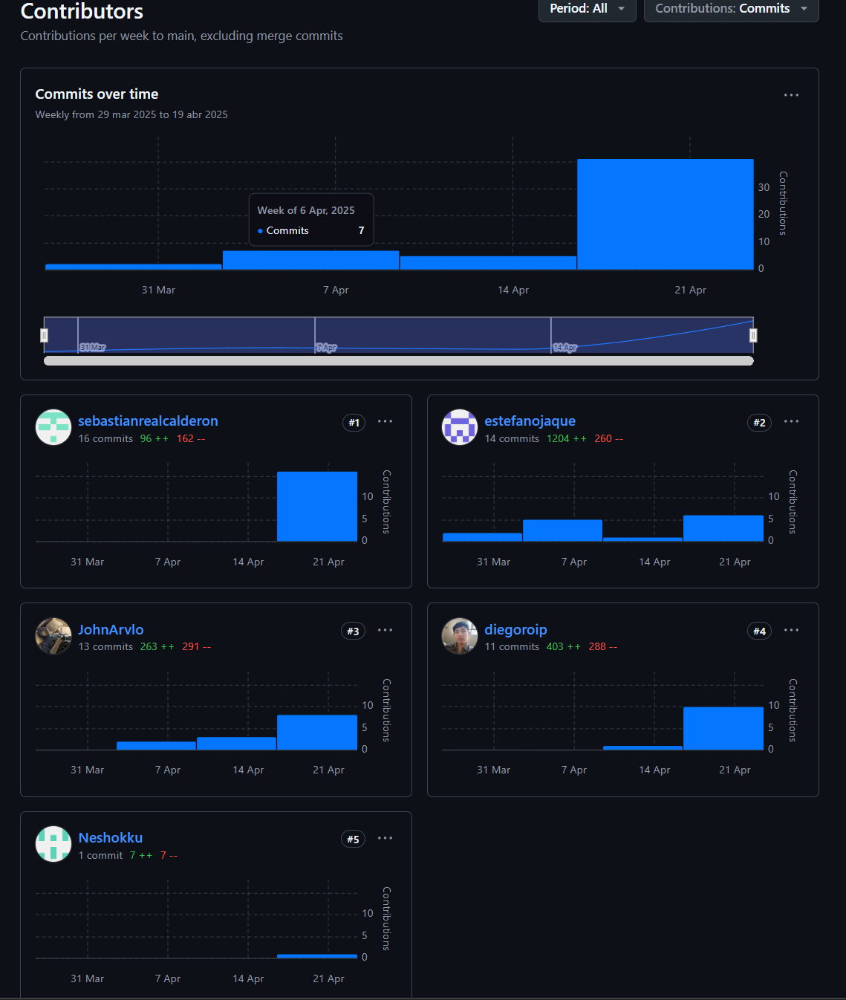

- Estefano Oscar Jaque Peña: 14
- Sebastian Omar Real Calderón:16
- John Telesforo Arevalo Meza: 13
- Diego Alonso Rosado Iporre: 11

TB1: 
|Integrante|Tarea Asignada|
|-|-|
|Jaque Peña, Estefano Oscar|Desarrollé el Lean UX Problem Statements,Lean UX Assumptions,Diseño de entrevistas,Coompetidores y Estrategias y tácticas frente a competidores, User Stories , Product Backlog|
| Sebastian Omar Real Calderón | Análisis de entrevistas, Registro de entrevista, Ubiquitous Language, Impact Mapping, Bounded Context Management |
| Arévalo Meza John | Desarrollé el Event Storming, antecedentes y problemática, startup profile, Domain Message Flows Modeling, Bounded Context Canvases, empathy mapping, User journey mapping y el registro de 1 entrevista para el segmento 1. |
| Rosado Iporre, Diego | Entrevistas, diagrama C4 ,as is ,to be , context mapping y  candidate context dicovery |

## Contenido

### Tabla de contenidos

  - [Student Outcome](#student-outcome)
  - [Capítulo I: Presentación](#capítulo-i-presentación)
    - [1.1. Startup Profile](#11-startup-profile)
      - [1.1.1. Descripción de la Startup](#111-descripción-de-la-startup)
      - [1.1.2. Perfiles de integrantes del equipo](#112-perfiles-de-integrantes-del-equipo)
    - [1.2. Solution Profile](#12-solution-profile)
      - [1.2.1. Antecedentes y problemática](#121-antecedentes-y-problemática)
      - [1.2.2. Lean UX Process](#122-lean-ux-process)
        - [1.2.2.1. Lean UX Problem Statements](#1221-lean-ux-problem-statements)
        - [1.2.2.2. Lean UX Assumptions](#1222-lean-ux-assumptions)
        - [1.2.2.3. Lean UX Hypothesis Statements](#1223-lean-ux-hypothesis-statements)
        - [1.2.2.4. Lean UX Canvas](#1224-lean-ux-canvas)
    - [1.3. Segmentos objetivo](#13-segmentos-objetivo)
  - [Capítulo II: Requirements Elicitation \& Analysis](#capítulo-ii-requirements-elicitation--analysis)
    - [2.1. Competidores](#21-competidores)
      - [2.1.1. Análisis competitivo](#211-análisis-competitivo)
      - [2.1.2. Estrategias y tácticas frente a competidores](#212-estrategias-y-tácticas-frente-a-competidores)
    - [2.2. Entrevistas](#22-entrevistas)
      - [2.2.1. Diseño de entrevistas](#221-diseño-de-entrevistas)
      - [2.2.2. Registro de entrevistas](#222-registro-de-entrevistas)
      - [2.2.3. Análisis de entrevistas](#223-análisis-de-entrevistas)
    - [2.3. Needfinding](#23-needfinding)
      - [2.3.1. User Personas](#231-user-personas)
      - [2.3.2. User Task Matrix](#232-user-task-matrix)
      - [2.3.3. User Journey Mapping](#233-user-journey-mapping)
      - [2.3.4. Empathy Mapping](#234-empathy-mapping)
      - [2.3.5. As-is Scenario Mapping](#235-as-is-scenario-mapping)
    - [2.4. Ubiquitous Language](#24-ubiquitous-language)
  - [Capítulo III: Requirements Specification](#capítulo-iii-requirements-specification)
    - [3.1. To-Be Scenario Mapping](#31-to-be-scenario-mapping)
    - [3.2. User Stories](#32-user-stories)
    - [3.3. Impact Mapping](#33-impact-mapping)
    - [3.4. Product Backlog](#34-product-backlog)
  - [Capítulo IV: Product Design](#capítulo-iv-product-design)
    - [4.1. Strategic-Level Domain-Driven Design.](#41-strategic-level-domain-driven-design)
      - [4.1.1. EventStorming.](#411-eventstorming)
        - [4.1.1.1. Candidate Context Discovery.](#4111-candidate-context-discovery)
        - [4.1.1.2. Domain Message Flows Modeling.](#4112-domain-message-flows-modeling)
        - [4.1.1.3. Bounded Context Canvases.](#4113-bounded-context-canvases)
      - [4.1.2. Context Mapping.](#412-context-mapping)
      - [4.1.3. Software Architecture.](#413-software-architecture)
        - [4.1.3.1. Software Architecture Context Level Diagrams.](#4131-software-architecture-context-level-diagrams)
        - [4.1.3.2. Software Architecture Container Level Diagrams.](#4131-software-architecture-context-level-diagrams)
        - [4.1.3.3. Software Architecture Deploymnet Diagrams.](#4133-software-architecture-deploymnet-diagrams)
    - [4.2. Tactical-Level Domain-Driven Design](#42-tactical-level-domain-driven-design)
      - [4.2.1. Bounded Context: IAM](#421-bounded-context-iam)
        - [4.2.1.1. Domain Layer](#4211-domain-layer)
        - [4.2.1.2. Interface Layer](#4212-interface-layer)
        - [4.2.1.3. Application Layer](#4213-application-layer)
        - [4.2.1.4. Infrastructure Layer](#4214-infrastructure-layer)
        - [4.2.1.5. Bounded Context Software Architecture Component Level Diagrams](#4215-bounded-context-software-architecture-component-level-diagrams)
        - [4.2.1.6. Bounded Context Software Architecture Code Level Diagrams](#4216-bounded-context-software-architecture-code-level-diagrams)
          - [4.2.1.6.1. Bounded Context Domain Layer Class Diagrams](#42161-bounded-context-domain-layer-class-diagrams)
          - [4.2.1.6.2. Bounded Context Database Design Diagram](#42162-bounded-context-database-design-diagram)
      - [4.2.2. Bounded Context: Application](#422-bounded-context-application)
        - [4.2.2.1. Domain Layer](#4221-domain-layer)
        - [4.2.2.2. Interface Layer](#4222-interface-layer)
        - [4.2.2.3. Application Layer](#4223-application-layer)
        - [4.2.2.4. Infrastructure Layer](#4224-infrastructure-layer)
        - [4.2.2.5. Bounded Context Software Architecture Component Level Diagrams](#4225-bounded-context-software-architecture-component-level-diagrams)
        - [4.2.2.6. Bounded Context Software Architecture Code Level Diagrams](#4226-bounded-context-software-architecture-code-level-diagrams)
          - [4.2.2.6.1. Bounded Context Domain Layer Class Diagrams](#42261-bounded-context-domain-layer-class-diagrams)
          - [4.2.2.6.2. Bounded Context Database Design Diagram](#42262-bounded-context-database-design-diagram)
      - [4.2.3. Bounded Context: Management](#423-bounded-context-management)
        - [4.2.3.1. Domain Layer](#4231-domain-layer)
        - [4.2.3.2. Interface Layer](#4232-interface-layer)
        - [4.2.3.3. Application Layer](#4233-application-layer)
        - [4.2.3.4. Infrastructure Layer](#4234-infrastructure-layer)
        - [4.2.3.5. Bounded Context Software Architecture Component Level Diagrams](#4235-bounded-context-software-architecture-component-level-diagrams)
        - [4.2.3.6. Bounded Context Software Architecture Code Level Diagrams](#4236-bounded-context-software-architecture-code-level-diagrams)
          - [4.2.3.6.1. Bounded Context Domain Layer Class Diagrams](#42361-bounded-context-domain-layer-class-diagrams)
          - [4.2.3.6.2. Bounded Context Database Design Diagram](#42362-bounded-context-database-design-diagram)
    - [5.1. Product Design](#51-product-design)
      - [5.1.1. Style Guidelines](#511-style-guidelines)
        - [5.1.1.1. General Style Guidelines](#5111-general-style-guidelines)
      - [5.1.2. Information Architecture](#512-information-architecture)
        - [5.1.2.1. Organization Systems](#5121-organization-systems)
        - [5.1.2.2. Labelling Systems](#5122-labelling-systems)
        - [5.1.2.3. SEO Tags and Meta Tags](#5123-seo-tags-and-meta-tags)
        - [5.1.2.4. Searching Systems](#5124-searching-systems)
        - [5.1.2.5. Navigation Systems](#5125-navigation-systems)
      - [5.1.3. Landing Page UI Design](#513-landing-page-ui-design)
        - [5.1.3.1. Landing Page Wireframe](#5131-landing-page-wireframe)
        - [5.1.3.2. Landing Page Mock-up](#5132-landing-page-mock-up)
      - [5.1.4. Mobile Applications UX/UI Design](#514-mobile-applications-uxui-design)
        - [5.1.4.1. Mobile Applications Wireframes](#5141-mobile-applications-wireframes)
        - [5.1.4.2. Mobile Applications Wireflow Diagrams](#5142-mobile-applications-wireflow-diagrams)
        - [5.1.4.3. Mobile Applications Mock-ups](#5143-mobile-applications-mock-ups)
        - [5.1.4.4. Mobile Applications User Flow Diagrams](#5144-mobile-applications-user-flow-diagrams)
        - [5.1.4.5. Mobile Applications Prototyping](#5145-mobile-applications-prototyping)
    - [6.1. Software Configuration Management](#61-software-configuration-management)
      - [6.1.1. Software Development Environment Configuration](#611-software-development-environment-configuration)
      - [6.1.2. Source Code Management](#612-source-code-management)
      - [6.1.3. Source Code Style Guide & Conventions](#613-source-code-style-guide--conventions)
      - [6.1.4. Software Deployment Configuration.](#614-software-deployment-condiguration)
    - [6.2. Landing Page, Services & Applications Implementation.](#62-landing-page--mobile-application-implementation)
      - [6.2.1. Sprint 1](#621-sprint-1)
        - [6.2.1.1. Sprint Planning 1.](#6211-sprint-planning-1)
        - [6.2.1.2. Sprint Backlog 1.](#6212-sprint-backlog-1)
        - [6.2.1.3. Development Evidence for Sprint Review.](#6213-development-evidence-for-sprint-review)
        -[6.2.1.4. Execution Evidence for Sprint Review.](#6214-execution-evidence-for-sprint-review)
        - [6.2.1.5. Services Documentation Evidence for Sprint Review.](#6215-services-documentation-evidence-for-sprint-review)
        - [6.2.1.6. Software Deployment Evidence for Sprint Review.](#6216-software-deployment-evidence-for-sprint-review)
        - [6.2.1.7. Team Collaboration Insights during Sprint.](#6217-team-collaboration-insights-during-sprint-1)
  - [Conclusiones](#conclusiones)
  - [Bibliografia](#bibliografia)
  - [Anexos](#anexos)

## Student Outcome

_ABET – EAC - Student Outcome 3_  
**Criterio:** Capacidad de comunicarse efectivamente con un rango de audiencias.

En el siguiente cuadro se describen las acciones realizadas y enunciados de conclusiones por parte del grupo, que permiten sustentar el haber alcanzado el logro del ABET - EAC - Student Outcome 7.

| Criterio especifico | Acciones Realizadas| Conclusiones|
| :-- | :-- | -- |
| 1. Actualiza conceptos y conocimientos necesarios para su desarrollo profesional y en especial para su proyecto en soluciones de software. |  **Estefano Oscar Jaque Peña** TB1: Al realizar las user stories pude aprender a profundidad la funcionalidad del aplicativo pensar a hacer a futuro , pude conocer mas a los segementos objetivos con las entrevistas y realizando el user persona , ademas con el lean UX procees puede ver las necesidades y beneficios del aplicativo **Diego Alonso Rosado Iporre**  TB1: Apliqué herramientas como entrevistas, wireframes y escenarios para identificar oportunidades clave del proyecto. Contribuí al diseño de la solución desde la comprensión del dominio hasta la arquitectura del software.  **John Arévalo Meza**  TB1: Realicé el registro de entrevistas, empathy mapping, user journey mapping, event storming y bounded context canvases, lo que permitió identificar claramente los bounded contexts, además de una mayor comprensión del dominio.  **Sebastián Omar Real Calderón** TB1: Apliqué análisis de entrevistas y modelado de dominios para entender las necesidades reales del proyecto. Mi contribución ayudó a traducir problemas complejos en requisitos claros para la solución de software.| **TB1:** El equipo demostró capacidad para integrar aprendizajes técnicos y metodologías ágiles en el desarrollo del proyecto. A través de la investigación y colaboración, se identificaron oportunidades clave para optimizar procesos mediante tecnología, reforzando la importancia de adaptarse continuamente a los requerimientos del contexto profesional.|
| 2. Reconoce la necesidad del aprendizaje permanente para el desempeño profesional y el desarrollo de proyectos en soluciones de software. | TB1:  **Estefano Oscar Jaque Peña** TB1:  Al realizar las user stories pude aprender a profundidad la funcionalidad del aplicativo pensar a hacer a futuro , pude conocer mas a los segementos objetivos con las entrevistas y realizando el user persona , ademas con el lean UX procees puede ver las necesidades y beneficios del aplicativo **Diego Alonso Rosado Iporre**  TB1: Entendí que el aprendizaje constante es esencial para enfrentar retos cambiantes. Este proyecto fortaleció mi motivación por seguir explorando enfoques modernos en desarrollo de software.  **Sebastián Omar Real Calderón** TB1: Reconozco que mantenerme actualizado con metodologías ágiles y técnicas de análisis es clave para desarrollar soluciones efectivas. Este proyecto reforzó mi compromiso con el aprendizaje continuo para abordar desafíos técnicos y de negocio. **John Telesforo Arevalo Meza** TB1: Comprendí que mantenerse a la vanguardía con metodologías y flujos de trabajos es importante, ya que nos permite eliminar posibles retrasos y aplicar conceptos anteriormente sabidos con el fin de mejorar el proyecto.  | **TB1:** El equipo evidenció la importancia de la formación continua en el ámbito profesional, aplicando nuevos conocimientos directamente al desarrollo del proyecto. Esta experiencia destacó cómo la adaptabilidad y la mejora constante son esenciales para entregar soluciones de software alineadas con las necesidades reales del mercado. |

## Capítulo I: Presentación

### 1.1. Startup Profile

### 1.1.1. Descripción de la Startup

Aventis es una startup innovadora creada por estudiantes de la Facultad de Ingeniería de la Universidad Privada de Ciencias Aplicadas (UPC), la cual ha desarrollado la aplicación móvil Scholr con el propósito de conectar a los apoderados o representantes de alumnos con oportunidades de becas ofrecidas por empresas privadas líderes. Bajo el contexto actual, donde el acceso a educación de calidad sigue siendo un desafío para muchas familias en el Perú y a nivel global, Scholr busca ser la plataforma que facilite el proceso de búsqueda y postulación a becas para estudiantes, además de brindar una herramienta de vanguardia para asi ayudar a las instituciones privadas que brindan las becas a gestionar las postulaciones y asi agilizar el proceso de estas.

Misión: Nuesta misión es democratizar el acceso a la educación, ofreciendo a las familias herramientas que faciliten la conexión con becas y programas educativos de empresas privadas. A través de Scholr, buscamos empoderar a los apoderados para que puedan tomar decisiones informadas sobre el futuro académico de sus hijos, apoyando el desarrollo profesional de jóvenes talentosos y contribuyendo a una sociedad más inclusiva.

Visión: Aspiramos a ser la principal plataforma de conexión entre apoderados y becas educativas ofrecidas por empresas privadas, siendo reconocidos por nuestra capacidad de facilitar el acceso a oportunidades educativas de calidad. Queremos convertirnos en el aliado estratégico de las familias que buscan asegurar el futuro académico de sus hijos, con soluciones innovadoras que respondan a las necesidades actuales y anticipen las tendencias del sector educativo. A través de Scholr, queremos crear un impacto positivo en la sociedad, mejorando las posibilidades de éxito y desarrollo de los jóvenes mediante el acceso a una educación superior accesible y apoyada por el sector privado.

### 1.1.2. Perfiles de integrantes del equipo

- Estefano Oscar Jaque Peña - U202225466

| 

 | Soy Estefano Oscar Jaque Peña, tengo 23 años y soy estudiante de la carrera de Ingeniería de Software,  una disciplina enfocada en el diseño, desarrollo y gestión de software para solucionar problemas  complejos. Desde temprana edad, he sentido fascinación por la tecnología y he buscado aprender  constantemente sobre las últimas tendencias en programación. He ampliado mis conocimientos a  través de cursos en Python, SQL, y C++, así como también explorando otros lenguajes de programación  por mi cuenta. Además, tengo habilidades en el uso avanzado de Excel para análisis de datos y gestión  de información. Mi experiencia trabajando en equipos me ha brindado habilidades de comunicación y  colaboración que considero fundamentales para contribuir de manera efectiva a proyectos innovadores  en el área de la Ingeniería de Software. |
|-|:-|

- John Telésforo Arévalo Meza - U202117377

| 
 
 | Soy John Arévalo, tengo 20 años y soy estudiante de la carrera de Ingeniería de Software. Tengo conocimiento en lenguajes de programación como python y c++, y bases de datos como SQLServer y MongoDB. Desde pequeño me sentí atraído por la tecnología, por lo que me decidí a estudiar la carrera, además disfruto de jugar videojuegos con amigos en mi tiempo libre. |
|:-|-|

- Sebastián Omar Real Calderón - U20221D964

| 
 
 | Soy Sebastián Real Calderón, tengo 19 años y soy estudiante de la carrera de Ingeniería de Software. Tengo conocimientos sobre lenguajes de programación como C++, C# y Java. Principalmente me dedico al desarrollo de proyectos que me permitan desarrollar mis habilidades de programación, tales como videojuegos o programas sencillos, ya que apunto a volverme desarrollador. Dentro de mis hobbies están los videojuegos, las series, el baile y el fútbol.
|-|:-|

- Diego Alonso Rosado Iporre - U201620127

| 
 
 | Mi nombre es Diego Rosado, tengo 25 años. Mi interés en las base de datos y arquitectura de páginas web me impulsó a estudiar Ingeniería de Software. Tengo conocimiento de lenguajes como C#, C++, JavaScript, Python, base de datos como MySQL y me atrae el diseño de páginas web con HTML y CSS. Me considero una persona positiva, tolerante y creativa. Mi aporte al grupo es mi total compromiso, apoyo mutuo y el esfuerzo por asegurar que todos tengamos una visión compartida del proyecto a elaborar. Mis habilidades son resolución de problemas, adaptabilidad, trabajo en equipo y toma de decisiones. |
|-|:-|

### 1.2. Solution Profile

### 1.2.1. Antecedentes y problemática

Los apoderados de estudiantes o posibles estudiantes enfrentan grandes desafíos cuando se trata de acceder a oportunidades educativas y de apoyo financiero. En particular, las familias tienen dificultades para encontrar información clara y actualizada sobre las becas ofrecidas por empresas privadas, lo que puede generar estrés y confusión durante el proceso de postulación. Por otro lado la mayoria de empresas privadas que brindan este tipo de ayudas, no cuentan con un sistema moderno, lo que puede ralentizar el proceso de postulación. Esta falta de una plataforma centralizada y fácil de usar para gestionar las becas agrava el problema, limitando las oportunidades para los estudiantes que necesitan apoyo financiero. Sin una herramienta eficaz que conecte a los apoderados con las becas disponibles, muchas oportunidades se pierden, y los estudiantes no logran acceder a los recursos que podrían mejorar su educación y futuro profesional.

**What?**

**¿Qué problema hay?**  
El principal problema radica en la falta de una plataforma centralizada y eficiente que permita a los apoderados gestionar de manera adecuada la búsqueda y postulación a becas ofrecidas por empresas privadas. A pesar de la creciente disponibilidad de becas, muchos apoderados tienen dificultades para encontrar información relevante, seguir plazos de inscripción y gestionar todas las etapas del proceso de postulación. Esta falta de organización y visibilidad incrementa el riesgo de perder oportunidades educativas y genera un alto nivel de estrés en las familias.

**¿Qué relación tiene el problema con el usuario/cliente?**  
Para los apoderados y estudiantes, este problema se traduce en una experiencia frustrante y desorganizada al intentar acceder a becas educativas. La falta de una plataforma unificada obliga a los apoderados a recorrer múltiples sitios web y fuentes de información, lo que genera una pérdida de tiempo valioso y aumenta el riesgo de no postular a las becas adecuadas o de perder fechas importantes.

**When?**

**¿Cuándo sucede el problema?**  
El problema se presenta durante todo el proceso de búsqueda, selección y postulación a becas. Desde el momento en que los apoderados comienzan a buscar opciones, hasta el seguimiento de los plazos y la gestión de los documentos necesarios. La falta de una plataforma centralizada y de fácil acceso agrava estos desafíos en cada fase del proceso.

**¿Cuándo utiliza el cliente el producto?**  
Los clientes utilizarán Scholr desde el momento en que comienzan a buscar oportunidades de becas, pasando por la postulación y hasta el seguimiento de los plazos y el estado de las solicitudes.

**Where?**

**¿Dónde ocurre el problema?**  
Este problema ocurre en cualquier lugar donde los apoderados buscan y gestionan becas, como en sus hogares, oficinas o durante desplazamientos. La falta de una plataforma eficiente hace que los usuarios deban consultar múltiples fuentes de información dispersas, lo que provoca desorganización y pérdida de tiempo.

**¿Dónde está el cliente cuando usa el producto?**  
Los clientes pueden usar Scholr en cualquier lugar con acceso a internet, como en casa, en el trabajo o durante viajes, utilizando dispositivos móviles que les permitan acceder a la plataforma de manera rápida y sencilla.

**Who?**

**¿Quiénes son los involucrados en este problema?**  
Los principales involucrados son los apoderados que buscan oportunidades educativas para sus hijos, así como los estudiantes que desean acceder a becas. También se ven afectadas las empresas privadas que ofrecen becas, ya que una plataforma más eficiente incrementaría su visibilidad y participación en los programas.

**¿Quiénes están afectados por el problema?**  
Los apoderados y los estudiantes son los principales afectados, ya que enfrentan dificultades para encontrar y gestionar becas. Las empresas que ofrecen becas también se ven afectadas, ya que una menor visibilidad de las oportunidades limita su alcance.

**Why?**

**¿Por qué ocurre el problema?**  
El problema ocurre debido a la dispersión de la información sobre becas a través de múltiples plataformas y la falta de una solución que centralice todas las oportunidades disponibles. Además, la gestión del proceso de postulación es ineficiente sin herramientas que organicen plazos, requisitos y estado de las solicitudes de manera clara y accesible.

**How?**

**¿En qué condiciones los clientes usan nuestro producto?**  
Los usuarios utilizan Scholr en un contexto de alta demanda, cuando necesitan organizar y gestionar múltiples solicitudes de becas. Los apoderados emplean la app durante todo el proceso de búsqueda, postulación y seguimiento de becas, lo que les permite mantenerse organizados y aprovechar al máximo las oportunidades disponibles.

**¿Cómo nos conocieron los compradores?**  
Los compradores potenciales conocen Scholr a través de recomendaciones de otros apoderados, marketing digital, colaboraciones con universidades y empresas que ofrecen becas, y contenidos informativos en redes sociales o blogs relacionados con el acceso a la educación.

**¿Qué llevó a la persona a llegar a esta situación?**  
Las personas llegaron a la situación de buscar una solución como Scholr debido a la falta de plataformas que centralicen de manera eficiente las becas disponibles, especialmente en el contexto de becas ofrecidas por empresas privadas. Muchos apoderados han enfrentado frustración por la dificultad de encontrar información actualizada, los plazos vencidos y la escasa organización del proceso de postulación. Buscan una herramienta que les permita acceder a todas las becas en un solo lugar, simplificar la gestión de los documentos y plazos, y garantizar que sus hijos no pierdan oportunidades educativas clave debido a la falta de una estructura clara.

**How much?**

**¿Cuánto cuesta este problema?**  
La falta de acceso eficiente a becas puede resultar en una oportunidad educativa perdida. En América Latina, un 60% de los estudiantes no están al tanto de las becas disponibles, lo que les impide aprovechar oportunidades clave para su desarrollo académico. Además, los apoderados pueden invertir hasta 10-15 horas mensuales buscando y gestionando becas, lo que se traduce en una pérdida significativa de tiempo y recursos.

Los costos operativos también se ven incrementados significativamente. Sin una herramienta adecuada para gestionar las becas, las familias pueden enfrentar gastos adicionales asociados con la búsqueda de información, la recopilación de documentación y el seguimiento manual de las fechas límite. Un análisis de estudios sobre el tema indica que, en promedio, las personas que no utilizan plataformas de gestión adecuadas pierden hasta un 30% de oportunidades debido a la falta de seguimiento eficiente.

### 1.2.2. Lean UX Process

El proceso Lean UX se adapta especialmente bien a startups como Aventis que buscan crear soluciones innovadoras y efectivas en el mercado. Este enfoque se caracteriza por su agilidad y centrado en el usuario, lo que significa que estamos constantemente buscando validar nuestras ideas y prototipos con los usuarios para garantizar que estamos abordando sus necesidades de manera adecuada.

### 1.2.2.1. Lean UX Problem Statements

El aplicativo móvil Scholr busca centralizar y simplificar el proceso de postulación a becas educativas ofrecidas por empresas privadas y ONGs en Perú, permitiendo a los trabajadores de estas acceder a oportunidades de financiamiento educativo de manera ágil y transparente.
Hemos identificado que Los trabajadores de empresas privadas u ONGs enfrentan dificultades para encontrar, comparar y aplicar a convocatorias de becas para sus hijos debido a la dispersión de información, requisitos complejos y plazos poco claros, lo que reduce sus posibilidades de acceder a beneficios educativos para su familia.
¿Cómo podríamos optimizar el proceso de búsqueda y postulación a becas dirigidas a hijos de trabajadores, para que los padres/apoderados aumenten sus oportunidades de éxito y reduzcan las barreras de acceso a la información?

### 1.2.2.2. Lean UX Assumptions

Assumptions:

1. Creo que mis clientes necesitan un acceso centralizado y simplificado a convocatorias de becas educativas en Perú.

2. Estas necesidades se pueden resolver con una plataforma móvil que agrupe, filtre y notifique oportunidades de becas según el perfil del usuario.

3. Mis clientes iniciales son padres o apoderados (trabajadores de empresas/ONGs) que buscan becas educativas para sus hijos en edad escolar o universitaria.

4. El valor #1 es garantizar que los padres encuentren becas compatibles con el perfil académico de sus hijos y postulen a tiempo, sin perder oportunidades por desconocimiento o trámites engorrosos.

5. El cliente también puede obtener estos beneficios adicionales: asesoría personalizada(atencion al cliente) y recordatorios de plazos(notificaciones).

6. Voy a adquirir la mayoría de mis clientes a través de alianzas con Empresas Privadas y ONGs, redes sociales (Facebook, Instagram, LinkedIn) y recomendaciones de usuarios satisfechos.

7. Haré dinero a través de comisiones por becas gestionadas con éxito y publicidad.

8. Mi competencia principal en el mercado será portales educativos genéricos y plataformas de empleo que incluyen secciones de becas.

9. Los venceremos debido a nuestra especialización en becas peruanas, interfaz intuitiva y herramientas de seguimiento de postulaciones.

10. Mi mayor riesgo de producto es que las instituciones no actualicen sus convocatorias a tiempo o que los usuarios no confíen en la veracidad de la información.

11. Resolveremos esto a través de alianzas formales con las empresas y ONGs oferentes, además de un sistema de verificación en tiempo real.

12. ¿Quién es el usuario?
Los usuarios principales son padres/apoderados (trabajadores de empresas/ONGs) que gestionan becas para sus hijos. Los usuarios secundarios son administradores de becas en esas instituciones.

13. ¿Dónde encaja nuestro producto en su trabajo o vida?
Scholr se integra en la vida de , facilitando su acceso a oportunidades educativas y eliminando las barreras de tiempo y complejidad en el proceso de postulación a becas.

14. ¿Qué problemas tiene nuestro producto y cómo se pueden resolver?
Falta de claridad sobre qué becas son exclusivas para hijos de trabajadores, y dificultad para comprobar el vínculo padre-empresa/hijo-estudiante.

15. ¿Cuándo y cómo es usado nuestro producto?
El producto se usa principalmente durante períodos de búsqueda activa de becas (inicios de semestre, fin de año) y durante el proceso de postulación. Los usuarios acceden a través de la app móvil para consultar oportunidades, subir documentos y recibir notificaciones.

16. ¿Qué características son importantes?
Las características clave incluyen: un buscador inteligente de becas que puedan ser filtradas, alertas personalizadas respecto a la beca que buscas, seguimiento de postulaciones y tutoriales para completar requisitos. 

17. ¿Cómo debe verse nuestro producto y cómo debe comportarse?
Scholr debe tener un diseño limpio y profesional, con colores institucionales (azules/blancos) que inspiren confianza. Debe ser rápido en cargar información actualizada, con una navegación intuitiva y funciones claras para postular en pocos pasos. El comportamiento debe ser proactivo (notificaciones útiles) pero no intrusivo.

Business Outcomes:

- Incrementar en un 40% el número de postulaciones exitosas a becas mediante la plataforma en el primer año.

- Lograr que el 70% de los usuarios recurran a Scholr como principal fuente de información sobre becas educativas en Perú.

- Establecer alianzas con al menos 6 empresas y ONGs para integrar sus convocatorias de manera exclusiva.

- Posicionar la app entre las 3 plataformas más descargadas en educación en Perú durante los primeros 18 meses.

User Outcomes:

- Encontrar todas las becas disponibles que coincidan con mi perfil académico en un solo lugar.

- Simplificar el proceso de postulación con guías paso a paso y recordatorios de plazos importantes.

- Recibir alertas personalizadas sobre nuevas convocatorias que se ajusten a mis intereses y necesidades.

- Ahorrar tiempo y esfuerzo al gestionar múltiples postulaciones de manera centralizada y organizada.

- Aumentar mis posibilidades de obtener una beca gracias a información actualizada y herramientas de seguimiento.

### 1.2.2.3. Lean UX Hypothesis Statements

- **Hipótesis 1 (Enfoque: Postulaciones exitosas)**  
  *Creemos que* al centralizar y simplificar el proceso de postulación a becas en una sola plataforma *Sabremos que hemos tenido éxito cuando* el 40% de padres/trabajadores que usan Scholr logren postular a becas para sus hijos (vs. 10% en el método tradicional) en el primer año.

- **Hipótesis 2 (Enfoque: Fuente principal de información)**  
  *Creemos que* ofrecer información verificada y actualizada sobre becas en tiempo real *Sabremos que hemos tenido éxito cuando* el 70% de trabajadores de empresas aliadas usen Scholr como canal oficial para becas familiares.

- **Hipótesis 3 (Enfoque: Alianzas estratégicas)**  
  *Creemos que* al formalizar alianzas con empresas y ONGs para integrar sus convocatorias de manera exclusiva *Sabremos que hemos tenido éxito cuando* al menos 6 empresas/ONGs integren sus programas de becas familiares en Scholr con validación automática de empleados.

- **Hipótesis 4 (Enfoque: Posicionamiento en el mercado)**  
  *Creemos que* al optimizar la experiencia del usuario con funciones intuitivas y notificaciones personalizadas *Sabremos que hemos tenido éxito cuando* Scholr se ubique como App #1 en becas corporativas/familiares en Perú.

### 1.2.2.4. Lean UX Canvas

| Sección | Contenido |
|---------|-----------|
| **Business Problem** | Padres/trabajadores de empresas/ONGs no encuentran becas educativas para sus hijos de manera ágil, o pierden oportunidades por trámites complejos y falta de información centralizada. |
| **Business Outcomes** | - 40% de padres/trabajadores logran postular exitosamente para sus hijos - 70% de trabajadores de empresas aliadas usan Scholr como canal principal - 6+ empresas/ONGs integran sus becas familiares - Posicionarse como app líder en becas corporativas |
| **Users and Customers** | Trabajadores de empresas privadas y ONGs (padres/apoderados) que buscan becas para sus hijos en edad escolar/universitaria. |
| **User Benefits** | - Acceso a becas exclusivas para hijos de colaboradores - Validación automática del vínculo padre-empresa - Postulación simplificada con documentos prevalidados (credencial laboral + notas del hijo) |
| **Solution Ideas** | - Filtro "Becas para hijos de trabajadores de [tu empresa]" - Integración con RRHH para verificación de empleo - Sección de "Becas patrocinadas por tu empleador" - Alertas personalizadas por perfil académico del hijo |
| **Hypotheses** | 1. Postulaciones exitosas aumentarán 40% 2. 70% adoptarán Scholr como canal principal 3. 6+ alianzas con instituciones 4. Liderazgo en becas familiares |
| **What's the most important thing we need to learn first?** | - Necesidades reales de padres/trabajadores - Barreras actuales en postulaciones familiares - Requisitos de empresas/ONGs para integrar sus programas |
| **What's the least amount of work we need to do to learn the next most important thing?** | - Entrevistas con padres trabajadores - Reuniones piloto con departamentos de RRHH - Pruebas de concepto con 1-2 empresas aliadas |

### 1.3. Segmentos objetivo

**Segmento objetivo 1: Padres trabajadores (empleados/colaboradores de empresas y ONGs):**  
Descripción:  
Trabajadores formales de empresas medianas/grandes o ONGs en Perú, con hijos en edad escolar o universitaria, que buscan acceder a becas educativas exclusivas para familiares de empleados.  

Necesidades:  
- Encontrar información confiable y actualizada sobre becas disponibles para sus hijos.

- Simplificar el proceso de postulación (especialmente para acreditar su vínculo laboral).

- Evitar perder oportunidades por plazos desconocidos o requisitos poco claros.

Aspiraciones:

- Garantizar la mejor educación posible para sus hijos sin asumir costos elevados.

- Sentir que su empleador les ofrece beneficios valiosos y fáciles de usar.

- Reducir el estrés y tiempo invertido en trámites burocráticos.

**Segmento objetivo 2: Coordinadores de bienestar laboral/RSE (en empresas y ONGs):**    
Descripción:  
Profesionales en departamentos de RRHH, Bienestar o Responsabilidad Social, encargados de gestionar programas de becas educativas para hijos de empleados.  

Necesidades:  

- Mejorar la comunicación interna sobre beneficios disponibles.  

- Generar métricas claras sobre el impacto de los programas de becas.  

Aspiraciones:  

- Posicionar a su organización como un empleador socialmente responsable.  

- Implementar soluciones escalables que ahorren tiempo y recursos.  

- Demostrar el valor de los programas de bienestar a la alta dirección.  

## Capítulo II: Requirements Elicitation & Analysis

### 2.1. Competidores

- SABE :  
El Sistema de Administración de Beneficios Educativos, se trata de una plataforma creada por la institución Escalo sin fines de lucro. La plataforma se encarga de apoyar en la gestión de postulantes y beneficiarios para becas privadas.

- Pronabec APP:  
La plataforma del programa nacional de becas y crédito educativo del gobierno peruano que se encarga de facilitar la postulación a diferentes becas o ayudas económicas.

- Universia:  
Se trata de una red de universidades de Iberoamérica con un programa de becas y ayudas económicas para estudiantes

### 2.1.1. Análisis competitivo

Competitive Analysis Landscape

¿Por qué llevar a cabo este análisis?  
Para poder tener un análisis completo sobre nuestro modelo de negocio además de poder comprender a nuestros competidores.

| Nombre de  los Startups   o Empresas | | Scholr | SABE | Pronabec App | Universia |
| -- | -- | -- | -- | -- | -- |
| *Perfil* | *Overview*                                                      |                                                                                                                                                                                         | Es una plataforma sin fines de lucro que busca apoyar a la gestión de postulantes y beneficiarios para becas y ayudas económicas.                                                                                                                                                                                                                                                | Es una aplicación para el programa del gobierno peruano que facilita la postulación a las becas o ayudas económicas para los estudiantes de bajos recursos.                                                                                                                                | Una red de universidades con conexiones en iberoamérica que cuenta con un programa de becas y ayudas económicas para estudiantes.                                                                                                                                |
| | *Ventaja competitiva* | | - Alianzas con más de 100 instituciones. - Asesoría personalizada gratuita. | - Oficialidad (aval del Estado peruano). - Becas 100% financiadas. | - Alcance global. - Convenios con empresas para empleabilidad. |
| *Perfil de Marketing* | *Mercado Objetivo* | | - Universitarios peruanos de bajos recursos. - Becas parciales/totales. | - Estudiantes peruanos (secundaria, técnicos, universitarios). | - Estudiantes iberoamericanos (pregrado/postgrado). |
| | *Estrategias de Marketing* | | - Charlas en universidades públicas. - Campañas en Facebook/Instagram. | - Publicidad en TV y radios nacionales. - Ferias "Beca 18". | - Webinars con universidades top. - Newsletter con oportunidades. |
| *Perfil del producto* | *Productos/servicios* | | - Buscador de becas. - Talleres de postulación. - Mentorías. | - Postulación en línea. - Resultados en tiempo real. | - Buscador de becas, más de 20,000 opciones. - Cursos de preparación. |
| | *Precios y Costos* | | Gratuito (financiado por donaciones). | Gratuito (fondos públicos). | Gratuito (patrocinio Santander). |
| | *Canales* | | Web + WhatsApp Business. | App móvil (iOS/Android) + web. | Web + app (funcionalidades limitadas). |
| *Análisis SWOT* | *Fortalezas*                                                    | | - Modelo sin fines de lucro genera confianza. - Enfoque en acompañamiento integral. | - Respaldo institucional del gobierno. - Cobertura nacional. | - Red internacional consolidada. - Diversidad de opciones académicas. |
| | *Debilidades* | | - Solo cubre Perú. - Depende de donantes. | - Requisitos burocráticos. - Saturación en convocatorias. | - Becas principalmente para posgrado. |
| | *Oportunidades* | | - Ampliar modelo a otros países andinos. | - Implementar Inteligencia Artificial. | - Alianzas con gobiernos locales. |
| | *Amenazas* | | - Competencia de plataformas con más recursos. - Cambios en políticas de donaciones. | - Cambios políticos afectan presupuesto. | - Reducción de fondos. |

### 2.1.2. Estrategias y tácticas frente a competidores

### Estrategias y Tácticas frente a Competidores
#### Enfoque en Apoderados
Nuestra plataforma tiene un enfoque  en los apoderados de los estudiantes que se benefician de las becas, promocionándose principalmente en charlas en las empresas en las que laboran.
#### Simplificación para empresas
La plataforma pretende ofrecer el servicio para que las empresas privadas puedan publicar sus becas y filtrar postulantes de forma sencilla, y sin verse obstaculizadas por procesos democráticos.
#### Cercanía y Confianza
Planeamos crear colaboraciones con Asociaciones de Madres y Padres para un mayor alcance, para una difusión más orgánica de nuestro servicio. Asimismo, planeamos usar las redes sociales como un principal método de difusión.

### 2.2. Entrevistas

En esta sección del informe se realizará el diseño, registro y análisis de las entrevistas de nuestros segmentos objetivos

### 2.2.1. Diseño de entrevistas

Segmentos encontrados:

- Padres Trabajadores (Empleados/Colaboradores)

- Coordinadores de Bienestar Laboral/RSE

Antes de poder realizar las entrevistas, consideramos prudente poder concretar un análisis previo para poder realizar las entrevistas de una mejor manera. Es por ello, que para cada uno de nuestros segmentos proponemos estas preguntas para poder conocer un poco más sobre nuestro público objetivo.

Preguntas :
preguntas ordenadas para entrevistar a los dos segmentos objetivos de la startup "Scholr  ":

**Segmento: Padres Trabajadores (Empleados/Colaboradores)**

**Principales:**

1. **Acceso a información**: ¿Cómo se entera actualmente de las becas educativas que ofrece su empresa/ONG para sus hijos? ¿Qué dificultades ha tenido para encontrar información clara sobre requisitos, plazos o beneficios?
2. **Proceso de postulación**: ¿Qué parte del trámite de solicitud de becas le resulta más complicada (ej: adjuntar documentos, acreditar vínculo laboral)? ¿Ha perdido alguna oportunidad de beca por no cumplir un plazo o requisito que no conocía?
3. **Experiencia con beneficios laborales**: ¿Cómo calificaría la facilidad de uso de los beneficios educativos que ofrece su empleador (ej: becas, descuentos)? ¿Qué cambiaría para que el proceso fuera más sencillo?
4. **Sobre el proceso actual de proceso de beca**: Cuando postula a una beca para su hijo, ¿qué tan fácil o difícil le resulta comprobar su vínculo laboral con la empresa/ONG? ¿Ha tenido que repetir el mismo trámite en diferentes plataformas para postular a varias becas? ¿Le gustaría unificar ese proceso?
5. **Tecnología y usabilidad**: Si su empleador le ofreciera una app móvil para gestionar becas, ¿qué tan dispuesto estaría a usarla en lugar de los métodos actuales (ej: formularios en papel, correos)? ¿Qué tipo de soporte técnico esperaría si tiene problemas al usar una plataforma de becas?
6. **Beneficios percibidos**: Además de la beca en sí, ¿qué otro valor le gustaría recibir? (Ej: asesoría educativa, alianzas con colegios, descuentos en útiles)
7. **Consideraciones de Seguridad**: ¿Qué tan preocupado/a está por la protección de los datos personales de su hijo/a al subirlos a una plataforma digital? ¿Qué medidas de seguridad esperaría? Si su empleador le pidiera compartir documentos sensibles (ej: boletines de notas, DNI) a través de una app, ¿qué le daría confianza para hacerlo?
8. **Disposición a Colaborar**: Si su empleador lanzara una plataforma de becas en fase inicial, ¿estaría dispuesto/a a probarla y dar feedback a cambio de acceso prioritario?

**Complementarias:**

1. **Expectativas de una solución digital**: ¿Usaría una app móvil o web donde pueda ver todas las becas disponibles para sus hijos, con recordatorios de plazos y requisitos? ¿Qué funcionalidad le gustaría que tuviera (ej: subir documentos desde el celular, chat de soporte)?
2. **Confianza y seguridad**: ¿Qué le daría más seguridad al usar una plataforma de becas vinculada a su empleador (ej: verificación en dos pasos, respaldo de RRHH)?

**Segmento: Coordinadores de Bienestar Laboral/RSE**

**Principales:**

1. **Gestión actual de becas**: ¿Cómo manejan hoy las postulaciones a becas para hijos de empleados (ej: correos, formularios físicos, Excel)? ¿Qué porcentaje de su tiempo dedican a tareas repetitivas (ej: verificar documentos, responder consultas)?
2. **Pesar administrativo**: ¿Cuáles son los 3 mayores cuellos de botella en el proceso de asignación de becas? ¿Han tenido problemas con postulaciones incompletas o fuera de plazo?
3. **Comunicación interna**: "¿Cómo informan a los empleados sobre las becas disponibles? ¿Sienten que el mensaje llega efectivamente?
4. **Gestión y métricas**: Hoy, ¿cómo miden el impacto de sus programas de becas? ¿Reciben retroalimentación de los empleados beneficiados?, ¿Qué porcentaje de postulaciones rechazan por errores en documentos o fuera de plazo? ¿Cómo podría reducirse?
5. **Integración y seguridad**: ¿Tienen problemas para validar automáticamente la elegibilidad de los empleados (ej: antigüedad, tipo de contrato)? ¿Qué políticas de seguridad de datos exigen al almacenar información sensible (ej: documentos de hijos)?
6. **Adopción organizacional**: ¿Qué departamentos (ej: Legal, TI) suelen frenar la implementación de nuevas herramientas? ¿Cómo lo manejan?
7. **Seguridad y Privacidad**: ¿Su empresa tiene políticas específicas para el manejo de datos de familiares de empleados (ej: regulaciones GDPR o locales)? ¿Cómo las cumplen hoy?, ¿Rechazarían una solución en la nube por temas de seguridad? ¿O preferirían un sistema on-premise?
8. **Disposición a Colaborar**: ¿Estarían abiertos a trabajar con un proveedor externo para personalizar la herramienta según sus flujos internos? ¿Qué recursos podrían aportar (ej: tiempo de su equipo, datos de prueba)?, ¿Cómo manejarían la resistencia al cambio en empleados que prefieran métodos tradicionales?
9. **Visión Futura**: ¿Cómo medirían el éxito de una plataforma de becas después de 1 año de uso? (Ej: % de empleados satisfechos, tiempo ahorrado en gestión) 

**Complementarias:**

1. **Solución ideal**: ¿Qué características priorizaría en una plataforma digital para gestionar becas (ej: dashboard de postulantes, integración con nómina)? 
2. **Inversión y adopción**: ¿Qué presupuesto suelen asignar a herramientas que optimicen estos procesos? ¿Qué obstáculos ven para implementar una solución digital (ej: resistencia al cambio, seguridad de datos)?

Estas preguntas están diseñadas para llevar la conversación de manera lógica y ordenada, desde la comprensión del problema actual hasta la exploración de soluciones y colaboraciones futuras.

### 2.2.2. Registro de entrevistas

**Segmento 1: Padres Trabajadores (Empleados/Colaboradores)**

1. Entrevista 1:  
   Datos del entrevistado  
   Nombre: Oscar  
   Apellidos: Jaque Huerta 
   Edad: 49  
   Distrito: Los Olivos  

Link de entrevista : [https://drive.google.com/file/d/1z7yWYeRh9HBRBOg6GvJrI5mW5n_ghVA9/view?usp=sharing](https://drive.google.com/file/d/1z7yWYeRh9HBRBOg6GvJrI5mW5n_ghVA9/view?usp=sharing)

Inicio: 0:00 
Duracion: 8:48

Resumen: 
Oscar Jaque Huerta, trabajador de 49 años en Backus, compartió su vivencia como padre al gestionar las becas por excelencia académica que la empresa ofrece para sus hijos. Destacó que uno de los principales retos es la dispersión de la información, así como la poca claridad en los requisitos y fechas límite del proceso. Mencionó que la postulación puede volverse complicada debido a la repetición de trámites, como acreditar su vínculo laboral en diferentes plataformas, además de la carga manual de documentos. En varias ocasiones ha perdido la oportunidad de postular por no conocer ciertos requisitos específicos o por desconocer las fechas clave. Si bien valora mucho este beneficio, considera que sería más accesible si existiera una herramienta digital que centralice el proceso, permita subir documentos desde el celular, envíe recordatorios automáticos y cuente con un canal de soporte eficiente.

2.  Entrevista 2:  
    Datos del entrevistado  
    Nombre: Isabel 
    Apellidos: Ríos 
    Edad: 37  
    Distrito: Pueblo Libre  

Link de entrevista : [https://drive.google.com/file/d/19c-xodTnZrWXuZNAd_Uqw-bGU5h_Yy0a/view?usp=drive_link](https://drive.google.com/file/d/19c-xodTnZrWXuZNAd_Uqw-bGU5h_Yy0a/view?usp=drive_link)

Inicio: 0:00 
Duracion: 5:28

Resumen: 
Isabel asistente administrativa en Industrias Andinas S.A., compartió su experiencia como madre trabajadora en la gestión de becas educativas para su hijo. Identificó como principal dificultad la dispersión de la información y la falta de claridad en los requisitos y plazos. El proceso de postulación resulta complejo por la necesidad de repetir trámites como la acreditación de vínculo laboral en distintas plataformas, así como por la carga manual de documentos. Ha perdido oportunidades por no conocer fechas límite o requisitos específicos. Señaló que los beneficios son valorados, pero difíciles de usar debido a la falta de una herramienta centralizada. Considera que una plataforma digital podría agilizar el proceso si incluye recordatorios automáticos, posibilidad de cargar documentos desde el celular y un canal de soporte.

**Segmento 2: Coordinadores de Bienestar Laboral/RSE**

1.  Entrevista 1:  
    Datos del entrevistado  
    Nombre: Lourdes  
    Apellidos: Huamani Vasquez 
    Cargo: Coordinadora de RSE y Bienestar Laboral 
    Experiencia: 3 años gestionando becas para 300 colaboradores 
    Edad: 27  
    Distrito: Los Olivos  

Link de entrevista : [https://drive.google.com/file/d/1Z55__pbvuMZ4kC79pfcWfCwCs8alKu8k/view?usp=sharing](https://drive.google.com/file/d/1Z55__pbvuMZ4kC79pfcWfCwCs8alKu8k/view?usp=sharing)

Inicio: 0:12 
Duracion: 11:45

Resumen: 
Lourdes Huamani, Coordinadora de RSE y Bienestar Laboral en Grupo Horizonte, compartió su experiencia gestionando becas educativas para hijos de colaboradores, revelando una problemática central: el proceso actual es completamente manual, lo que genera pérdida de oportunidades y sobrecarga en RR.HH. Los empleados deben enviar documentos por correo o en físico, llenar formularios en Word y seguir instrucciones poco claras, lo que se traduce en errores frecuentes, documentos ilegibles y una gestión desordenada. Aproximadamente el 70% del tiempo del equipo se dedica a tareas repetitivas como validación de documentos y atención de consultas, mientras que el 50% de las postulaciones son rechazadas por errores o por presentarse fuera de plazo. Además, identificó como principales cuellos de botella la validación manual, la falta de comunicación clara y la mala coordinación con otras áreas. La difusión de las becas es inefectiva, con correos poco leídos y ausencia de un canal centralizado de información. Lourdes considera que una solución digital podría mejorar significativamente el proceso si incluye validación automática de documentos, recordatorios inteligentes y plantillas visuales, siempre que se respeten políticas estrictas de seguridad de datos. Estarían abiertos a colaborar con un proveedor externo, iniciando con una prueba piloto y evaluando el impacto en ahorro de tiempo y satisfacción del personal. Reconoce como posibles obstáculos la resistencia al cambio, preocupaciones sobre la privacidad y la falta de habilidades digitales en algunos colaboradores.

2.  Entrevista 2:  
    Datos del entrevistado  
    Nombre: Maria Pía 
    Apellidos: Tejada 
    Edad: 38  
    Distrito: Miraflores  

Link de entrevista : [https://drive.google.com/file/d/1sjZi95xLPCam7giprGC7reAFExzH_G5E/view?usp=sharing](https://drive.google.com/file/d/1sjZi95xLPCam7giprGC7reAFExzH_G5E/view?usp=sharing)

Inicio: 0:05 
Duracion: 7:41

Resumen: 
Durante la entrevista con María, Directora del Programa de Becas de "Futuros Brillantes Perú", quedó claro que la ONG enfrenta desafíos únicos en la gestión de becas: procesos manuales caóticos (con postulaciones vía WhatsApp y fotos de documentos), falta de acceso estable a internet en comunidades vulnerables, y dificultad para verificar datos socioeconómicos. "El 70% de nuestro tiempo se va en verificar documentos uno por uno, y aun así, el 30% de postulaciones se rechazan por errores evitables", explicó María. La ONG necesita urgentemente una solución tecnológica simple y accesible —funcional sin conexión estable, que acepte documentos desde móviles básicos y priorice la protección de datos sensibles—, pero con un costo adaptado a su limitado presupuesto. El éxito para ellos se mediría en aumentar el alcance sin complicar el proceso, manteniendo el enfoque humano que caracteriza su labor. Esta conversación refuerza la necesidad de que Scholr desarrolle herramientas inclusivas, pensadas para realidades donde la tecnología es un puente, no una barrera.

### 2.2.3. Análisis de entrevistas

**Análisis Segmento 1: Padres Trabajadores (Empleados/Colaboradores)**

Las entrevistas con empleados como Isabel evidencian que los principales desafíos en la gestión de becas son la información dispersa que genera confusiones y pérdida de oportunidades, los trámites repetitivos como la acreditación laboral múltiple, y los procesos manuales que consumen tiempo valioso. A pesar de valorar estos beneficios, la ausencia de una plataforma centralizada dificulta su aprovechamiento. Los padres requieren urgentemente un sistema digital intuitivo con recordatorios automáticos, capacidad para subir documentos desde celulares y un canal de soporte ágil. Estos hallazgos reflejan directamente las necesidades identificadas por los coordinadores de bienestar, demostrando que la solución ideal debe simplificar el proceso tanto para los empleados como para los administradores. La clave del éxito radicará en crear una herramienta que elimine la burocracia innecesaria sin sacrificar la accesibilidad para usuarios con distintos niveles de habilidad digital.

**Análisis Segmento 2: Coordinadores de Bienestar Laboral/RSE**

Las entrevistas con Lourdes Huamani (Grupo Horizonte) y María Pía Tejada (Futuros Brillantes Perú) revelan que, aunque operan en contextos distintos (corporativo vs. ONG), ambos enfrentan desafíos similares por su dependencia de procesos manuales: pérdida de tiempo (70% en tareas repetitivas), altas tasas de rechazo (30-50% por errores) y falta de canales claros de comunicación. En el ámbito corporativo, los principales obstáculos son la resistencia al cambio y preocupaciones sobre privacidad, mientras que la ONG lucha con limitaciones tecnológicas en comunidades vulnerables (conexión inestable, dispositivos básicos). Sin embargo, coinciden en que una solución digital podría transformar sus operaciones si prioriza la usabilidad: Grupo Horizonte necesita automatización de validaciones e integración con RR.HH, y la ONG requiere funcionalidad offline y bajo costo. Esto plantea una oportunidad clave para Scholr: desarrollar una plataforma modular que ofrezca versiones adaptadas a cada realidad, comenzando con pilotos que demuestren reducción de tiempo (corporativo) y mayor alcance (ONG), acompañados de capacitación para garantizar adopción. La viabilidad del proyecto dependerá de su capacidad para balancear sofisticación técnica con simplicidad, sin perder de vista las brechas digitales existentes.

### 2.3. Needfinding

### 2.3.1. User Personas

**Segmento 1: Carlos (Trabajador apoderado/padre de familia)** 

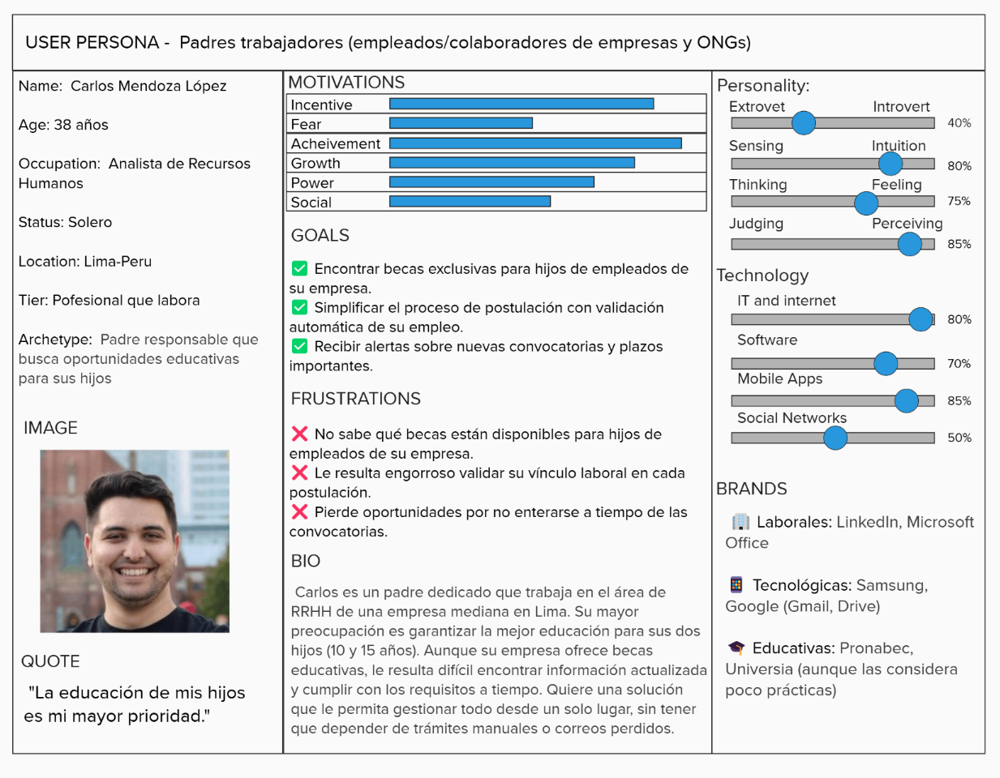

**Segmento 2: Luis (Administrador de becas de una empresa privada)** 

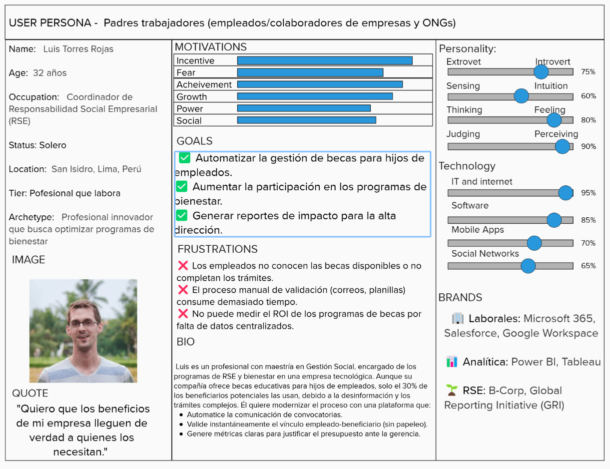

ANEXO A

### 2.3.2. User Task Matrix

**Perfiles Analizados**  
1. **Carlos Mendoza (Padre Trabajador)**  
2. **Luis Torres (Coordinador de RSE/Bienestar Laboral)**  

| **Tarea** | **Carlos Frecuencia** | **Carlos Importancia** | **Luis Frecuencia** | **Luis Importancia** |  
|-----------|----------------------|----------------------|---------------------|---------------------|  
| **Buscar becas compatibles con el perfil de su hijo** | Semanal | Alta | Mensual | Media |  
| **Postular a becas (cargar documentos, completar formularios)** | Mensual (en períodos de convocatorias) | Alta | A veces (revisa procesos) | Alta |  
| **Recibir notificaciones sobre plazos y requisitos** | Semanal | Alta | Mensual | Media |  
| **Validar vínculo laboral para becas exclusivas** | Por postulación | Alta | A menudo (gestiona validaciones) | Alta |  
| **Consultar el estado de postulaciones** | Semanal | Alta | Mensual | Media |  
| **Comparar becas disponibles (beneficios, requisitos)** | Mensual | Alta | A veces (para informar a empleados) | Media |  
| **Gestionar alertas personalizadas por perfil académico** | Semanal | Alta | A veces (configura para empleados) | Media |  
| **Generar reportes de postulaciones (solo Luis)** | - | - | Mensual | Alta |  
| **Comunicar becas disponibles a empleados (solo Luis)** | - | - | Mensual | Alta |  
| **Validar datos de empleados para becas (solo Luis)** | - | - | Semanal | Alta |  

**Análisis de Tareas Críticas**  

 **Para Carlos (Padre Trabajador)**  
- **Tareas de Alta Frecuencia e Importancia:**  
  - **Buscar becas** y **recibir notificaciones** (semanal).  
  - **Validar vínculo laboral** (cada postulación).  
  - **Consultar estado de postulaciones** (semanal).  
  - **Gestionar alertas personalizadas** (para no perder oportunidades).  

- **Dolor Principal:**  
  - Pérdida de tiempo en trámites manuales (ej.: validar empleo en cada postulación).  
  - Falta de claridad en requisitos y plazos.  

**Para Luis (Coordinador RSE)**  
- **Tareas de Alta Frecuencia e Importancia:**  
  - **Validar datos de empleados** (semanal).  
  - **Generar reportes** (mensual, para alta dirección).  
  - **Comunicar becas a empleados** (evitar subutilización de beneficios).  

- **Dolor Principal:**  
  - Procesos manuales de verificación (ej.: cruzar datos RRHH con postulaciones).  
  - Falta de métricas para demostrar el impacto de los programas.  

 **Prioridades para Scholr**  
1. **Funcionalidades Clave para Padres:**  
   - **Buscador inteligente** con filtros por perfil académico y vínculo laboral.  
   - **Validación automática** del empleo (integración con RRHH).  
   - **Notificaciones proactivas** (plazos, documentos pendientes).  

2. **Funcionalidades Clave para Coordinadores:**  
   - **Dashboard de métricas** (participación, ahorro de tiempo, ROI).  
   - **Herramientas de comunicación masiva** (ej.: push notifications para empleados).  
   - **Automatización de validaciones** (ej.: sincronización con bases de datos de RRHH).  

 **Conclusión**  
La matriz revela que:  
- **Carlos** necesita **simplicidad y automatización** para no perder oportunidades.  
- **Luis** requiere **herramientas de gestión y analítica** para optimizar programas.  

**Scholr debe enfocarse en:**  
✔ **Automatizar** tareas repetitivas (validaciones, notificaciones).  
✔ **Centralizar información** para ambos perfiles (transparencia).  
✔ **Generar datos accionables** (ej.: reportes para empresas).  

### 2.3.3. User Journey Mapping

**Segmento 1: Carlos (Trabajador apoderado/padre de familia)** 

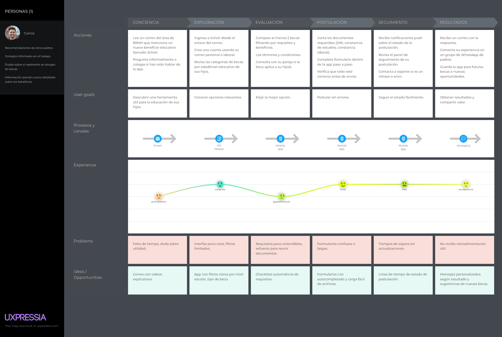 

**Segmento 2: Luis (Administrador de becas de una empresa privada)** 

 

### 2.3.4. Empathy Mapping

**Segmento 1: Carlos (Trabajador apoderado/padre de familia)** 

 

**Segmento 2: Luis (Administrador de becas de una empresa privada)** 

### 2.3.5. As-is Scenario Mapping

**Segmento 1:** Padres Trabajadores (Empleados/Colaboradores)

|Fases|Doing|Thinking|Feeling|
|-|-|-|-|
|Descubrimiento|Se entera por correo o aviso interno de que hay becas disponibles.	|“¿Dónde encuentro toda la información completa?”	|Confusión inicial. Algo de interés.|
| Revisión de requisitos | Busca cartillas, PDF o consulta con colegas sobre documentos necesarios.	 | “¿Esto estará actualizado? ¿Tengo todo lo que me piden?”	 | Incertidumbre. A veces frustración.|
| Recolección de docs.| Junta boletas, certificados, etc. Algunos debe escanearlos o pedirlos a otras entidades.	| “¿Y si me falta algo? ¿En qué formato los quieren?”	| Estrés por conseguir todo a tiempo.|
|Envío de postulación|Llena formularios en Word/PDF, los junta en un solo correo y los envía.	|“¿Les habrá llegado? ¿Está todo bien?”	|Inseguridad. Falta de claridad.|
|Espera de resultados|Revisa su correo esperando noticias. A veces pasa mucho tiempo sin saber nada.	|“¿Me habrán leído? ¿Habré sido aprobado?”	|Impaciencia. Frustración por falta de seguimiento.|
|Resultado / Feedback|Recibe un correo con respuesta. Si fue rechazo, no siempre puede volver a postular fácilmente.	|“¿Qué hice mal? ¿Puedo corregirlo?”	|Si fue rechazo: decepción. Si fue aprobado: alivio y alegría.|

**Segmento 2:** Coordinadores de Bienestar Laboral/RSE

|Fases|Doing|Thinking|Feeling|
|-|-|-|-|
|Anuncio de convocatoria|Publica en intranet o por correo interno la apertura del proceso de becas.	|“¿Habrá suficiente difusión? ¿Estará claro el mensaje?”	|Responsabilidad. Algo de presión.|
|Recepción de postulaciones|Revisa mails con formularios, valida que estén completos.	|“¿Habrá errores? ¿Todos usaron el formato correcto?”	|Sobrecarga. Algo rutinario.|
|Verificación de documentos|Revisa uno por uno: DNI, certificados, boletas, etc.	|“¿Esto estará vigente? ¿Y si falta algo? ¿Debo pedirlo otra vez?”	|Cansancio. Riesgo de pasar algo por alto.|
|Evaluación|Evalúa criterios con equipo o comité. A veces toma decisiones sola o con lineamientos poco claros.	|“¿Es justo? ¿Cumple con lo establecido? ¿Puedo justificar este rechazo?”	|Presión por ser objetiva. Inseguridad si falta protocolo.|
|Comunicación de resultados|Notifica vía correo los resultados. En algunos casos, debe redactar feedback.	|“¿Cómo reaccionará esta persona? ¿Entenderán el motivo del rechazo?”	|Tensión si debe rechazar. Alivio si todo salió bien.|
|Seguimiento y archivo|Archiva documentos, responde consultas tardías. A veces actualiza un Excel manualmente.	|“¿Tendré todo ordenado? ¿Qué pasa si me piden algo después?”	|Carga administrativa. Deseo de digitalizar procesos.|

### 2.4. Ubiquitous Language

| Término | Descripción |
|-----------------------|------------|
| *Colaborador* | Padre, madre o tutor legal de un estudiante que utiliza Scholr para gestionar becas educativas. |
| *Beca privada* | Beneficio financiero ofrecido por empresas para cubrir costos educativos (parcial o total). |
| *Postulación* | Proceso donde el apoderado aplica a una beca a través de la plataforma. |
| *Dashboard empresarial* | Panel donde empresas crean convocatorias y evalúan postulantes. |
| *Charla corporativa* | Evento presencial/virtual en empresas para promocionar becas entre colaboradores-apoderados. |
| *Perfil del estudiante* | Datos académicos y socioeconómicos del alumno usados para postular. |
| *Filtros de búsqueda* | Herramientas para encontrar becas por: institución, monto o requisitos. |
| *Pre-aprobación* | Verificación automática de requisitos básicos para una beca. |

## Capítulo III: Requirements Specification

### 3.1. To-Be Scenario Mapping

**Segmento 1:** Padres Trabajadores (Empleados/Colaboradores)

|Fases|Doing|Thinking|Feeling|
|-|-|-|-|
|Acceso y autenticación|Ingresa al sistema con su correo institucional y contraseña.	|“Qué bueno que puedo entrar rápido, sin papeles.”	|Tranquilidad. Seguridad.|
|Revisión de requisitos|Consulta los requisitos detallados, fechas y documentos desde el dashboard.	|“Ahora sí tengo claro qué necesito. Todo está en un solo lugar.”	|Confianza. Organización.|
|Registro de postulación|Completa los datos de manera guiada y validada automáticamente.	|“Es fácil llenar esto. Me guía paso a paso.”	|Comodidad. Alivio.|
|Carga de documentos|Sube archivos desde su celular	|“Subí todo bien, sin necesidad de correos o impresiones.”	|Eficiencia. Satisfacción.|
|Envío y confirmación|Recibe notificación inmediata del envío exitoso y puede ver su estado.	|“Listo. Ya lo envié, tengo comprobante. Sé que fue recibido.”	|Seguridad. Control.|
|Revisión del estado|Visualiza el estado (en revisión, aprobado, rechazado) desde su perfil.	|“Puedo ver cómo va mi trámite sin preguntar ni esperar correos.”	|Tranquilidad. Autonomía.|
|Retroalimentación|Si fue rechazado, accede a comentarios claros y puede re-postular con sus datos guardados.	|“Entiendo por qué lo rechazaron. Puedo corregir y volver a enviar.”	|Motivación. Menos frustración.|

**Segmento 2:** Coordinadores de Bienestar Laboral/RSE

|Fases|Doing|Thinking|Feeling|
|-|-|-|-|
|Inicio de sesión|Ingresa a la plataforma con credenciales institucionales.	|“Listo, puedo comenzar la revisión sin depender de archivos físicos.”	|Comodidad. Organización.|
|Revisión de convocatorias|Accede rápidamente a las becas activas, requisitos y fechas importantes.	|“Todo está centralizado. Puedo supervisar fácilmente qué se está ofreciendo.”	|Claridad. Control.|
|Visualización de postulaciones|Ve todas las postulaciones recibidas según cada tipo de beca, con opción de filtrado.	|“Puedo ver quiénes postularon, sin buscar documentos en carpetas.”	|Eficiencia. Reducción de carga operativa.|
|Evaluación y retroalimentación|Revisa expedientes, acepta o rechaza, y agrega feedback directo en la plataforma.	|“Es más ordenado dejar observaciones aquí mismo para que el colaborador lo revise.”	|Agilidad. Precisión.|
|Seguimiento del proceso|Observa el estado general de postulaciones (aprobadas, en revisión, rechazadas).	|“Puedo monitorear el avance general y responder a consultas con información precisa.”	|Seguridad. Supervisión efectiva.|
|Generación de reportes|Exporta listados y reportes de estados o estadísticas de forma automática.	|“Ya no tengo que armar Excel manualmente. Ahorra mucho tiempo.”	|Alivio. Productividad.|

### 3.2. User Stories

EPICS:

|EPIC(ID)|Titulo|Descripcion|
|--------|------|-----------|
|EP01|	Gestión de Identidad y Acceso (IAM)|Como trabajador de una empresa/ONG, quiero registrarme y verificar mi identidad para acceder a las becas exclusivas de mi empleador, garantizando que solo personal autorizado pueda postular.|
|EP02|Gestión de Postulaciones|Como padre/trabajador, quiero postular a becas educativas para mis hijos de manera sencilla y centralizada, para asegurar que no pierda oportunidades por trámites complejos o falta de información.|
|EP03|Seguimiento de Postulaciones|Como padre/trabajador, quiero monitorear el estado de mis postulaciones en tiempo real, para estar informado y tomar acciones si es necesario.|
|EP04|Gestión de Postulaciones por Empresas/ONGs|Como coordinador de bienestar laboral, quiero gestionar las postulaciones a becas de los colaboradores de mi empresa, para garantizar transparencia y eficiencia en el proceso.|
|EP05|Soporte y Educación|Como padre/trabajador, quiero acceder a recursos de ayuda y asesoría, para entender mejor el proceso de postulación y requisitos.|
|EP06|Landing Page Informativa|Como visitante (padre/trabajador o representante de empresa), quiero acceder a una landing page clara que me explique los beneficios de Scholr, para decidir si registrarme o contactar al equipo.|
| EP-TECH-01 | Infraestructura Backend | Como desarrollador, necesito implementar APIs y servicios críticos para soportar las funcionalidades del sistema. |
| EP-TECH-02 | Seguridad y Compliance | Como desarrollador, necesito garantizar que el sistema cumpla con estándares de seguridad y protección de datos. |
| EP-TECH-03 | Performance y Escalabilidad | Como desarrollador, necesito optimizar el rendimiento del sistema para manejar alta demanda. |

| User Storiy ID | Título| Descripción| Criterios de Aceptación| Relacionado con(Epic ID) |     
| -- | -- | -- | -- | -- |
| US01|Selección de empresa durante el registro|Como padre/trabajador,quiero subir documentos (credencial laboral, notas de mi hijo) directamente en la app,para evitar trámites presenciales y acelerar mi postulación.| Escenario: Dado que el usuario está en el formulario de registro,cuando selecciona la empresa y completa su código de colaborador y datos extras,entonces el sistema habilita el botón "Continuar" para enviar los datos a verificación.| EP01|
| US02| Validación automática de datos laborales|Como trabajador, quiero que el sistema verifique automáticamente mi código de colaborador con la base de datos de mi empresa, para confirmar mi elegibilidad en 24 horas.| Escenario: Dado que el usuario ingresó su código de colaborador de su empresa.Cuando la API de Backus confirma que el código existe, entonces el sistema envía un correo al correo del usuario con el asunto "¡Cuenta verificada! ingresa a tu cuenta scholr", con su usuario y contraseña.| EP01|
| US03| Notificación de verificación exitosa| Como padre/trabajador,quiero recibir confirmación con un código único al enviar mi postulación,para tener un comprobante digital de mi solicitud.| Escenario: Dado que el usuario hizo clic en el enlace de activación del correo.Cuando inicia sesión por primera vez,entonces la app muestra: "¡Bienvenido, Ahora puedes postular a becas exclusivas que brinda tu empresa".| EP01|
| US04|Subir documentos de postulación|Como padre/trabajador,quiero subir documentos (credencial laboral, notas de mi hijo) directamente en la app,para evitar trámites presenciales y acelerar mi postulación.| Escenario: El usuario potencial visita la página principal. Dado que el usuario potencial ha accedido a la página de inicio, Cuando navega hacia la sección de beneficios y funcionalidades, Entonces puede ver una descripción clara y visualmente destacada de las características clave de la plataforma.| EP02|
| US05| Guardar postulación como borrador| Como padre/trabajador,quiero guardar una postulación como borrador antes de enviarla,para completar los requisitos más tarde sin perder el progreso.| Escenario: El usuario potencial busca información sobre la plataforma en redes sociales. Dado que el usuario potencial navega a la página de inicio,Cuando se desplaza hasta el pie de página o la sección de contacto,Entonces puede hacer clic en enlaces directos a las redes sociales de la plataforma.| EP2|
| US06| Confirmación con código único| Como padre/trabajador,quiero recibir confirmación con un código único al enviar mi postulación,para tener un comprobante digital de mi solicitud.| Escenario: Un nuevo usuario desea registrarse. Dado que el usuario nuevo accede a la página de registro,Cuando completa el formulario con los datos básicos,Entonces puede finalizar el registro sin complicaciones ni pasos adicionales innecesarios.| EP02|
| US07| Visualizacion de postulaciones| Como padre/trabajador,quiero ver todas mis postulaciones (enviadas, en revisión, aprobadas, rechazadas),para poder gestionarlas desde un solo lugar.| Escenario 1, Título: Filtrado de postulaciones por estado  Dado que el usuario accede a la sección "Mis Postulaciones".Cuando selecciona un filtro (ej. "En revisión").Entonces el Sistema muestra solo las postulaciones con ese estado. Escenario 2, Título: Detalle de postulación específica. Dado que el usuario selecciona una postulación de la lista.Cuando hace clic en "Ver Detalles".Entonces el Sistema muestra información completa: documentos adjuntos, comentarios del evaluador (si aplica) y fecha de última actualización.| EP03|
| US08| Notificaciones de cambios de estado| Como padre/trabajador,quiero recibir notificaciones push cuando mi postulación cambie de estado,para actuar rápidamente en caso de requerirse más información.| Escenario 1,Título: Alerta de postulación aprobada. Dado que el sistema actualiza el estado de una postulación a "Aprobado" Cuando el usuario tiene activadas las notificaciones push.Entonces el Sistema envía una notificación con el mensaje: "¡Felicidades! Tu postulación al programa [X] ha sido aprobada. Revisa tu correo para más detalles". Escenario 2,Título: Alerta de postulación rechazada con comentarios.Dado que el sistema actualiza el estado a "Rechazado" y el evaluador ingresa comentarios.Cuando el usuario recibe la notificación.Entonces el Sistema incluye un botón "Ver Motivos" que redirige a los comentarios del evaluador.| EP03|
| US09| Reenvío de postulación rechazada| Como padre/trabajador,quiero reenviar una postulación rechazada (si el plazo lo permite),para corregir errores sin empezar desde cero.| Escenario 1,Título: Reenvío exitoso de postulación corregida. Dado que el usuario selecciona una postulación rechazada con estado "Editable".Cuando sube los documentos corregidos y hace clic en "Reenviar".Entonces el Sistema valida que estén completos y cambia el estado a "En revisión".Y envía un correo de confirmación al usuario. Escenario 2,Título: Bloqueo de reenvío por plazo vencido. Dado que el usuario intenta reenviar una postulación rechazada.Cuando el plazo de corrección ha expirado.Entonces el Sistema muestra el mensaje: "El plazo para reenviar esta postulación ha finalizado. Por favor, inicia una nueva".| EP03|
| US10|Listado de postulaciones para coordinador | Como coordinador de bienestar,quiero ver un listado de todas las postulaciones recibidas filtradas por tipo de beca,para priorizar revisiones según urgencia.| Escenario 1,Título: Priorización de becas urgentes. Dado que el coordinador accede al módulo "Postulaciones".Cuando selecciona el filtro por tipo de beca.Entonces el Sistema muestra solo postulaciones de ese tipo, ordenadas por fecha de solicitud (más antiguas primero).Y cada registro incluye: nombre del colaborador , postulaciones dependiendo de la cantidad de hijos y fecha de envio  Escenario 2,Título: Generación de reporte filtrado. Dado que el coordinador visauliza una postulacion.Cuando hace clic en "Exportar".Entonces el Sistema genera un archivo para su visualizacion| EP04|
| US11| Aprobar/rechazar con comentarios|Como coordinador de bienestar,quiero aprobar/rechazar postulaciones con comentarios personalizados,para mantener informados a los padres/trabajadores.|Escenario 1,Título: Rechazo con comentarios obligatorios. Dado que el coordinador selecciona "Rechazar" en una postulación.Cuando intenta guardar sin ingresar comentarios.Entonces el Sistema muestra el error: "Debe agregar comentarios para notificar al solicitante".Y al ingresar comentarios y guardar, envía un correo automático al usuario con los detalles. Escenario 2, Título: Aprobación con documentos adicionales. Dado que el coordinador aprueba una postulación.Cuando adjunta un PDF con instrucciones para el beneficiario.Entonces el Sistema registra el estado como "Aprobado" y vincula el PDF al correo de notificación.Y este se envia a un excel con todos los aprobados para el conocimiento de la empresa| EP04|
| US12 | Publicación de nuevas becas| Como coordinador de bienestar,quiero publicar fechas límite y requisitos de nuevas becas en la app,para evitar consultas masivas al departamento de RRHH. | Escenario 1, Título: Registro de nueva beca con fecha límite. Dado que el coordinador accede a "Gestión de Becas".Cuando ingresa: nombre, requisitos, fecha límite y documentos obligatorios.Entonces el Sistema valida que la fecha sea futura y muestra un preview en la app móvil bajo la sección "Nuevas Oportunidades". Escenario 2, Título: Validación de requisitos obligatorios. Dado que el coordinador deja vacío el campo "Requisitos".Cuando intenta publicar.Entonces el Sistema resalta el campo en rojo con el mensaje: "Este campo es requerido para continuar".| EP04 |
| US13 | Tutoriales en video| Como padre/trabajador,quiero ver tutoriales en video sobre cómo completar una postulación,para evitar errores comunes. | Escenario 1, Título: Visualización de tutorial paso a paso. Dado que el usuario accede a la sección "Ayuda" como icono de interrogacion.Cuando selecciona el video "Cómo completar el formulario de beca".Entonces el Sistema reproduce el video en una ventana emergente con controles (pausa, volumen, pantalla completa).|EP05 |
| US14 |Acceso a cartilla de instrucciones | Como padre/trabajador, quiero acceder a una cartilla de instrucciones descargable en PDF, para consultar los pasos de postulación sin conexión a internet.| Escenario 1, Título: Descarga de cartilla offline. Dado que el usuario hace clic en "Descargar instructivo" en la sección de ayuda.Cuando el sistema genera el archivo "Guía_Postulación_Becas_2024.pdf".Entonces el dispositivo guarda el PDF en la carpeta "Descargas/Scholr".Y se abre automáticamente con un visor de PDF.|EP05 |
| US15 | Visualizar información de contacto de soporte | Como padre/trabajador, quiero poder ver el correo electrónico y número telefónico de soporte dentro de la app, para contactar directamente al equipo de Scholr en caso de problemas urgentes. | Escenario 1: Visualización desde sección de Ayuda ,  Cuando el sistema carga la página,entonces muestra los datos de contacto en un cuadro destacado y el número telefónico aparece como enlace clicable|EP05 |
| US16 | Visualización de información clave | Como visitante, quiero ver una explicación breve de cómo funciona Scholr, para entender rápidamente si cubre mis necesidades.|Escenario 1,Título: Mostrar resumen interactivo de funcionalidades Dado que un visitante llega a la página principal,cuando hace scroll hasta la sección "Cómo funciona Scholr",entonces el sistema muestra 3 tarjetas interactivas con:icono + texto breve (ej: "Postulación en 5 pasos"),,video explicativo de 30 segundos (autoreproducible sin audio) y Estadísticas clave (ej: "95% de postulaciones procesadas en 72h")|EP06 |
| US17 |Acceso a recursos demostrativos | Como visitante escéptico, quiero descargar un folleto PDF o ver casos de éxito, para validar la confiabilidad de Scholr.|Escenario 1, Título: Visualización directa de recursos Dado que el visitante selecciona "Ver casos de éxito"cuando no ha iniciado sesión,entonces muestra 2 opciones:"Ver online" (abre carrusel interactivo),"Enviar a mi correo" (solo pide email, sin registro completo)   |EP06 |
| US18 | Formulario de contacto para empresas | Como representante de RRHH, quiero enviar una solicitud de información sin registrarme, para evaluar una posible alianza con Scholr.|Escenario 1: Envío exitoso Dado que el representante completa: Nombre, Empresa, Email y Consulta.Cuando hace clic en "Enviar".Entonces el sistema valida el formato de email y muestra "Gracias, te contactaremos en 48h",Escenario 2:, Titulo: Campos obligatorios Dado que el usuario deja vacío el campo Email.Cuando intenta enviar.Entonces el sistema resalta el campo en rojo y muestra "Email es requerido"|EP06|
| US19 |Adaptabilidad móvil | Como usuario móvil, quiero navegar la landing page sin problemas, para acceder a la información desde cualquier dispositivo.| Escenario 1, Tituloo:Menú responsive Dado que el usuario accede desde móvil.Cuando hace clic en el ícono de menú.Entonces se despliegan las opciones principales y el fondo se oscurece para mejor contraste|EP06|
| TS01 | API de Verificación de Código de Colaborador | Como desarrollador, necesito una API REST que valide el código de colaborador con la base de datos de la empresa (Backus). | Escenario 1: Validación exitosa de código. Dado que se recibe una solicitud POST a /api/verify-employee con { "codigo": "EMP123", "empresa": "Backus" }.Cuando el código existe en la base de datos de Backus.Entonces la API responde con 200 OK y { "valido": true, "nombre": "Juan Pérez" }.Escenario 2: Código inválido o empresa no soportada.Dado que se recibe una solicitud con { "codigo": "INVALIDO", "empresa": "Backus" }.Cuando el código no existe.Entonces la API responde con 404 Not Found y { "valido": false, "error": "Código no registrado" }.| EP-TECH-01 |
| TS02 | Sincronización de Documentos con Google Cloud Storage | Como desarrollador, necesito que los documentos subidos se almacenen en Google Cloud Storage con encriptación AES-256. | Escenario 1: Subida exitosa de documento. Dado que un usuario sube un archivo credencial.pdf (≤5MB).Cuando el sistema valida que es un PDF.Entonces se guarda en gs://scholr-docs/[user_id]/[timestamp].pdf con metadatos { "hash_sha256": "abc123", "empresa": "Backus" }. Escenario 2: Intento de subida con formato no permitido. Dado que un usuario sube virus.exe.Cuando el sistema detecta la extensión .exe.,entonces rechaza la operación con error 415 Unsupported Media Type.| EP-TECH-02 |
| TS03 | Notificaciones Push con Firebase Cloud Messaging | Como desarrollador, necesito integrar FCM para enviar notificaciones push cuando una postulación cambia de estado. | Escenario 1: Notificación de cambio de estado. Dado que una postulación pasa a "Aprobado",cuando FCM recibe la solicitud con { "token": "device123", "estado": "Aprobado" }.Entonces el dispositivo recibe la notificación en ≤2 segundos. Escenario 2: Caída de conexión del dispositivo. Dado que el dispositivo está offline por >1 hora,cuando FCM intenta enviar la notificación,entonces el mensaje se encola y se reenvía al reconectar.| EP-TECH-01 |
| TS04 | Generación de Reportes en Excel para Empresas | Como desarrollador, necesito un endpoint que genere reportes en Excel con postulaciones filtradas por empresa. | Escenario 1: Descarga de reporte básico. Dado que un coordinador solicita /api/report?empresa=Backus&formato=excel.Cuando hay 50 postulaciones en la BBDD.Entonces la API responde con un archivo .xlsx que contiene las columnas: ID, Nombre, Hijos, Estado.Escenario 2: Filtrado por fecha. Dado que se agrega el parámetro ?fecha_inicio=2024-01-01.Cuando solo 10 postulaciones coinciden.Entonces el Excel generado tiene exactamente 10 filas.| EP-TECH-01 |
| TS05 | Cacheo de Landing Page con Cloudflare | Como desarrollador, necesito configurar Cloudflare para cachear la landing page por 24 horas. |Escenario 1: Primera visita sin cache. Dado que un usuario accede a scholr.com.Cuando es la primera visita en 48 horas.Entonces el TTFB (Time To First Byte) es ≤600ms. Escenario 2: Visita recurrente. Dado que el usuario recarga la página.Cuando Cloudflare sirve la versión cacheada.Entonces el TTFB es ≤100ms.| EP-TECH-03 |
| TS06 | Migración de Datos desde Legacy System | Como desarrollador, necesito un script ETL que migre postulaciones antiguas desde SQL Server a Firestore. | Escenario 1: Dado 1000 registros, entonces loguea errores y migra 800 limpios. Escenario 2, Titulo:Validación de integridad.  Dado que la migración finaliza.Cuando se compara COUNT(*) entre SQL Server y Firestore.Entonces las diferencias son ≤1% (tolerancia para registros corruptos). | EP-TECH-01 |

### 3.3. Impact Mapping

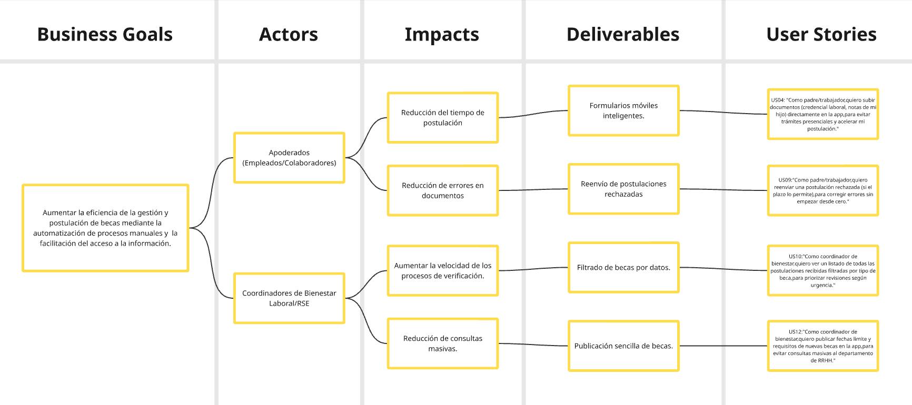

### 3.4. Product Backlog

| #Orden | User Story ID | Título                                                  | Descripción                                                                                                 | Story Points   (1/2/3/5/8) |
| ------ | ------------- | ------------------------------------------------------- | ----------------------------------------------------------------------------------------------------------- | :---------------------------: |
|1| US01|Selección de empresa durante el registro|Como padre/trabajador,quiero subir documentos (credencial laboral, notas de mi hijo) directamente en la app,para evitar trámites presenciales y acelerar mi postulación.| 2|
|2| US02| Validación automática de datos laborales|Como trabajador, quiero que el sistema verifique automáticamente mi código de colaborador con la base de datos de mi empresa, para confirmar mi elegibilidad en 24 horas.|3|
|3| US03| Notificación de verificación exitosa| Como padre/trabajador,quiero recibir confirmación con un código único al enviar mi postulación,para tener un comprobante digital de mi solicitud.| 3|
|4| US04|Subir documentos de postulación|Como padre/trabajador,quiero subir documentos (credencial laboral, notas de mi hijo) directamente en la app,para evitar trámites presenciales y acelerar mi postulación.| 3|
|5| US05| Guardar postulación como borrador| Como padre/trabajador,quiero guardar una postulación como borrador antes de enviarla,para completar los requisitos más tarde sin perder el progreso.| 3|
|6| US06| Confirmación con código único| Como padre/trabajador,quiero recibir confirmación con un código único al enviar mi postulación,para tener un comprobante digital de mi solicitud.| 3|
|7| US07| Visualizacion de postulaciones| Como padre/trabajador,quiero ver todas mis postulaciones (enviadas, en revisión, aprobadas, rechazadas),para poder gestionarlas desde un solo lugar.|5|
|8| US08| Notificaciones de cambios de estado| Como padre/trabajador,quiero recibir notificaciones push cuando mi postulación cambie de estado,para actuar rápidamente en caso de requerirse más información.| 5|
|9| US09| Reenvío de postulación rechazada| Como padre/trabajador,quiero reenviar una postulación rechazada (si el plazo lo permite),para corregir errores sin empezar desde cero.|5|
|10| US10|Listado de postulaciones para coordinador | Como coordinador de bienestar,quiero ver un listado de todas las postulaciones recibidas filtradas por tipo de beca,para priorizar revisiones según urgencia.|5|
|11| US11| Aprobar/rechazar con comentarios|Como coordinador de bienestar,quiero aprobar/rechazar postulaciones con comentarios personalizados,para mantener informados a los padres/trabajadores.|3|
|12| US12 | Publicación de nuevas becas| Como coordinador de bienestar,quiero publicar fechas límite y requisitos de nuevas becas en la app,para evitar consultas masivas al departamento de RRHH. | 5|
|13| US13 | Tutoriales en video| Como padre/trabajador,quiero ver tutoriales en video sobre cómo completar una postulación,para evitar errores comunes. | 2|
|14| US14 |Acceso a cartilla de instrucciones | Como padre/trabajador, quiero acceder a una cartilla de instrucciones descargable en PDF, para consultar los pasos de postulación sin conexión a internet.| 3|
|15| US15 | Visualizar información de contacto de soporte | Como padre/trabajador, quiero poder ver el correo electrónico y número telefónico de soporte dentro de la app, para contactar directamente al equipo de Scholr en caso de problemas urgentes. | 3 |
|16| US16 | Visualización de información clave | Como visitante, quiero ver una explicación breve de cómo funciona Scholr, para entender rápidamente si cubre mis necesidades.|3|
|17| US17 |Acceso a recursos demostrativos | Como visitante escéptico, quiero descargar un folleto PDF o ver casos de éxito, para validar la confiabilidad de Scholr.|3|
|18| US18 | Formulario de contacto para empresas | Como representante de RRHH, quiero enviar una solicitud de información sin registrarme, para evaluar una posible alianza con Scholr.|5|
|19| US19 |Adaptabilidad móvil | Como usuario móvil, quiero navegar la landing page sin problemas, para acceder a la información desde cualquier dispositivo.| 3|
|20| TS01 | API de Verificación de Código de Colaborador | Como desarrollador, necesito una API REST que valide el código de colaborador con la base de datos de la empresa (Backus). |5|
|21| TS02 | Sincronización de Documentos con Google Cloud Storage | Como desarrollador, necesito que los documentos subidos se almacenen en Google Cloud Storage con encriptación AES-256. |5 |
|22| TS03 | Notificaciones Push con Firebase Cloud Messaging | Como desarrollador, necesito integrar FCM para enviar notificaciones push cuando una postulación cambia de estado. |5|
|23| TS04 | Generación de Reportes en Excel para Empresas | Como desarrollador, necesito un endpoint que genere reportes en Excel con postulaciones filtradas por empresa. | 5|
|24| TS05 | Cacheo de Landing Page con Cloudflare | Como desarrollador, necesito configurar Cloudflare para cachear la landing page por 24 horas. |5|
|25| TS06 | Migración de Datos desde Legacy System | Como desarrollador, necesito un script ETL que migre postulaciones antiguas desde SQL Server a Firestore. |5|

Pivotal Tracker:

ANEXO B

## Capítulo IV: Product Design

### 4.1. Strategic-Level Domain-Driven Design

### 4.1.1. EventStorming

Primera etapa:

 

Segunda etapa:

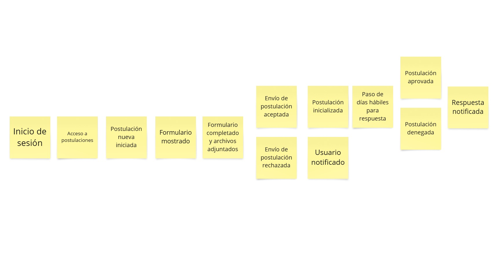 

Tercera etapa:

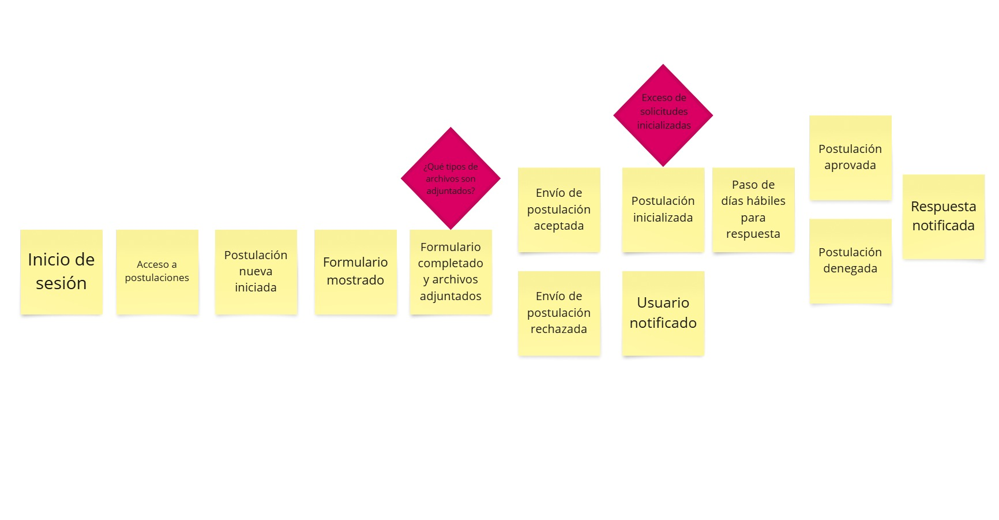 

Cuarta etapa:

 

Quinta etapa:

 

Sexta etapa:

 

Séptima etapa:

 

Octava etapa:

 

Novena/Décima etapa:

 

Segmento administrador de becas:

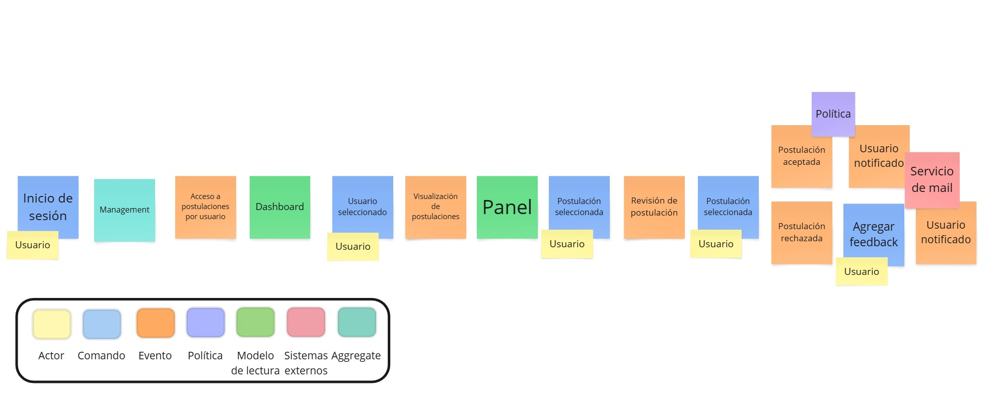 

ANEXO C

### 4.1.1.1. Candidate Context Discovery

Luego de realizar el EventStorming inicial, el equipo organizó una sesión específica de Candidate Context Discovery con el objetivo de identificar los posibles Bounded Contexts que conforman el sistema.

Partimos identificando los elementos que representan el mayor valor para los usuarios clave: Padres trabajadores y coordinadores de RSE. A partir de los eventos más significativos en el flujo (como “Se verifica trabajador activo”, “Padre envía postulación”, “Postulación es revisada” y “Se comunica estado de beca”), reconocimos claramente cambios de estado que justificaban la separación de responsabilidades en contextos distintos.

Durante la sesión se identificaron los siguientes Bounded Contexts:

- Gestión de Identidad y Acceso (IAM)

Focalizado en validar la identidad del usuario, verificar si efectivamente trabaja en la empresa (consulta con RRHH), y gestionar su acceso según el rol (padre, administrador, comité).

- Postulaciones a Becas

Encargado de todo el proceso de aplicación por parte de los padres, desde el llenado del formulario, carga de documentos y revisión del estado hasta la posibilidad de reenviar postulaciones corregidas.

- Administración de Becas

Manejado por el área de RSE o comités internos, quienes definen los tipos de becas disponibles, evalúan las solicitudes y generan reportes de impacto.

A lo largo de la sesión, se refinaron los límites de cada contexto, se identificaron interacciones entre ellos y se marcaron transiciones relevantes, lo cual permitió avanzar con una base sólida hacia la fase de modelado de mensajes y diseño de los Bounded Context Canvas.

### 4.1.1.2. Domain Message Flows Modeling

Con los Bounded Contexts definidos en la etapa anterior, el equipo procedió a realizar una sesión de Domain Storytelling para modelar cómo estos contextos colaboran entre sí para resolver los distintos escenarios del negocio. Esta técnica nos permitió visualizar de forma clara los flujos de comunicación entre contextos y entender mejor el comportamiento esperado del sistema desde la perspectiva de los usuarios.

Durante la sesión, se analizaron principalmente dos casos de uso relevantes:

**Caso 1: Postulación de un padre trabajador a una beca para su hijo** 

1. El Padre Trabajador accede a la plataforma y se autentica a través del Contexto IAM.

2. El sistema verifica con RRHH que el padre esté activo en la empresa.

3. Una vez validado, el Contexto de Postulaciones presenta el formulario de aplicación.

4. El padre completa y envía la solicitud.

5. El Contexto de Administración de Becas recibe la postulación para revisión.

6. Una vez evaluada, se actualiza el estado y se notifica al padre.

**Caso 2: Gestión interna de solicitudes por parte del comité de RSE**

1. El Coordinador de RSE accede mediante el Contexto IAM.

2. Desde el Contexto de Administración, consulta todas las postulaciones activas.

3. Revisa los documentos adjuntos, aplica filtros (por tipo de beca, empresa, nivel académico, etc.).

4. Acepta o rechaza postulaciones, adjuntando retroalimentación si corresponde.

5. La información es devuelta al Contexto de Postulaciones, que actualiza el estado y notifica al padre.

Esta visualización permitió entender no solo los puntos de integración entre los contextos, sino también los límites de responsabilidad de cada uno, asegurando una arquitectura desacoplada pero coherente. El resultado fue un conjunto de diagramas de Domain Storytelling que reflejan claramente cómo fluyen los mensajes entre usuarios y contextos del sistema.

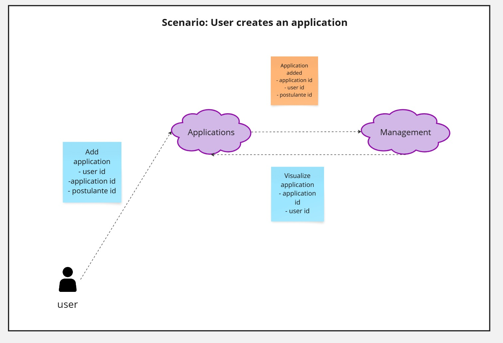 
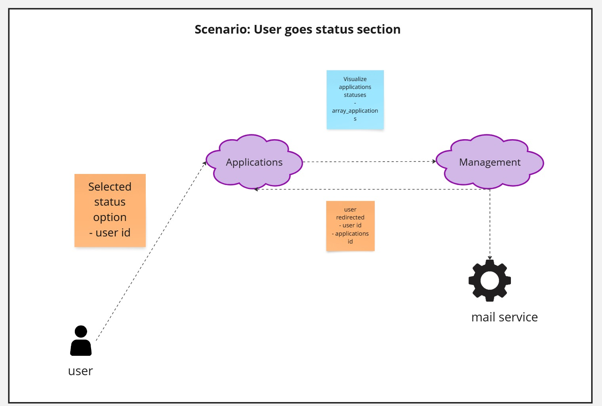 
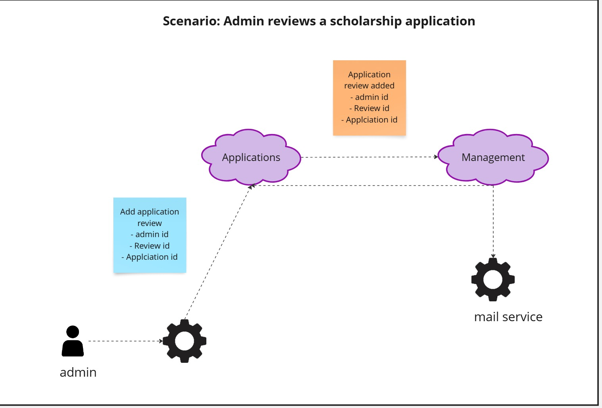

ANEXO D  

### 4.1.1.3. Bounded Context Canvases

IAM:

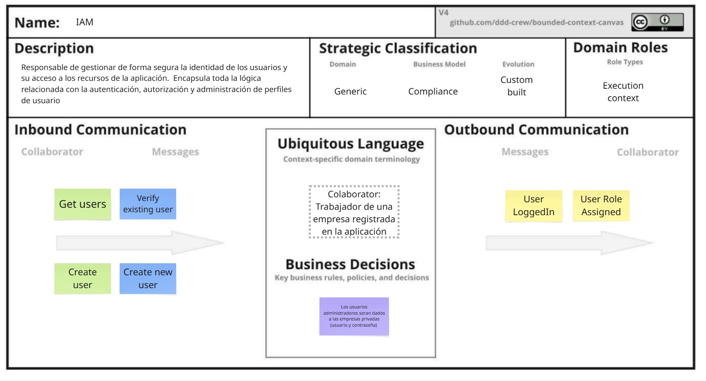 

Management:

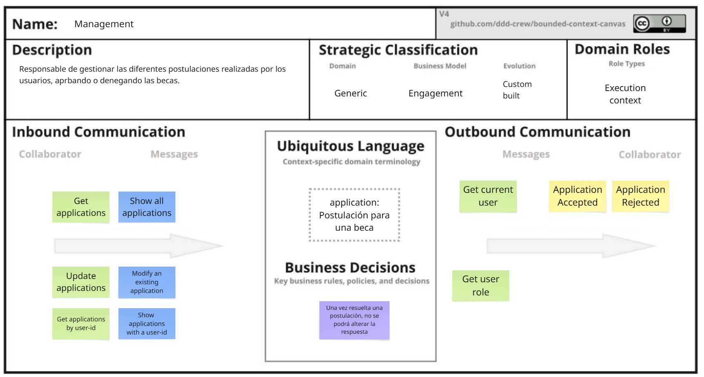 

Applications:

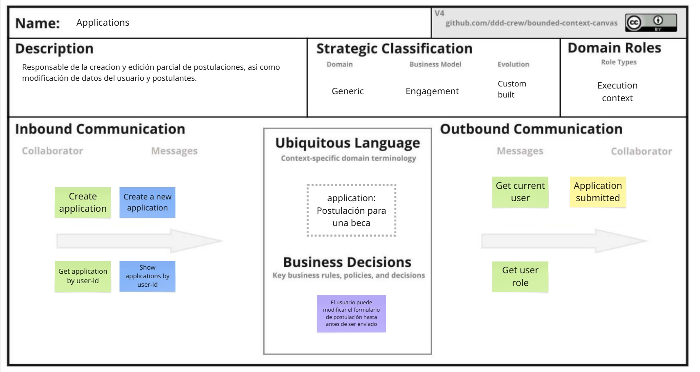 

ANEXO E  
### 4.1.2. Context Mapping

Se identificaron los siguientes bounded contexts en el sistema:

- IAM: manejo de autenticación y autorización
- Postulación: contiene el flujo completo de postulación, formularios y documentos
- Gestión: involucra revisión, validación y generación de reportes
- Backend: centraliza y expone la lógica de negocio mediante API

**Mapa de Contextos Inicial**

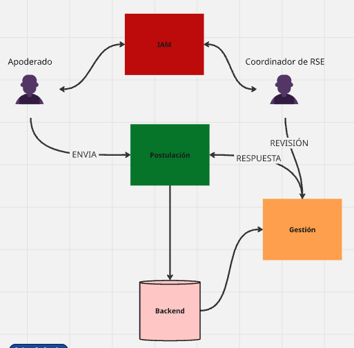

**Mapa de Contexto Final**

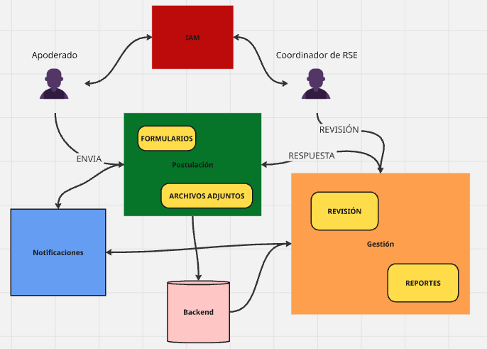

Este diseño final refleja la autonomía de contextos y prepara el sistema para evolucionar modularmente.

ANEXO E  

### 4.1.3. Software Architecture

### 4.1.3.1. Software Architecture Context Level Diagrams

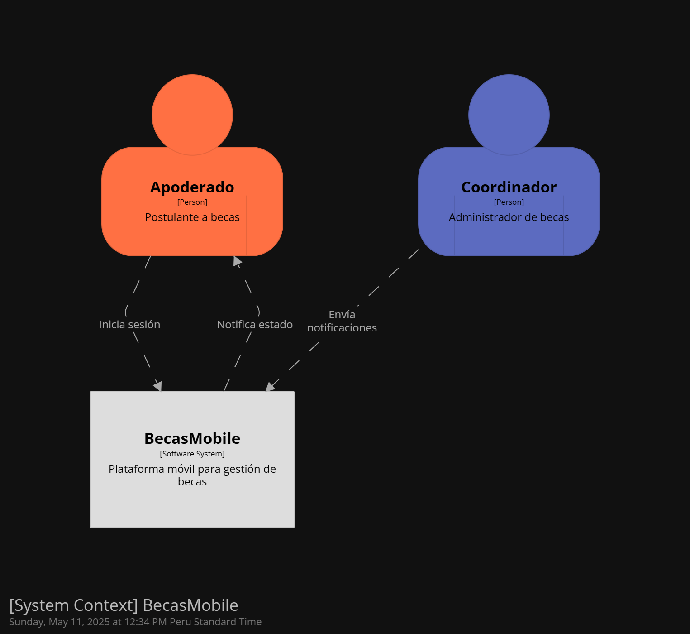

### 4.1.3.2. Software Architecture Container Level Diagrams

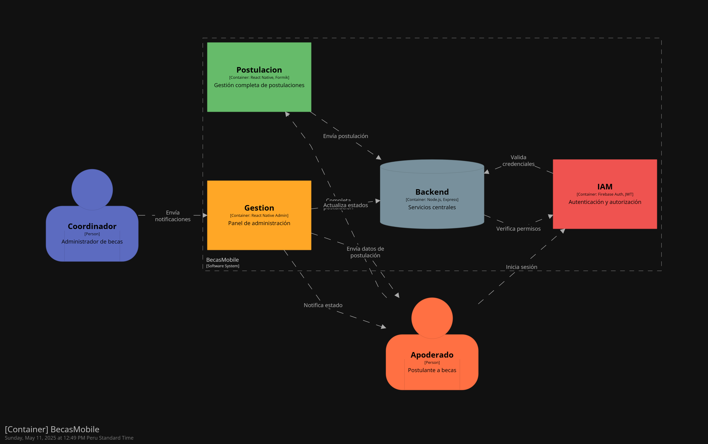

### 4.1.3.3. Software Architecture Deployment Diagrams

**Componente de gestión:**

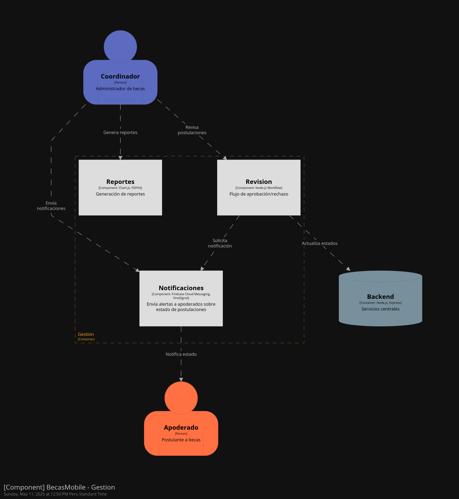

**Componente Backend:**

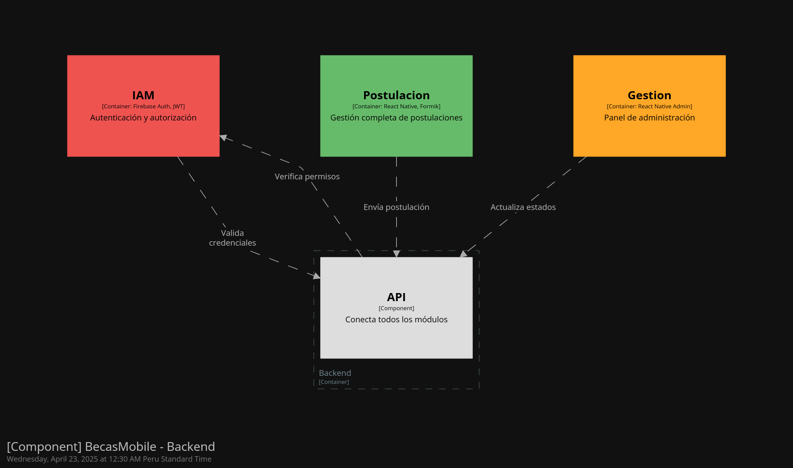

**Componente de postulación:**

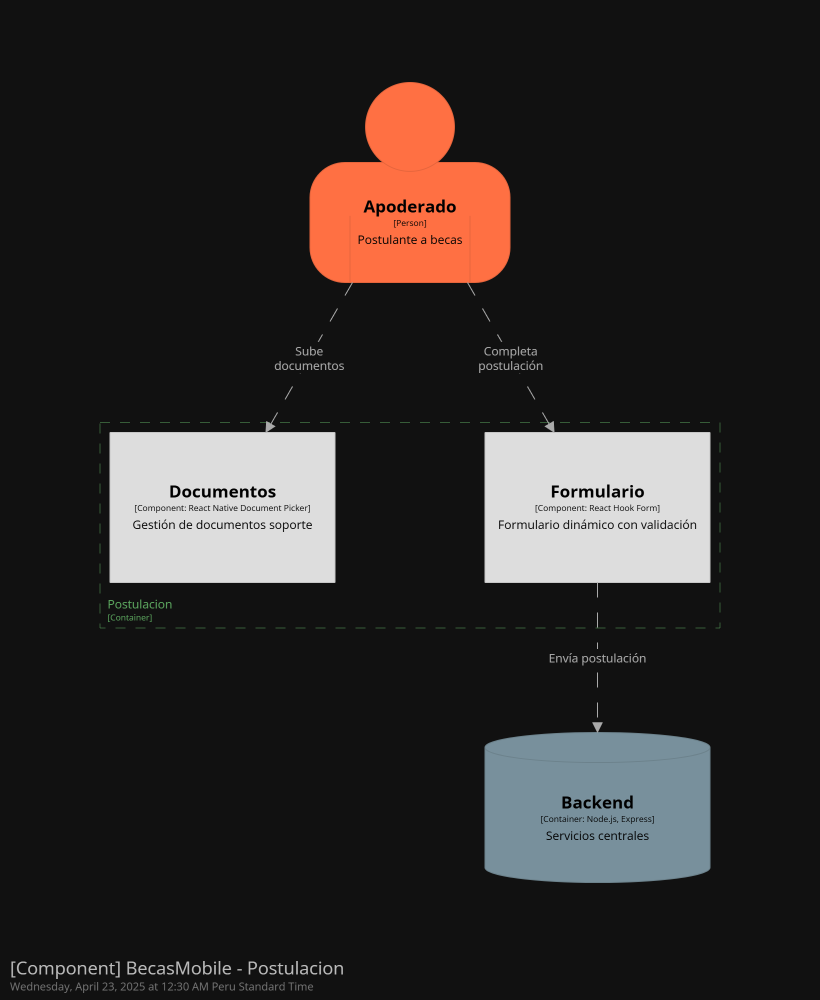

**Componente de autenticación:**

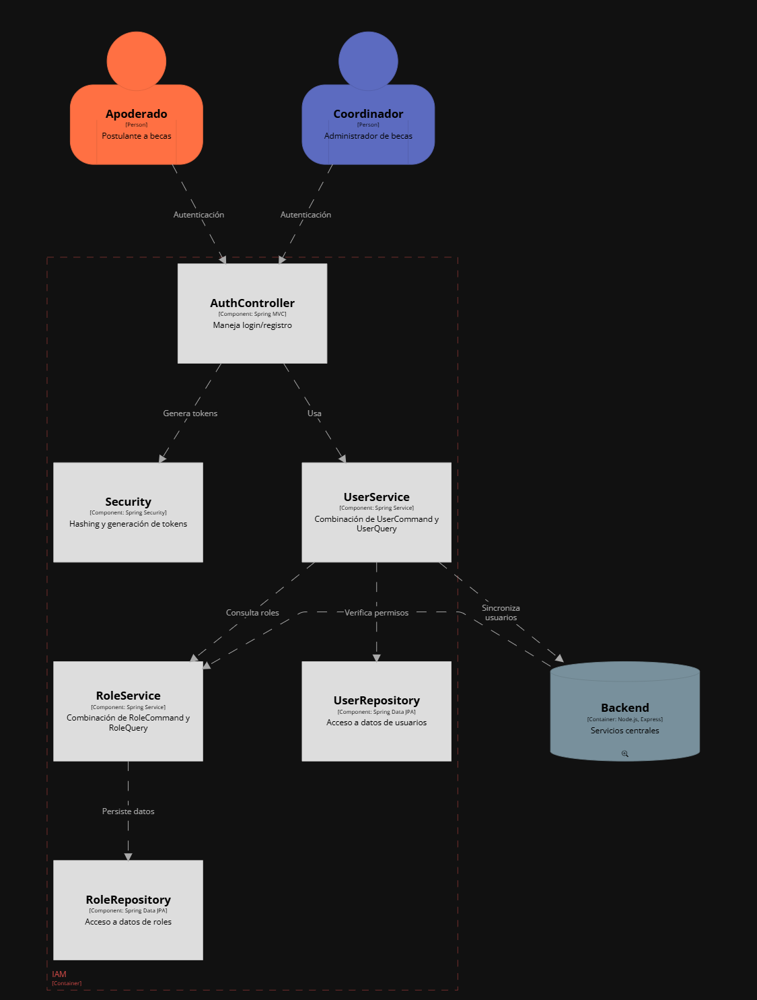 

ANEXO F
### 4.2. Tactical-Level Domain-Driven Design

## 4.2.1. Bounded Context: IAM  
### 4.2.1.1. Domain Layer
La capa de dominio constituye el corazón de la aplicación, ya que en ella se encuentran las reglas y modelos fundamentales que determinan la lógica del negocio. En este contexto, el Aggregate "User" actúa como la entidad clave que representa a los usuarios del sistema, abarcando tanto sus atributos como sus funciones. Esta capa garantiza que los conceptos empresariales y sus relaciones estén adecuadamente representados y encapsulados.

Objetivo: Representar las entidades del dominio, incorporando tanto sus características como sus acciones, para reflejar con precisión los elementos clave de la aplicación, como usuarios, productos, operaciones comerciales, entre otros.

Este enfoque mantiene la esencia del texto original pero con un estilo y estructura diferentes, evitando así problemas de similitud textual. 

* Aggregate: User  
**Descripción:**  El agregado "Usuario" actúa como la raíz del modelo, encapsulando los datos esenciales de la cuenta y su rol dentro del sistema. Su representación en la base de datos se realiza mediante la tabla users, asegurando la persistencia de esta entidad clave.

|Atributo|Tipo|Descripción|
|:-|:-|:-|
|id|Long|Identificador único del usuario (autogenerado).|
|username|String|Nombre de usuario único del sistema.|
|password|String|Contraseña del usuario.|
|roles|Set<Role>|Conjunto de roles asociados al usuario.|
|proofingApoderado|String|Prueba o evidencia del usuario como apoderado (almacenada como texto).|
|createdAt|Date|Fecha de creación del usuario (heredado de la clase base).|
|updatedAt|Date|Fecha de la última actualización del usuario (heredado de la clase base).|

|Método|Descripción|
|:-|:-|
|addRoles(List< Role >roles)|Añade una lista de role para el usuario , retorna el usuario con su rol añadido|
|getAuthorities()|retorna el conjunto de roles (roles) del usuario, que ya implementan la interfaz GrantedAuthority. Esto permite que Spring Security utilice esta información para realizar la autorización de acceso en la aplicación.|
|isAccountNonExpired()| Indica si la cuenta del usuario no ha expirado. Devuelve true si la cuenta sigue siendo válida.|
|isAccountNonLocked()| Indica si la cuenta del usuario no está bloqueada. Devuelve true si la cuenta está desbloqueada.|
|isCredentialsNonExpired()| Indica si las credenciales del usuario (como la contraseña) no han expirado. Devuelve true si las credenciales son válidas.|
|isEnabled()| Indica si la cuenta del usuario está habilitada. Devuelve true si la cuenta está activa.|
|getId()|Retorna el id del usuario.||
|getUsername()| Devuelve el nombre de usuario del usuario (valor incrustado)|
|getEmail()| Devuelve el correo electrónico del usuario (valor incrustado)|
|getPassword()| Devuelve la contraseña del usuario (valor incrustado)|

* Value Object: EmailAddress  

**Descripción:**  Representa una dirección de correo electrónico válida como un objeto de valor embebido.||

|Atributo|Tipo|Descripción|
|:-|:-|:-|
|email|String|Dirección de correo electrónico validada (no en blanco, máximo 50 caracteres, formato válido de correo).|
|Método|Descripción||
|EmailAddress(String email)|Constructor que recibe un correo electrónico y lo valida según las restricciones.||
|EmailAddress()|Constructor por defecto que inicializa con null .||

* Value Object: Roles  

Descripción : Define un conjunto fijo de constantes relacionadas con los roles de usuario en el sistema. En este caso, los roles definidos son ROLE_APODERADO,ROLE_ADMIN

* Entity: Role   
**Descripción:** La entidad "Role" representa el rol de un usuario dentro del sistema. Define los permisos y responsabilidades asociados a un usuario. Su representación en la base de datos se realiza mediante la tabla `roles`.

|Atributo|Tipo|Descripción|
|:-|:-|:-|
|id|Long|Identificador único del rol (autogenerado).|
|name|Roles|Nombre del rol, representado como un valor enumerado (enum).|

|Método|Descripción|
|:-|:-|
|getStringName()|Devuelve el nombre del rol como una cadena de texto.|
|getDefaultRole()|Devuelve el rol predeterminado del sistema (`ROLE_APODERADO`).|
|toRoleFromName(String name)|Convierte un nombre de rol (cadena) en una instancia de la entidad `Role`.|
|validateRoleSet(List< Role > roles)|Valida un conjunto de roles. Si el conjunto está vacío o es nulo, devuelve el rol predeterminado.|
|getAuthority()|Devuelve el nombre del rol como una cadena, implementando la interfaz `GrantedAuthority` para integrarse con Spring Security.|

### 4.2.1.2. Interface Layer
Esta capa funciona como la puerta de entrada que facilita la comunicación entre los usuarios y los diferentes servicios del sistema. Aquí, los controladores (Controllers) juegan un papel fundamental, ya que se encargan de recibir las peticiones, procesarlas y generar las respuestas correspondientes. Por ejemplo, los controladores dedicados a la autenticación y a la gestión de usuarios son los responsables de manejar todo lo relacionado con el inicio de sesión y el acceso a la información de los perfiles. Su principal objetivo es proporcionar endpoints (APIs) que permitan a los usuarios o sistemas externos conectarse con la lógica del negocio, sin embargo, es importante destacar que esta capa no implementa reglas de negocio directamente, sino que su función principal es coordinar y dirigir las solicitudes hacia los servicios correspondientes o hacia la capa de dominio para su procesamiento.  

- Controlador:  AuthenticationController  

**Descripción:** Controlador que maneja los endpoints relacionados con la autenticación de usuarios.

|Método|Ruta|Descripción|
|:-|:-|:-|
|signIn|POST /api/v1/authentication/sign-in|Maneja la solicitud de inicio de sesión. Recibe un objeto `SignInResource` del cuerpo de la solicitud, lo convierte en un comando y llama al servicio de comandos para autenticar al usuario. Si la autenticación es exitosa, devuelve un recurso de usuario autenticado. Si falla, retorna un error 404.|
|signUp|POST /api/v1/authentication/sign-up|Maneja la solicitud de registro de nuevos usuarios. Recibe un objeto `SignUpResource`, lo convierte en un comando y llama al servicio de comandos para registrar al usuario. Si el registro es exitoso, devuelve un recurso de usuario creado. Si hay un error, retorna un error 400.|

|Dependencias|Descripción|
|:-|:-|
|UserCommandService|Servicio encargado de manejar los comandos relacionados con la creación y autenticación de usuarios.|
|SignInCommandFromResourceAssembler|Utilidad para convertir el recurso de inicio de sesión en un comando.|
|SignUpCommandFromResourceAssembler|Utilidad para convertir el recurso de registro en un comando.|
|AuthenticatedUserResourceFromEntityAssembler|Utilidad para convertir el usuario autenticado en un recurso.|
|UserResourceFromEntityAssembler|Utilidad para convertir el usuario registrado en un recurso.|

- Controlador:  RolesController

**Descripción:** Controlador que maneja los endpoints relacionados con la gestión de roles.

|Método|Ruta|Descripción|
|:-|:-|:-|
|getAllRoles|GET /ap/v1/roles|Maneja la solicitud para obtener todos los roles. Llama al servicio de consultas, obtiene la lista de roles y los convierte en recursos para la respuesta. Devuelve una lista de recursos de roles.|

|Dependencias|Descripción|
|:-|:-|
|RoleQueryService|Servicio encargado de manejar las consultas relacionadas con roles.|
|GetAllRolesQuery|Consulta que se utiliza para obtener todos los roles.|
|RoleResourceFromEntityAssembler|Utilidad para convertir las entidades de roles en recursos que se envían en la respuesta.|

- Controlador:  UsersController

**Descripción:** Controlador que maneja los endpoints relacionados con la gestión de usuarios.

|Método|Ruta|Descripción|
|:-|:-|:-|
|getAllUsers|GET /api/v1/users|Maneja la solicitud para obtener todos los usuarios. Llama al servicio de consultas, obtiene la lista de usuarios y la convierte en recursos para la respuesta. Devuelve una lista de recursos de usuarios.|
|getUserById|GET /api/v1/users/{userId}|Maneja la solicitud para obtener un usuario específico por su ID. Llama al servicio de consultas con el ID proporcionado. Si el usuario existe, lo convierte en un recurso y lo devuelve; si no, retorna un error 404.|
|updateProofingApoderado|PUT /api/v1/users/{userId}/update-proofing|Maneja la solicitud para actualizar el estado de verificación de un apoderado. Recibe un objeto `UpdateProofingApoderadoResource` del cuerpo de la solicitud, lo convierte en un comando y llama al servicio de comandos para actualizar el estado. Devuelve un mensaje de éxito si la operación es exitosa.|

|Dependencias|Descripción|
|:-|:-|
|UserQueryService|Servicio encargado de manejar las consultas relacionadas con usuarios.|
|UserCommandService|Servicio encargado de manejar los comandos relacionados con la gestión de usuarios.|
|GetAllUsersQuery|Consulta que se utiliza para obtener todos los usuarios.|
|GetUserByIdQuery|Consulta que se utiliza para obtener un usuario específico por su ID.|
|UpdateProofingApoderadoCommandFromResourceAssembler|Utilidad para convertir el recurso de actualización de verificación en un comando.|
|UserResourceFromEntityAssembler|Utilidad para convertir las entidades de usuario en recursos que se envían en la respuesta.|

### 4.2.1.3. Application Layer
La capa de aplicación se encarga de organizar las operaciones del negocio y manejar la lógica que regula el intercambio de información entre las capas de dominio e infraestructura. En este nivel se encuentran los servicios que administran tanto las acciones (comandos) como las consultas vinculadas a los usuarios, integrando las normas de negocio asociadas a estos flujos. Su objetivo principal es ofrecer los servicios que materializan la lógica operativa del negocio, coordinando la comunicación entre el repositorio (capa de infraestructura) y las entidades del dominio. En esta capa también se llevan a cabo verificaciones de negocio y procesos complejos antes de cualquier interacción con las demás capas del sistema.  

* Servicio:UserCommandServiceImpl  
**Descripción:** Implementación del servicio de comandos para la gestión de usuarios, incluyendo registro, inicio de sesión y actualización del estado de verificación de apoderados y organizador.||

|Método|Descripción|
|:-|:-|
|handle(SignUpCommand)|Maneja el comando de registro de un nuevo usuario. Verifica la unicidad del nombre de usuario. Si todo es válido, crea un nuevo usuario, lo guarda en el repositorio y devuelve el usuario creado.||
|handle(SignInCommand)|Maneja el comando de inicio de sesión. Busca al usuario por nombre de usuario. Verifica que el usuario existe y que la contraseña coincide. Si es válido, genera un token de autenticación y lo devuelve junto con el usuario.||
|updateProofingApoderado(UpdateProofingApoderadoCommand)|Actualiza el estado de verificación de un apoderado. Verifica que el usuario tenga el rol adecuado y actualiza el estado en el repositorio.||

|Dependencias|Descripción|
|:-|:-|
|UserRepository|Repositorio que maneja las operaciones de persistencia relacionadas con usuarios.||
|HashingService|Servicio encargado de codificar y verificar contraseñas de usuarios.||
|TokenService|Servicio que genera tokens de autenticación para usuarios.||
|RoleRepository|Repositorio que maneja las operaciones de persistencia relacionadas con roles.||
|User|Agregado que representa al usuario en el sistema.||
|SignUpCommand|Comando que encapsula la información necesaria para registrar un nuevo usuario.||
|SignInCommand|Comando que encapsula la información necesaria para iniciar sesión con un usuario.||
|UpdateProofingApoderadoCommand|Comando que encapsula la información necesaria para actualizar el estado de verificación de un apoderado.||

* Servicio:UserQueryServiceImpl  

**Descripción:** Implementación del servicio de consultas para la gestión de usuarios, permitiendo obtener información sobre usuarios registrados.||

|Método|Descripción|
|:-|:-|
|handle(GetUserByUsernameQuery)|Maneja la consulta para obtener un usuario por su nombre de usuario. Devuelve un `Optional<User>` que puede estar vacío si no se encuentra el usuario.||
|handle(GetUserByIdQuery)|Maneja la consulta para obtener un usuario por su ID. Devuelve un `Optional<User>` que puede estar vacío si no se encuentra el usuario.||
|handle(GetAllUsersQuery)|Maneja la consulta para obtener todos los usuarios registrados en el sistema. Devuelve una lista de objetos `User`.||

|Dependencias|Descripción|
|:-|:-|
|UserRepository|Repositorio que maneja las operaciones de persistencia relacionadas con usuarios.||
|User|Agregado que representa al usuario en el sistema.||
|GetUserByUsernameQuery|Consulta que encapsula la información necesaria para buscar un usuario por su nombre de usuario.||
|GetUserByIdQuery|Consulta que encapsula la información necesaria para buscar un usuario por su ID.||
|GetAllUsersQuery|Consulta que encapsula la información necesaria para obtener todos los usuarios registrados.||

* Servicio: RoleCommandServiceImpl  

**Descripción:** Implementación del servicio de comandos para la gestión de roles, incluyendo la creación de roles iniciales si no existen.||

|Método|Descripción|
|:-|:-|
|handle(SeedRolesCommand)|Maneja el comando para inicializar los roles en el sistema. Verifica si los roles ya existen en el repositorio y, si no, los crea y los guarda.||

|Dependencias|Descripción|
|:-|:-|
|RoleRepository|Repositorio que maneja las operaciones de persistencia relacionadas con roles.||
|Role|Entidad que representa un rol en el sistema.||
|SeedRolesCommand|Comando que encapsula la información necesaria para inicializar los roles en el sistema.||

* Servicio: RoleQueryServiceImpl  

**Descripción:** Implementación del servicio de consultas para la gestión de roles, permitiendo obtener información sobre los roles registrados.||

|Método|Descripción|
|:-|:-|
|handle(GetAllRolesQuery)|Maneja la consulta para obtener todos los roles registrados en el sistema. Devuelve una lista de objetos `Role`.||
|handle(GetRoleByNameQuery)|Maneja la consulta para obtener un rol por su nombre. Devuelve un `Optional<Role>` que puede estar vacío si no se encuentra el rol.||

|Dependencias|Descripción|
|:-|:-|
|RoleRepository|Repositorio que maneja las operaciones de persistencia relacionadas con roles.||
|Role|Entidad que representa un rol en el sistema.||
|GetAllRolesQuery|Consulta que encapsula la información necesaria para obtener todos los roles registrados.||
|GetRoleByNameQuery|Consulta que encapsula la información necesaria para buscar un rol por su nombre.||  

### 4.2.1.4. Infrastructure Layer
La capa de infraestructura gestiona la comunicación con sistemas externos, incluyendo bases de datos, servicios web y otros recursos ajenos al núcleo del negocio. En este contexto, el UserRepository se encarga específicamente de almacenar y recuperar información de usuarios, ofreciendo funcionalidades para verificar su existencia y realizar búsquedas en la base de datos. Su propósito principal es facilitar el acceso a los datos externos y asegurar que el sistema pueda interactuar con ellos de manera óptima. Esta capa alberga los componentes repositorio, que son los responsables de mantener la persistencia de las entidades definidas en el dominio. 

* Repositorio: UserRepository  
**Descripción:** Repositorio que maneja las operaciones de persistencia relacionadas con los usuarios en la base de datos.

|Método|Descripción|
|:-|:-|
|findByUsername(String username)|Busca un usuario en la base de datos utilizando su nombre de usuario. Devuelve un `Optional<User>`.|
|existsByUsername(String username)|Verifica si un usuario con el nombre de usuario especificado ya existe en la base de datos. Devuelve un `boolean`.|
|findById(Long id)|Busca un usuario en la base de datos utilizando su ID. Devuelve un `Optional<User>`.|
|findAll()|Devuelve una lista de todos los usuarios almacenados en la base de datos.|
|hasApoderadoRole(Long userId)|Verifica si un usuario tiene el rol de apoderado (basado en `role_id = 3`). Devuelve un `boolean`.|

|Dependencias|Descripción|
|:-|:-|
|User|Clase que representa al usuario en el sistema.||

* Repositorio: RoleRepository  

**Descripción:** Repositorio que maneja las operaciones de persistencia relacionadas con los roles en la base de datos.

|Método|Descripción|
|:-|:-|
|findByName(Roles name)|Busca un rol en la base de datos utilizando su nombre. Devuelve un `Optional<Role>`.|
|existsByName(Roles name)|Verifica si un rol con el nombre especificado ya existe en la base de datos. Devuelve un `boolean`.|
|findById(Long id)|Busca un rol en la base de datos utilizando su ID. Devuelve un `Optional<Role>`.|
|findAll()|Devuelve una lista de todos los roles almacenados en la base de datos.|

|Dependencias|Descripción|
|:-|:-|
|Role|Clase que representa un rol en el sistema.||
|Roles|Valor de objeto que encapsula el nombre del rol.||

### 4.2.1.5. Bounded Context Software Architecture Component Level Diagrams
El diagrama representa el módulo de Identity and Access Management (IAM) del sistema "BecasMobile" del aplicativo Scholr, diseñado con una arquitectura modular basada en Spring Boot. El AuthController expone endpoints para autenticación (login/registro), delegando la lógica al UserService (gestión de usuarios) y RoleService (gestión de roles). Estos servicios interactúan con sus respectivos repositorios (UserRepository y RoleRepository) para persistir datos en la base de datos, mientras que el componente Security se encarga del hashing y generación de tokens JWT.

El IAM se integra con otros módulos: el UserService sincroniza datos con el Backend API, y el RoleService provee verificación de permisos para el sistema. Además, los actores (Apoderado , Gestionador y Administrador) interactúan directamente con el AuthController para autenticarse, estableciendo un flujo centralizado y seguro para la gestión de identidad.

ANEXO F

### 4.2.1.6. Bounded Context Software Architecture Code Level Diagrams  

#### 4.2.1.6.1. Bounded Context Domain Layer Class Diagrams  
El diagrama de clases del Domain Layer para el Bounded Context IAM representa la estructura central del modelo de dominio, mostrando las entidades, objetos de valor, enumeraciones y sus relaciones con un alto nivel de detalle. En este diagrama, la clase principal es User (Aggregate Root), que contiene atributos como id, username, password (todos privados) y métodos públicos como addRoles() y getAuthorities(). La relación con la entidad Role (1:N) se representa con multiplicidad (1..* en User y 1 en Role), calificada por el atributo roles (Set<Role>).

El objeto de valor EmailAddress se muestra como una clase embebida (embedded) dentro de User, con su atributo privado email y constructores públicos. La enumeración Roles (ROLE_ADMIN, ROLE_APODERADO y ROL_GESTIONADOR) se asocia con la entidad Role a través del atributo name. Cada clase incluye notación UML para scope (- private, + public), tipos de retorno y parámetros en métodos (ej: +addRoles(roles: List<Role>): User). Las interfaces implementadas (como UserDetails en User) se representan con líneas discontinuas y el estereotipo «implement».

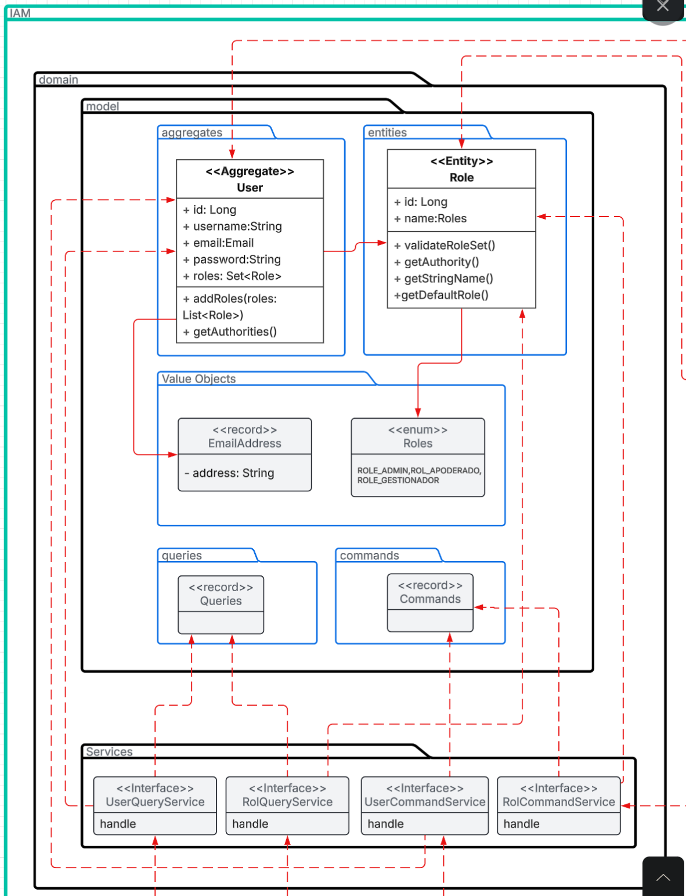 

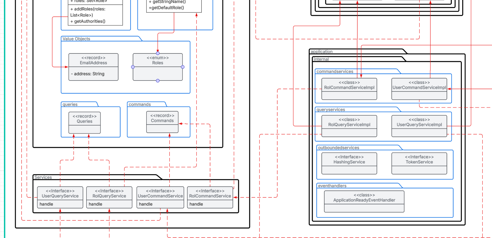 

ANEXO G

#### 4.2.1.6.2. Bounded Context Database Design Diagram  
El diagrama de base de datos para el Bounded Context IAM detalla el esquema relacional que soporta la persistencia del modelo de dominio. La tabla principal users incluye columnas como id (PK, autoincremental), username (VARCHAR, UNIQUE), password (VARCHAR), proofing_apoderado (TEXT) y campos de auditoría (created_at, updated_at). La tabla roles contiene id (PK) y name (ENUM o VARCHAR con constraint CHECK para los valores permitidos).

La relación muchos-a-muchos entre users y roles se implementa mediante una tabla de unión user_roles con las foreign keys user_id (FK a users.id) y role_id (FK a roles.id), ambas formando una PK compuesta. Se incluyen constraints como NOT NULL en campos obligatorios (ej: username) e índices únicos. Para el objeto de valor EmailAddress, se añade la columna email en users con longitud máxima (50 caracteres). Las flechas identifican las relaciones (crow’s foot notation), destacando la cardinalidad (1:N entre users y user_roles). 

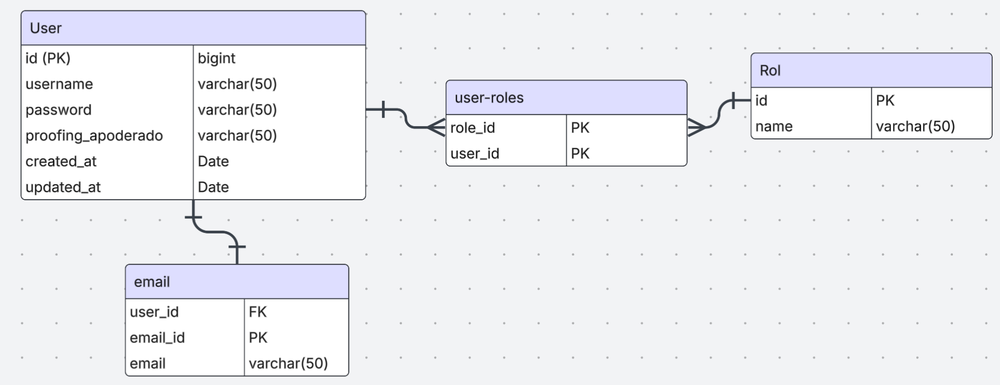

ANEXO H
 
## 4.2.2. Bounded Context: Application
### 4.2.2.1. Domain Layer

Descripción: El Domain Layer es donde se define la lógica de negocio principal, encapsulando las reglas de negocio más importantes del sistema. Este nivel contiene las entidades y los agregados que representan objetos de dominio reales. Los agregados en esta capa permiten gestionar la consistencia y las operaciones de estas entidades.

Justificación: La entidad Application representa las postulaciones a becas en el sistema. Contiene atributos como un identificador único, el postulante, apoderado del mismo, fecha de solicitud, entre otros.

<table border="1">
    <tr style="text-align: center;">
        <td colspan="3"><b>Aggregate: Application</b></td>
    </tr>
    <tr>
        <td colspan="3"><b>Descripción:</b> Representa la raíz del agregado de una postulación en el sistema, mapeando la tabla "applications".</td>
    </tr>
    <tr>
        <td><b>Atributo</b></td>
        <td><b>Tipo</b></td>
        <td><b>Descripción</b></td>
    </tr>
    <tr>
        <td>id</td>
        <td>Long</td>
        <td>Identificador único de la postulación (autogenerado).</td>
    </tr>
    <tr>
        <td>apoderadoId</td>
        <td>Long</td>
        <td>Identificador único del apoderado.</td>
    </tr>
    <tr>
        <td>tipoBeca</td>
        <td>TipoBeca (Value Object)</td>
        <td>Tipo de beca a postular.</td>
    </tr>
    <tr>
        <td>status</td>
        <td>Status (Value Object)</td>
        <td>Estado en el que se encuentra la postulación.</td>
    </tr>
    <tr>
        <td>dataApoderado</td>
        <td>DataApoderado</td>
        <td>Información adicional sobre el apoderado.</td>
    </tr>
    <tr>
        <td>postulante</td>
        <td>Postulante</td>
        <td>Relación con el postulante.</td>
    </tr>
    <tr>
        <td>createdAt</td>
        <td>Date</td>
        <td>Fecha de creación de la postulación (no modificable).</td>
    </tr>
    <tr>
        <td>updatedAt</td>
        <td>Date</td>
        <td>Fecha de última actualización de la postulación.</td>
    </tr>
    <tr>
        <td><b>Método</b></td>
        <td colspan="2"><b>Descripción</b></td>
    </tr>
    <tr>
        <td>Application(tipoBeca, apoderado, postulante)</td>
        <td colspan="2">Constructor que inicializa una nueva postulación con tipo de beca, apoderado y postulante.</td>
    </tr>
    <tr>
        <td>getId()</td>
        <td colspan="2">Retorna el identificador único de la postulación.</td>
    </tr>
    <tr>
        <td>getTipoBeca()</td>
        <td colspan="2">Retorna el tipo de beca a la que se está postulando.</td>
    </tr>
    <tr>
        <td>getStatus()</td>
        <td colspan="2">Retorna el estado actual de la postulación.</td>
    </tr>
    <tr>
        <td>getApoderado()</td>
        <td colspan="2">Retorna la relación con el apoderado.</td>
    </tr>
    <tr>
        <td>getPostulante()</td>
        <td colspan="2">Retorna la relación con el postulante.</td>
    </tr>
    <tr>
        <td>getCreatedAt()</td>
        <td colspan="2">Retorna la fecha de creación de la postulación.</td>
    </tr>
    <tr>
        <td>getUpdatedAt()</td>
        <td colspan="2">Retorna la última fecha de actualización.</td>
    </tr>
    <tr>
        <td>update(tipoBeca, apoderado, postulante)</td>
        <td colspan="2">Actualiza los datos de la postulación excepto el estado.</td>
    </tr>
    <tr>
        <td>delete()</td>
        <td colspan="2">Elimina la postulación del sistema.</td>
    </tr>
    <tr>
        <td>getEstado()</td>
        <td colspan="2">Devuelve el estado actual de la postulación.</td>
    </tr>
    <tr>
        <td>changeStatus(nuevoEstado)</td>
        <td colspan="2">Modifica únicamente el estado de la postulación.</td>
    </tr>
</table>

 

<table border="1">
    <tr style="text-align: center;">
        <td colspan="3"><b>Aggregate: DataApoderado</b></td>
    </tr>
    <tr>
        <td colspan="3"><b>Descripción:</b> Representa datos extra de un apoderado</td>
    </tr>
    <tr>
        <td><b>Atributo</b></td>
        <td><b>Tipo</b></td>
        <td><b>Descripción</b></td>
    </tr>
    <tr>
        <td>id</td>
        <td>Long</td>
        <td>Identificador único de la informacion extra del apoderado.</td>
    </tr>
    <tr>
        <td>apoderadoId</td>
        <td>Long</td>
        <td>Identificador único del apoderado.</td>
    </tr>
    <tr>
        <td>nombres</td>
        <td>String</td>
        <td>Nombre(s) del apoderado.</td>
    </tr>
    <tr>
        <td>apellidos</td>
        <td>String</td>
        <td>Apellido(s) del apoderado.</td>
    </tr>
    <tr>
        <td>DNI</td>
        <td>Int</td>
        <td>Documento Nacional de Identidad.</td>
    </tr>
    <tr>
        <td>fecha_nacimiento</td>
        <td>Date</td>
        <td>Fecha de nacimiento del apoderado.</td>
    </tr>
    <tr>
        <td>contacto</td>
        <td>Contacto</td>
        <td>Información de contacto del apoderado.</td>
    </tr>
    <tr>
        <td>domicilio</td>
        <td>Domicilio</td>
        <td>Dirección del apoderado.</td>
    </tr>
    <tr>
        <td>cuentaBancaria</td>
        <td>CuentaBancaria</td>
        <td>Información de cuenta bancaria.</td>
    </tr>
    <tr>
        <td>informacionLaboral</td>
        <td>InformacionLaboral</td>
        <td>Datos laborales del apoderado.</td>
    </tr>
    <tr>
        <td><b>Método</b></td>
        <td colspan="2"><b>Descripción</b></td>
    </tr>
    <tr>
        <td>Apoderado(id, nombres, apellidos, DNI, fecha_nacimiento, contacto, domicilio, cuentaBancaria, informacionLaboral)</td>
        <td colspan="2">Constructor que inicializa un apoderado con toda su información.</td>
    </tr>
    <tr>
        <td>getId()</td>
        <td colspan="2">Retorna el identificador único.</td>
    </tr>
    <tr>
        <td>getNombres()</td>
        <td colspan="2">Retorna los nombres del apoderado.</td>
    </tr>
    <tr>
        <td>getApellidos()</td>
        <td colspan="2">Retorna los apellidos del apoderado.</td>
    </tr>
    <tr>
        <td>getDNI()</td>
        <td colspan="2">Retorna el DNI del apoderado.</td>
    </tr>
    <tr>
        <td>getFechaNacimiento()</td>
        <td colspan="2">Retorna la fecha de nacimiento.</td>
    </tr>
    <tr>
        <td>getContacto()</td>
        <td colspan="2">Retorna la información de contacto.</td>
    </tr>
    <tr>
        <td>getDomicilio()</td>
        <td colspan="2">Retorna el domicilio.</td>
    </tr>
    <tr>
        <td>getCuentaBancaria()</td>
        <td colspan="2">Retorna la cuenta bancaria.</td>
    </tr>
    <tr>
        <td>getInformacionLaboral()</td>
        <td colspan="2">Retorna la información laboral del apoderado.</td>
    </tr>
</table>

 

<table border="1">
    <tr style="text-align: center;">
        <td colspan="3"><b>Entidad: Postulante</b></td>
    </tr>
    <tr>
        <td colspan="3"><b>Descripción:</b> Entidad que representa a un postulante.</td>
    </tr>
    <tr>
        <td><b>Atributo</b></td>
        <td><b>Tipo</b></td>
        <td><b>Descripción</b></td>
    </tr>
    <tr>
        <td>id</td>
        <td>Long</td>
        <td>Identificador único de la postulación.</td>
    </tr>
    <tr>
        <td>nombres</td>
        <td>String</td>
        <td>Nombres del postulante.</td>
    </tr>
    <tr>
        <td>apellidos</td>
        <td>String</td>
        <td>Apellidos del postulante.</td>
    </tr>
    <tr>
        <td>DNI</td>
        <td>int</td>
        <td>Documento Nacional de Identidad del postulante.</td>
    </tr>
    <tr>
        <td>fechaNacimiento</td>
        <td>Date</td>
        <td>Fecha de nacimiento del postulante.</td>
    </tr>
    <tr>
        <td>contacto</td>
        <td>Contacto (value object)</td>
        <td>Información de contacto del postulante.</td>
    </tr>
    <tr>
        <td>centroEstudios</td>
        <td>CentroEstudios (value object)</td>
        <td>Centro de estudios del postulante.</td>
    </tr>
    <tr>
        <td><b>Método</b></td>
        <td colspan="2"><b>Descripción</b></td>
    </tr>
    <tr>
        <td>Postulante(id, nombres, apellidos, DNI, fechaNacimiento, contacto, centroEstudios)</td>
        <td colspan="2">Constructor que inicializa los atributos del postulante.</td>
    </tr>
    <tr>
        <td>setId(id: Long)</td>
        <td colspan="2">Establece el identificador único de la postulación.</td>
    </tr>
    <tr>
        <td>getId()</td>
        <td colspan="2">Retorna el identificador único de la postulación.</td>
    </tr>
    <tr>
        <td>setNombres(nombres: String)</td>
        <td colspan="2">Establece los nombres del postulante.</td>
    </tr>
    <tr>
        <td>getNombres()</td>
        <td colspan="2">Retorna los nombres del postulante.</td>
    </tr>
    <tr>
        <td>setApellidos(apellidos: String)</td>
        <td colspan="2">Establece los apellidos del postulante.</td>
    </tr>
    <tr>
        <td>getApellidos()</td>
        <td colspan="2">Retorna los apellidos del postulante.</td>
    </tr>
    <tr>
        <td>setDNI(DNI: int)</td>
        <td colspan="2">Establece el DNI del postulante.</td>
    </tr>
    <tr>
        <td>getDNI()</td>
        <td colspan="2">Retorna el DNI del postulante.</td>
    </tr>
    <tr>
        <td>setFechaNacimiento(fechaNacimiento: Date)</td>
        <td colspan="2">Establece la fecha de nacimiento del postulante.</td>
    </tr>
    <tr>
        <td>getFechaNacimiento()</td>
        <td colspan="2">Retorna la fecha de nacimiento del postulante.</td>
    </tr>
    <tr>
        <td>setContacto(contacto: Contacto)</td>
        <td colspan="2">Establece el contacto del postulante.</td>
    </tr>
    <tr>
        <td>getContacto()</td>
        <td colspan="2">Retorna el contacto del postulante.</td>
    </tr>
    <tr>
        <td>setCentroEstudios(centroEstudios: CentroEstudios)</td>
        <td colspan="2">Establece el centro de estudios del postulante.</td>
    </tr>
    <tr>
        <td>getCentroEstudios()</td>
        <td colspan="2">Retorna el centro de estudios del postulante.</td>
    </tr>
</table>

 

<table border="1">
    <tr style="text-align: center;">
        <td colspan="3"><b>Value Object: Contacto</b></td>
    </tr>
    <tr>
        <td colspan="3"><b>Descripcion:</b> Abarca tanto el correo como el número de celular para contacto.</td>
    </tr>
    <tr>
        <td><b>Atributo</b></td>
        <td><b>Tipo</b></td>
        <td><b>Descripcion</b></td>
    </tr>
    <tr>
        <td>email</td>
        <td>String</td>
        <td>Dirección de correo electrónico validada (no en blanco, máximo 50 caracteres, formato válido de correo).</td>
    </tr>
    <tr>
        <td>celular</td>
        <td>Long</td>
        <td>Número de celular validado (no en blanco ni mas de 9 dígitos)</td>
    </tr>
    <tr>
        <td><b>Método</b></td>
        <td colspan="2"><b>Descripción</b></td>
    </tr>
    <tr>
        <td>EmailAddress(email: String)</td>
        <td colspan="2">Contstructor que recibe un correo electrónico y lo valida.</td>
    </tr>
    <tr>
        <td>PhoneNumber(celular: string)</td>
        <td colspan="2">Contstructor que recibe un número de celular y lo valida.</td>
    </tr>
    <tr>
        <td>getEmail()</td>
        <td colspan="2">Retorna la dirección de correo electrónico.</td>
    </tr>
    <tr>
        <td>getPhoneNumber()</td>
        <td colspan="2">Retorna el número de celular.</td>
    </tr>
</table>

<table border="1">
    <tr style="text-align: center;">
        <td colspan="3"><b>Value Object: InformaciónLaboral</b></td>
    </tr>
    <tr>
        <td colspan="3"><b>Descripción:</b> Representa la información laboral de un colaborador.</td>
    </tr>
    <tr>
        <td><b>Atributo</b></td>
        <td><b>Tipo</b></td>
        <td><b>Descripción</b></td>
    </tr>
    <tr>
        <td>tipoColaborador</td>
        <td>String</td>
        <td>Tipo de colaborador (empleado, contratista, etc.).</td>
    </tr>
    <tr>
        <td>cargo</td>
        <td>String</td>
        <td>Puesto desempeñado dentro de la organización.</td>
    </tr>
    <tr>
        <td>sede</td>
        <td>String</td>
        <td>Ubicación principal donde trabaja el colaborador.</td>
    </tr>
    <tr>
        <td>local</td>
        <td>String</td>
        <td>Local específico dentro de la sede.</td>
    </tr>
    <tr>
        <td>ingreso</td>
        <td>BigDecimal</td>
        <td>Salario o ingreso del colaborador.</td>
    </tr>
    <tr>
        <td><b>Método</b></td>
        <td colspan="2"><b>Descripción</b></td>
    </tr>
    <tr>
        <td>InformacionLaboral(tipoColaborador, cargo, sede, local, ingreso)</td>
        <td colspan="2">Constructor que inicializa la información laboral.</td>
    </tr>
    <tr>
        <td>getTipoColaborador()</td>
        <td colspan="2">Retorna el tipo de colaborador.</td>
    </tr>
    <tr>
        <td>getCargo()</td>
        <td colspan="2">Retorna el cargo del colaborador.</td>
    </tr>
    <tr>
        <td>getSede()</td>
        <td colspan="2">Retorna la sede del colaborador.</td>
    </tr>
    <tr>
        <td>getLocal()</td>
        <td colspan="2">Retorna el local del colaborador.</td>
    </tr>
    <tr>
        <td>getIngreso()</td>
        <td colspan="2">Retorna el ingreso del colaborador.</td>
    </tr>
</table>

 

<table border="1">
    <tr style="text-align: center;">
        <td colspan="3"><b>Value Object: CuentaBancaria</b></td>
    </tr>
    <tr>
        <td colspan="3"><b>Descripción:</b> Representa los datos bancarios de un colaborador.</td>
    </tr>
    <tr>
        <td><b>Atributo</b></td>
        <td><b>Tipo</b></td>
        <td><b>Descripción</b></td>
    </tr>
    <tr>
        <td>entidadBancaria</td>
        <td>String</td>
        <td>Nombre de la institución bancaria.</td>
    </tr>
    <tr>
        <td>numeroCuenta</td>
        <td>String</td>
        <td>Número de cuenta bancaria (validado con longitud entre 10 y 20 caracteres).</td>
    </tr>
    <tr>
        <td>cci</td>
        <td>String</td>
        <td>Código de Cuenta Interbancaria (exactamente 20 caracteres).</td>
    </tr>
    <tr>
        <td><b>Método</b></td>
        <td colspan="2"><b>Descripción</b></td>
    </tr>
    <tr>
        <td>CuentaBancaria(entidadBancaria, numeroCuenta, cci)</td>
        <td colspan="2">Constructor que inicializa una cuenta bancaria validada.</td>
    </tr>
    <tr>
        <td>getEntidadBancaria()</td>
        <td colspan="2">Retorna la entidad bancaria.</td>
    </tr>
    <tr>
        <td>getNumeroCuenta()</td>
        <td colspan="2">Retorna el número de cuenta.</td>
    </tr>
    <tr>
        <td>getCci()</td>
        <td colspan="2">Retorna el código CCI.</td>
    </tr>
</table>

 

<table border="1">
    <tr style="text-align: center;">
        <td colspan="3"><b>Value Object: CentroEstudio</b></td>
    </tr>
    <tr>
        <td colspan="3"><b>Descripción:</b> Representa el centro de estudios del postulante.</td>
    </tr>
    <tr>
        <td><b>Atributo</b></td>
        <td><b>Tipo</b></td>
        <td><b>Descripción</b></td>
    </tr>
    <tr>
        <td>nombre</td>
        <td>String</td>
        <td>Nombre de la institución</td>
    </tr>
    <tr>
        <td>tipo</td>
        <td>String</td>
        <td>Tipo de institución</td>
    </tr>
    <tr>
        <td>nivel</td>
        <td>String</td>
        <td>Nivel de la institución</td>
    </tr>
    <tr>
        <td>departamento</td>
        <td>String</td>
        <td>Departamento en el que se encuentra la institución</td>
    </tr>
    <tr>
        <td>provincia</td>
        <td>String</td>
        <td>Provincia en la que se encuentra la institución</td>
    </tr>
    <tr>
        <td>distrito</td>
        <td>String</td>
        <td>Distrito en la que se encuentra la institución</td>
    </tr>
    <tr>
        <td><b>Método</b></td>
        <td colspan="2"><b>Descripción</b></td>
    </tr>
    <tr>
        <td>CentroEstudio(nombre, tipo, nivel, departamento, provincia, distrito)</td>
        <td colspan="2">Constructor que inicializa los atributos de la institución.</td>
    </tr>
    <tr>
        <td>setNombre(nombre: String)</td>
        <td colspan="2">Establece el nombre de la institución.</td>
    </tr>
    <tr>
        <td>getNombre()</td>
        <td colspan="2">Retorna el nombre de la institución.</td>
    </tr>
    <tr>
        <td>setTipo(tipo: String)</td>
        <td colspan="2">Establece el tipo de institución.</td>
    </tr>
    <tr>
        <td>getTipo()</td>
        <td colspan="2">Retorna el tipo de institución.</td>
    </tr>
    <tr>
        <td>setNivel(nivel: String)</td>
        <td colspan="2">Establece el nivel de la institución.</td>
    </tr>
    <tr>
        <td>getNivel()</td>
        <td colspan="2">Retorna el nivel de la institución.</td>
    </tr>
    <tr>
        <td>setDepartamento(departamento: String)</td>
        <td colspan="2">Establece el departamento donde se ubica la institución.</td>
    </tr>
    <tr>
        <td>getDepartamento()</td>
        <td colspan="2">Retorna el departamento de la institución.</td>
    </tr>
    <tr>
        <td>setProvincia(provincia: String)</td>
        <td colspan="2">Establece la provincia donde se ubica la institución.</td>
    </tr>
    <tr>
        <td>getProvincia()</td>
        <td colspan="2">Retorna la provincia de la institución.</td>
    </tr>
    <tr>
        <td>setDistrito(distrito: String)</td>
        <td colspan="2">Establece el distrito donde se ubica la institución.</td>
    </tr>
    <tr>
        <td>getDistrito()</td>
        <td colspan="2">Retorna el distrito de la institución.</td>
    </tr>
    <tr>
        <td>setEmail(email: String)</td>
        <td colspan="2">Establece el correo electrónico validándolo.</td>
    </tr>
    <tr>
        <td>getEmail()</td>
        <td colspan="2">Retorna la dirección de correo electrónico.</td>
    </tr>
    <tr>
        <td>setCelular(celular: String)</td>
        <td colspan="2">Establece el número de celular validándolo.</td>
    </tr>
    <tr>
        <td>getCelular()</td>
        <td colspan="2">Retorna el número de celular.</td>
    </tr>
</table>

 

<table border="1">
    <tr style="text-align: center;">
        <td colspan="3"><b>Value Object: Domicilio</b></td>
    </tr>
    <tr>
        <td colspan="3"><b>Descripción:</b> Representa el domicilio de una persona.</td>
    </tr>
    <tr>
        <td><b>Atributo</b></td>
        <td><b>Tipo</b></td>
        <td><b>Descripción</b></td>
    </tr>
    <tr>
        <td>direccion</td>
        <td>String</td>
        <td>Dirección exacta del domicilio</td>
    </tr>
    <tr>
        <td>departamento</td>
        <td>String</td>
        <td>Departamento donde se encuentra el domicilio</td>
    </tr>
    <tr>
        <td>provincia</td>
        <td>String</td>
        <td>Provincia donde se encuentra el domicilio</td>
    </tr>
    <tr>
        <td>distrito</td>
        <td>String</td>
        <td>Distrito donde se encuentra el domicilio</td>
    </tr>
    <tr>
        <td><b>Método</b></td>
        <td colspan="2"><b>Descripción</b></td>
    </tr>
    <tr>
        <td>Domicilio(direccion, departamento, provincia, distrito)</td>
        <td colspan="2">Constructor que inicializa los atributos del domicilio.</td>
    </tr>
    <tr>
        <td>setDireccion(direccion: String)</td>
        <td colspan="2">Establece la dirección del domicilio.</td>
    </tr>
    <tr>
        <td>getDireccion()</td>
        <td colspan="2">Retorna la dirección del domicilio.</td>
    </tr>
    <tr>
        <td>setDepartamento(departamento: String)</td>
        <td colspan="2">Establece el departamento donde se ubica el domicilio.</td>
    </tr>
    <tr>
        <td>getDepartamento()</td>
        <td colspan="2">Retorna el departamento del domicilio.</td>
    </tr>
    <tr>
        <td>setProvincia(provincia: String)</td>
        <td colspan="2">Establece la provincia donde se ubica el domicilio.</td>
    </tr>
    <tr>
        <td>getProvincia()</td>
        <td colspan="2">Retorna la provincia del domicilio.</td>
    </tr>
    <tr>
        <td>setDistrito(distrito: String)</td>
        <td colspan="2">Establece el distrito donde se ubica el domicilio.</td>
    </tr>
    <tr>
        <td>getDistrito()</td>
        <td colspan="2">Retorna el distrito del domicilio.</td>
    </tr>
</table>

 

<table border="1">
    <tr style="text-align: center;">
        <td colspan="2"><b>Value Object: TipoBeca</b></td>
    </tr>
    <tr>
        <td colspan="2"><b>Descripción:</b> Representa los tipos de becas disponibles.</td>
    </tr>
    <tr>
        <td><b>Enumeración</b></td>
        <td><b>Descripción</b></td>
    </tr>
    <tr>
        <td>MERITO</td>
        <td>Beca otorgada por rendimiento académico sobresaliente.</td>
    </tr>
    <tr>
        <td>DEPORTIVA</td>
        <td>Beca otorgada por habilidades deportivas destacadas.</td>
    </tr>
    <tr>
        <td>ECONOMICA</td>
        <td>Beca otorgada por necesidad económica.</td>
    </tr>
    <tr>
        <td>CULTURAL</td>
        <td>Beca otorgada por logros en actividades artísticas o culturales.</td>
    </tr>
</table>

 

<table border="1">
    <tr style="text-align: center;">
        <td colspan="2"><b>Value Object: Status</b></td>
    </tr>
    <tr>
        <td colspan="2"><b>Descripción:</b> Representa el estado de un proceso o entidad.</td>
    </tr>
    <tr>
        <td><b>Enumeración</b></td>
        <td><b>Descripción</b></td>
    </tr>
    <tr>
        <td>PENDIENTE</td>
        <td>El proceso está en espera de revisión o aprobación.</td>
    </tr>
    <tr>
        <td>APROBADO</td>
        <td>El proceso ha sido validado y aceptado.</td>
    </tr>
    <tr>
        <td>RECHAZADO</td>
        <td>El proceso ha sido denegado por no cumplir los requisitos.</td>
    </tr>
    <tr>
        <td>FINALIZADO</td>
        <td>El proceso ha concluido satisfactoriamente.</td>
    </tr>
</table>

### 4.2.2.2. Interface Layer

Descripción: El Interface Layer o capa de interfaz define cómo los usuarios o sistemas externos interactúan con el sistema. Aquí, los controladores reciben y gestionan las solicitudes HTTP, enviando la información adecuada a los servicios de aplicación.

Justificación: ApplicationController maneja las solicitudes relacionadas con las postulaciones a becas, como la creación de nuevas mediante createApplication. Este controlador se apoya en los servicios ApplicationQueryService y ApplicationCommandService para consultar y ejecutar acciones sobre las postulaciones. Este layer actúa como la entrada principal para interactuar con las postulaciones, canalizando solicitudes a la capa de aplicación.

<table border="1">
    <tr style="text-align: center;">
        <td colspan="2"><b>Controlador: ApplicationsController</b></td>
    </tr>
    <tr>
        <td colspan="2"><b>Descripcion:</b> Controlador que gestiona las operaciones relacionadas con las postulaciones.</td>
    </tr>
    <tr>
        <td><b>Método</b></td>
        <td><b>Descripción</b></td>
    </tr>
    <tr>
        <td>createApplication(CreateApplicationResource resource)</td>
        <td>Crea una nueva postulación</td>
    </tr>
    <tr>
        <td>updateApplication(long applicationId, UpdateApplicationResource resource)</td>
        <td>Actualizar una postulación</td>
    </tr>
    <tr>
        <td>deleteApplication(long applicationId)</td>
        <td>Eliminar una postulacion</td>
    </tr>
    <tr>
        <td>getAllApplications()</td>
        <td>Recupera una lista de todas las postulaciones registradas.</td>
    </tr>
    <tr>
        <td>getApplicationById(long applicationId)</td>
        <td>Recupera postulacion por el id de la misma.</td>
    </tr>
    <tr>
        <td>getApplicationsByApoderadoId(long apoderadoId)</td>
        <td>Recupera todas las postulaciones segun el id del apoderado.</td>
    </tr>
    <tr>
        <td>acceptApplication(long applicationId)</td>
        <td>Cambiar el estado de una postulacion a aceptada.</td>
    </tr>
    <tr>
        <td>denyApplication(long applicationId)</td>
        <td>Cambiar el estado de una postulacion a denegada.</td>
    </tr>
    <tr>
        <td><b>Dependencias</b></td>
        <td><b>Descripción</b></td>
    </tr>
    <tr>
        <td>ApplicationQueryService</td>
        <td>Servicio para manejar consultas relacionas con las postulaciones.</td>
    </tr>
    <tr>
        <td>ApplicationCommandService</td>
        <td>Servicio para manejar comandos de posulaciones.</td>
    </tr>
    <tr>
        <td>CreateApplicationCommandFromResourceAssembler</td>
        <td>Ensamblador para convertir un recurso de postulación en un comando.</td>
    </tr>
    <tr>
        <td>ApplicationResourceFromEntityAssembler</td>
        <td>Ensamblador para conovertir una entidad de postulación en un recurso para la API.</td>
    </tr>
    <tr>
        <td>CreateApplicationResource</td>
        <td>Recurso que representa la solicitud para crear una postulación.</td>
    </tr>
    <tr>
        <td>ApplicationResource</td>
        <td>Recurso que representa la respuesta de una postulación en la API.</td>
    </tr>
    <tr>
        <td>UpdateApplicationResource</td>
        <td>Recurso que representa la solicitud para actualizar la postulación.</td>
    </tr>
</table>

 

<table border="1">
    <tr style="text-align: center;">
        <td colspan="2"><b>Controlador: DataApoderadoController</b></td>
    </tr>
    <tr>
        <td colspan="2"><b>Descripcion:</b> Controlador que gestiona las operaciones relacionadas con la información adicional de los apoderados.</td>
    </tr>
    <tr>
        <td><b>Método</b></td>
        <td><b>Descripción</b></td>
    </tr>
    <tr>
        <td>createDataApoderado(CreateDataApoderadoResource resource)</td>
        <td>Crea una nueva entrada de información adicional para un apoderado.</td>
    </tr>
    <tr>
        <td>updateDataApoderado(long dataApoderadoId, UpdateDataApoderadoResource resource)</td>
        <td>Actualiza la información adicional de un apoderado.</td>
    </tr>
    <tr>
        <td>deleteDataApoderado(long dataApoderadoId)</td>
        <td>Elimina una entrada de información adicional de un apoderado.</td>
    </tr>
    <tr>
        <td>getAllDataApoderados()</td>
        <td>Recupera una lista de todas las entradas de información adicional de apoderados registradas.</td>
    </tr>
    <tr>
        <td>getDataApoderadoById(long dataApoderadoId)</td>
        <td>Recupera la información adicional de un apoderado por su ID.</td>
    </tr>
    <tr>
        <td>getDataApoderadosByApoderadoId(long apoderadoId)</td>
        <td>Recupera todas las entradas de información adicional asociadas a un apoderado específico.</td>
    </tr>
    <tr>
        <td><b>Dependencias</b></td>
        <td><b>Descripción</b></td>
    </tr>
    <tr>
        <td>DataApoderadoQueryService</td>
        <td>Servicio para manejar consultas relacionadas con la información adicional de apoderados.</td>
    </tr>
    <tr>
        <td>DataApoderadoCommandService</td>
        <td>Servicio para manejar comandos relacionados con la información adicional de apoderados.</td>
    </tr>
    <tr>
        <td>CreateDataApoderadoCommandFromResourceAssembler</td>
        <td>Ensamblador para convertir un recurso de información adicional en un comando.</td>
    </tr>
    <tr>
        <td>DataApoderadoResourceFromEntityAssembler</td>
        <td>Ensamblador para convertir una entidad de información adicional en un recurso para la API.</td>
    </tr>
    <tr>
        <td>CreateDataApoderadoResource</td>
        <td>Recurso que representa la solicitud para crear una entrada de información adicional.</td>
    </tr>
    <tr>
        <td>DataApoderadoResource</td>
        <td>Recurso que representa la respuesta de una entrada de información adicional en la API.</td>
    </tr>
    <tr>
        <td>UpdateDataApoderadoResource</td>
        <td>Recurso que representa la solicitud para actualizar una entrada de información adicional.</td>
    </tr>
</table>

### 4.2.2.3. Application Layer

Descripción: El Application Layer orquesta las operaciones que deben ejecutarse para cumplir con las necesidades del usuario, coordinando diferentes servicios y repositorios del sistema. Contiene la lógica específica de las acciones que no necesariamente forman parte del dominio principal pero son esenciales para el funcionamiento.

Justificación: En este contexto, los servicios ApplicationCommandService y ApplicationQueryService gestionan las reglas de negocio relacionadas con las postulaciones. Se encargan de ejecutar comandos y consultas sobre las postulaciones. Esta capa se comunica con ApplicationRepository, asegurando que la lógica de negocio esté aplicada y se cumpla.

<table border="1">
    <tr style="text-align: center;">
        <td colspan="2"><b>Servicio: ApplicationCommandServiceImpl</b></td>
    </tr>
    <tr>
        <td colspan="2"><b>Descripcion:</b> Implementación de la interfaz ApplicationCommandService, encargada de gestionar las postulaciones. </td>
    </tr>
    <tr>
        <td><b>Método</b></td>
        <td><b>Descripción</b></td>
    </tr>
    <tr>
        <td>handle(CreateApplicationCommand command)</td>
        <td>Maneja la creación de una nueva postulación.</td>
    </tr>
    <tr>
        <td>handle(AcceptApplicationCommand command)</td>
        <td>Maneja la aprobacion de una postulación.</td>
    </tr>
    <tr>
        <td>handle(DenyApplicationCommand command)</td>
        <td>Maneja la denegación de una postulación</td>
    </tr>
    <tr>
        <td>deleteApplication(long applicationId)</td>
        <td>Elimina una postulación existente por el id de la misma.</td>
    </tr>
    <tr>
        <td>updateApplication(long applicationId, UpdateApplicationResource request)</td>
        <td>Actualiza una aplicación, si esta ya fue iniciada, lanza una excepción.</td>
    </tr>
    <tr>
        <td><b>Dependencias</b></td>
        <td><b>Descripción</b></td>
    </tr>
    <tr>
        <td>ApplicationRepository</td>
        <td>Repositorio para manejar la persistencia en las postulaciones.</td>
    </tr>
    <tr>
        <td>CreateApplicationCommand</td>
        <td>Comando que encapsula los datos necesarios para crear una nueva postulación</td>
    </tr>
    <tr>
        <td>DenyApplicationCommand</td>
        <td>Comando que encapsula los datos necesarios para denegar una potulación.</td>
    </tr>
    <tr>
        <td>AcceptApplicationCommand</td>
        <td>Comando que encapsula los datos necesarios para aceptar una potulación.</td>
    </tr>
    <tr>
        <td>UpdateApplicationResource</td>
        <td>Recurso que encapsula los datos necesarios para actualizar una postulación</td>
    </tr>
    <tr>
        <td>Application</td>
        <td>Entidad que representa una postulación en el dominio.</td>
    </tr>
</table>

 

<table border="1">
    <tr style="text-align: center;">
        <td colspan="2"><b>Servicio: ApplicationQueryServiceImpl</b></td>
    </tr>
    <tr>
        <td colspan="2"><b>Descripcion:</b> Implementación de la interfaz ApplicationQueryService, encargada de manejar las consulatas relacionadas con postulaciones. </td>
    </tr>
    <tr>
        <td><b>Método</b></td>
        <td><b>Descripción</b></td>
    </tr>
    <tr>
        <td>handle(GetApplicationByIdQuery query)</td>
        <td>Maneja la consulta para obtener una postulacion por su Id.</td>
    </tr>
    <tr>
        <td>handle(getAllApplicationsQuery query)</td>
        <td>Maneja la consulta para obtener todas las postulaciones.</td>
    </tr>
    <tr>
        <td>handle(GetApplicationsByApoderadoIdQuery query)</td>
        <td>Maneja la consulta para obtener todas las postulaciones según el id del apoderado.</td>
    </tr>
    <tr>
        <td><b>Dependencias</b></td>
        <td><b>Descripción</b></td>
    </tr>
    <tr>
        <td>ApplicationRepository</td>
        <td>Repositorio para manejar la persistencia en las postulaciones.</td>
    </tr>
    <tr>
        <td>GetApplicationByIdQuery</td>
        <td>Consulta que encaptula el Id de la postulación que se desea obtener.</td>
    </tr>
    <tr>
        <td>GetAllApplicationsQuery</td>
        <td>Consulta que no requiere parámetros y busca todas las postulaciones.</td>
    </tr>
    <tr>
        <td>GetApplicationByApoderadoIdQuery</td>
        <td>Consulta que encaptula el Id del apoderado para buscar asi postulaciones que coincidan.</td>
    </tr>
</table>

 

<table border="1">
    <tr style="text-align: center;">
        <td colspan="2"><b>Servicio: DataApoderadoCommandServiceImpl</b></td>
    </tr>
    <tr>
        <td colspan="2"><b>Descripcion:</b> Implementación de la interfaz DataApoderadoCommandService, encargada de gestionar las operaciones relacionadas con la información adicional de los apoderados.</td>
    </tr>
    <tr>
        <td><b>Método</b></td>
        <td><b>Descripción</b></td>
    </tr>
    <tr>
        <td>handle(CreateDataApoderadoCommand command)</td>
        <td>Maneja la creación de una nueva entrada de información adicional para un apoderado.</td>
    </tr>
    <tr>
        <td>handle(UpdateDataApoderadoCommand command)</td>
        <td>Maneja la actualización de la información adicional de un apoderado.</td>
    </tr>
    <tr>
        <td>deleteDataApoderado(long dataApoderadoId)</td>
        <td>Elimina una entrada de información adicional de un apoderado por su ID.</td>
    </tr>
    <tr>
        <td><b>Dependencias</b></td>
        <td><b>Descripción</b></td>
    </tr>
    <tr>
        <td>DataApoderadoRepository</td>
        <td>Repositorio para manejar la persistencia de la información adicional de los apoderados.</td>
    </tr>
    <tr>
        <td>CreateDataApoderadoCommand</td>
        <td>Comando que encapsula los datos necesarios para crear una nueva entrada de información adicional.</td>
    </tr>
    <tr>
        <td>UpdateDataApoderadoCommand</td>
        <td>Comando que encapsula los datos necesarios para actualizar una entrada de información adicional.</td>
    </tr>
    <tr>
        <td>DataApoderado</td>
        <td>Entidad que representa la información adicional de un apoderado en el dominio.</td>
    </tr>
</table>

 

<table border="1">
    <tr style="text-align: center;">
        <td colspan="2"><b>Servicio: DataApoderadoQueryServiceImpl</b></td>
    </tr>
    <tr>
        <td colspan="2"><b>Descripcion:</b> Implementación de la interfaz DataApoderadoQueryService, encargada de manejar las consultas relacionadas con la información adicional de los apoderados.</td>
    </tr>
    <tr>
        <td><b>Método</b></td>
        <td><b>Descripción</b></td>
    </tr>
    <tr>
        <td>handle(GetDataApoderadoByIdQuery query)</td>
        <td>Maneja la consulta para obtener la información adicional de un apoderado por su ID.</td>
    </tr>
    <tr>
        <td>handle(GetAllDataApoderadosQuery query)</td>
        <td>Maneja la consulta para obtener todas las entradas de información adicional de apoderados registradas.</td>
    </tr>
    <tr>
        <td>handle(GetDataApoderadosByApoderadoIdQuery query)</td>
        <td>Maneja la consulta para obtener todas las entradas de información adicional asociadas a un apoderado específico.</td>
    </tr>
    <tr>
        <td><b>Dependencias</b></td>
        <td><b>Descripción</b></td>
    </tr>
    <tr>
        <td>DataApoderadoRepository</td>
        <td>Repositorio para manejar la persistencia de la información adicional de los apoderados.</td>
    </tr>
    <tr>
        <td>GetDataApoderadoByIdQuery</td>
        <td>Consulta que encapsula el ID de la información adicional que se desea obtener.</td>
    </tr>
    <tr>
        <td>GetAllDataApoderadosQuery</td>
        <td>Consulta que no requiere parámetros y busca todas las entradas de información adicional.</td>
    </tr>
    <tr>
        <td>GetDataApoderadosByApoderadoIdQuery</td>
        <td>Consulta que encapsula el ID del apoderado para buscar las entradas de información adicional asociadas.</td>
    </tr>
</table>

### 4.2.2.4. Infrastructure Layer

Descripción: El Infrastructure Layer se encarga de proporcionar acceso a la base de datos, servicios externos y otros detalles técnicos que no forman
parte de la lógica de negocio. Actúa como la implementación real de la persistencia y otras preocupaciones técnicas.

Justificación: ApplicationRepository es el responsable de la persistencia de las postulaciones. Los diferentes métodos permiten
interactuar directamente con la base de datos. Este layer asegura que los datos se almacenen y recuperen correctamente desde la infraestructura subyacente, separando las preocupaciones técnicas de las reglas de negocio.

<table border="1">
    <tr style="text-align: center;">
        <td colspan="2"><b>Repositorio: ApplicationRepository</b></td>
    </tr>
    <tr>
        <td colspan="2"><b>Descripcion:</b> Repositorio de acceso a datos para la entidad Application, utilizando JPA para realizar operaciones de persistencia.</td>
    </tr>
    <tr>
        <td><b>Método</b></td>
        <td><b>Descripción</b></td>
    </tr>
    <tr>
        <td>findApplicationStatus(long applicationId)</td>
        <td>Busca el estado de una postulación según el id de la misma.</td>
    </tr>
    <tr>
        <td>findApplicationByPostulanteIdAndId(long applicationId, long postulanteId)</td>
        <td>Busca una postulación que coincida con el id de la misma y el del postulante ingresados.</td>
    </tr>
</table>

 

<table border="1">
    <tr style="text-align: center;">
        <td colspan="2"><b>Repositorio: DataApoderadoRepository</b></td>
    </tr>
    <tr>
        <td colspan="2"><b>Descripcion:</b> Repositorio de acceso a datos para la entidad DataApoderado, utilizando JPA para realizar operaciones de persistencia.</td>
    </tr>
    <tr>
        <td><b>Método</b></td>
        <td><b>Descripción</b></td>
    </tr>
    <tr>
        <td>findDataApoderadoById(long dataApoderadoId)</td>
        <td>Busca la información adicional de un apoderado según su ID.</td>
    </tr>
    <tr>
        <td>findAllDataApoderados()</td>
        <td>Recupera una lista de todas las entradas de información adicional de apoderados registradas.</td>
    </tr>
    <tr>
        <td>findDataApoderadosByApoderadoId(long apoderadoId)</td>
        <td>Busca todas las entradas de información adicional asociadas a un apoderado específico.</td>
    </tr>
</table>

### 4.2.2.5. Bounded Context Software Architecture Component Level Diagrams

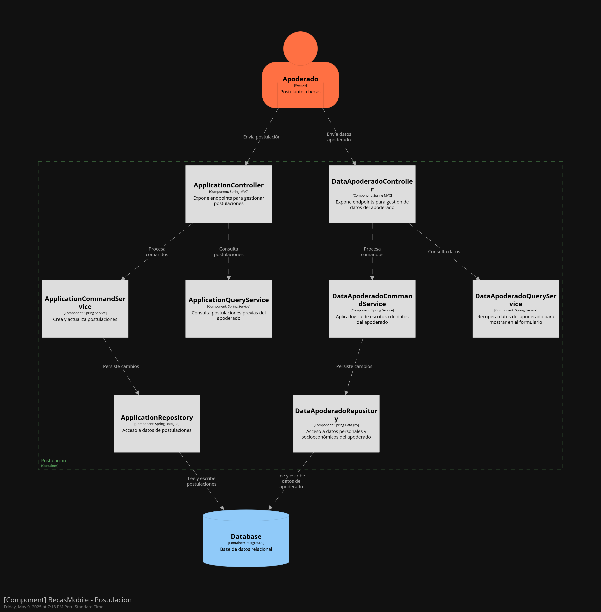

ANEXO F

### 4.2.2.6. Bounded Context Software Architecture Code Level Diagrams

#### 4.2.2.6.1. Bounded Context Domain Layer Class Diagrams

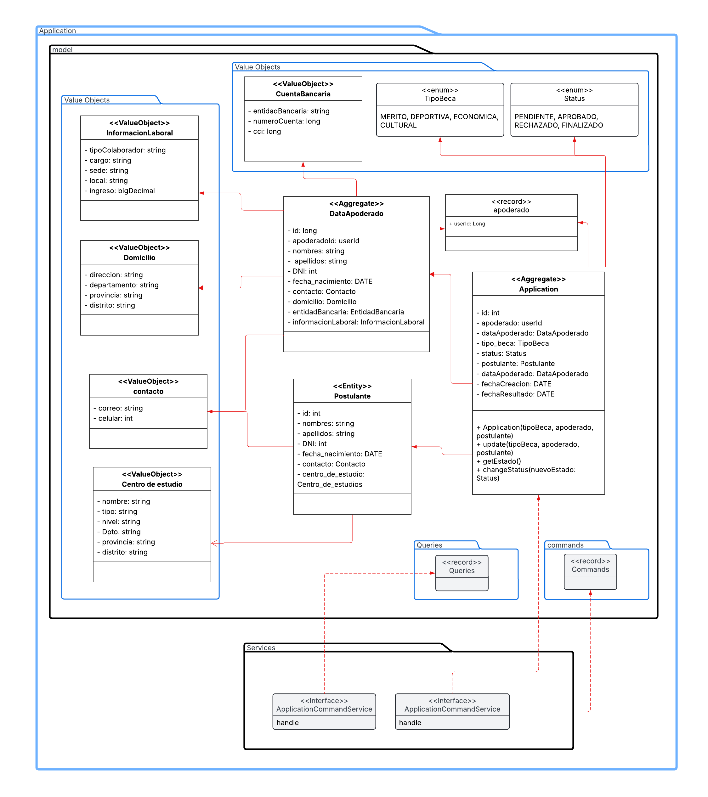

ANEXO G 

#### 4.2.2.6.2. Bounded Context Database Design Diagram

El diagrama de base de datos para el Bounded Context Applications detalla el esquema relacional que soporta la persistencia del modelo de dominio. La tabla principal applications incluye columnas como id (PK, autoincremental) y campos de auditoría (created_at, updated_at). La tabla data_apoderados contiene id (PK), name, apoderadoId (record), etc.

La relación uno-a-muchos entre data_apoderados y applications nos muestra que la misma data para apoderados puede estar en diferentes postulaciones, al igual que para la relación de postulantes a postulaciones.

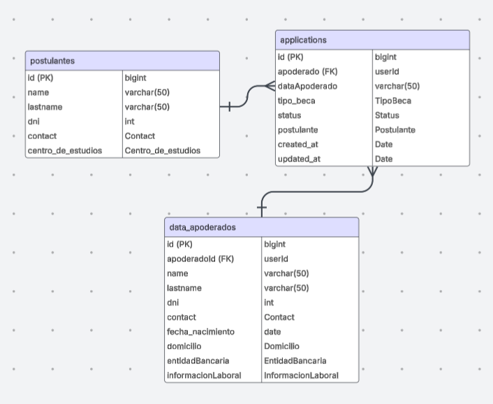 

ANEXO H
  
### 4.2.3. Bounded Context: Management

#### 4.2.3.1. Domain Layer  
**Descripción**: Capa que contiene los agregados, entidades y value objects fundamentales para la gestión de becas y reportes, garantizando la integridad de las reglas de negocio.

* **Aggregate: Scholarship**  
**Descripción:** Representa una convocatoria de beca en el sistema, controlando su ciclo de vida desde creación hasta cierre.

| Atributo            | Tipo               | Descripción |
|---------------------|--------------------|-------------|
| id                  | Long               | ID único generado automáticamente |
| name                | String             | Nombre descriptivo de la convocatoria (ej: "Beca Excelencia 2024") |
| requirements        | List<Requirement>  | Lista de requisitos obligatorios y opcionales |
| status              | ScholarshipStatus  | Estado actual: DRAFT, PUBLISHED o CLOSED |
| coordinatorId       | Long               | ID del usuario coordinador (relación con BC IAM) |

| Método              | Descripción |
|---------------------|-------------|
| publish()           | Transición de DRAFT a PUBLISHED si cumple validaciones |
| close()             | Cambia estado a CLOSED y dispara eventos relacionados |

| Dependencias        | Descripción |
|---------------------|-------------|
| Requirement         | Value Object que define los requisitos |
| User (BC IAM)       | Para validar coordinador |

* **Aggregate: Report**  
**Descripción:** Documento oficial que registra el resultado de una postulación, incluyendo snapshots históricos.

| Atributo            | Tipo               | Descripción |
|---------------------|--------------------|-------------|
| id                  | Long               | Identificador único |
| applicationId       | Long               | Referencia a la postulación en BC Application |
| apoderadoData       | ApoderadoSnapshot  | Copia inmutable de datos del apoderado |
| postulanteData      | PostulanteSnapshot | Copia inmutable de datos del postulante |
| resolution          | ResolutionStatus   | Resultado final: APPROVED/DENIED |
| adminComments       | String             | Comentarios detallados cuando es DENIED |

| Método              | Descripción |
|---------------------|-------------|
| generate()          | Crea documento con todos los datos relevantes |
| addDenialDetails()  | Registra motivos específicos de rechazo |

| Dependencias        | Descripción |
|---------------------|-------------|
| Application (BC App)| Para datos de postulación |
| ApoderadoSnapshot   | Para preservar datos históricos |

* **Value Object: Requirement**  
**Descripción:** Define un requisito específico para aplicar a la beca.

| Atributo            | Tipo      | Descripción |
|---------------------|-----------|-------------|
| name                | String    | Nombre del requisito (ej: "Promedio mínimo") |
| description         | String    | Explicación detallada |
| isMandatory         | Boolean   | Si es obligatorio para aplicar |

* **Value Object: ApoderadoSnapshot**  
**Descripción:** Captura inmutable de los datos del apoderado al momento de resolución.

| Atributo            | Tipo      | Descripción |
|---------------------|-----------|-------------|
| nombres             | String    | Nombre completo |
| dni                 | String    | Documento de identidad |
| contacto            | Contacto  | Datos de contacto |
| infoLaboral         | LaborInfo | Información laboral actual |

#### 4.2.3.2. Interface Layer  
**Descripción**: Capa que expone endpoints API para interactuar con el sistema de gestión.

* **Controller: ScholarshipController**

| Método | Ruta                    | Descripción |
|--------|-------------------------|-------------|
| POST   | /api/v1/scholarships    | Crea nueva convocatoria (requiere rol COORDINATOR) |
| PUT    | /api/v1/scholarships/{id}/status | Actualiza estado (PUBLISHED/CLOSED) |

| Dependencias        | Descripción |
|---------------------|-------------|
| ScholarshipCommandService | Para operaciones de escritura |
| AuthService (BC IAM)| Para validación de roles |

* **Controller: ReportController**

| Método | Ruta                    | Descripción |
|--------|-------------------------|-------------|
| GET    | /api/v1/reports/{id}    | Descarga reporte en formato PDF |

| Dependencias        | Descripción |
|---------------------|-------------|
| ReportQueryService  | Para recuperar reportes |
| PDFGenerator        | Para generación de documentos |

#### 4.2.3.3. Application Layer  
**Descripción**: Orquesta operaciones complejas entre dominio e infraestructura.

* **Service: ScholarshipCommandService**

| Método               | Descripción |
|----------------------|-------------|
| handle(CreateScholarshipCommand) | Valida y persiste nueva convocatoria |
| handle(PublishScholarshipCommand) | Publica convocatoria si cumple requisitos |

| Dependencias        | Descripción |
|---------------------|-------------|
| ScholarshipRepository | Persistencia de datos |
| RoleValidator (BC IAM) | Verificación de roles |

* **Service: ReportCommandService**

| Método               | Descripción |
|----------------------|-------------|
| handle(GenerateReportCommand) | Crea reporte con snapshots |
| handle(AddDenialDetailsCommand) | Añade comentarios de denegación |

| Dependencias        | Descripción |
|---------------------|-------------|
| ReportRepository    | Almacenamiento |
| ApplicationService (BC App) | Datos de postulación |

#### 4.2.3.4. Infrastructure Layer  
**Descripción**: Implementa persistencia e integraciones técnicas.

* **Repository: ScholarshipRepository**

| Método              | Descripción |
|---------------------|-------------|
| findByStatus(Status) | Filtra por estado actual |
| existsByName(String) | Verifica nombres duplicados |

* **Repository: ReportRepository**

| Método              | Descripción |
|---------------------|-------------|
| findByApplicationId(Long) | Busca por ID de postulación |
| saveWithSnapshot(Report) | Almacena con datos históricos |

* **Integraciones Externas**

| Componente          | Descripción |
|---------------------|-------------|
| PDFGenerator        | Genera documentos en formato PDF |
| EmailService        | Envía notificaciones (integración con BC IAM) |

### 4.2.3.5. Bounded Context Software Architecture Component Level Diagrams

Este diagrama de contenedores refleja la estructura y componentes clave de nuestro Sistema de Gestión de Becas y Reportes. En él, mostramos cómo interactúan los distintos actores, sistemas y servicios dentro de la plataforma para gestionar y procesar becas y reportes. El coordinador es el principal usuario del sistema, encargado de gestionar las convocatorias y los reportes, mientras que los diversos componentes y servicios como las APIs, servicios de comandos, repositorios y herramientas externas trabajan juntos para facilitar la creación, publicación, almacenamiento y notificación de información clave. Este diagrama nos ayuda a visualizar cómo cada parte del sistema contribuye a una experiencia fluida y eficiente para nuestros usuarios.

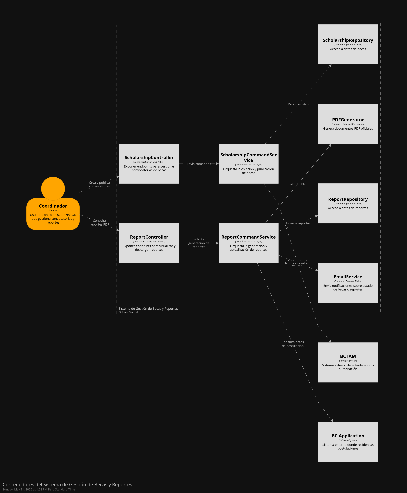 

ANEXO F

### 4.2.3.6. Bounded Context Software Architecture Code Level Diagrams
#### 4.2.3.6.1. Bounded Context Domain Layer Class Diagrams
Este diagrama de clases representa el modelo de dominio para un sistema de gestión de becas, mostrando los elementos principales con detalle. La estructura se organiza en objetos de valor como Requirement, ApoderadoSnapshot y PostulanteSnapshot, que capturan datos inmutables, junto con enumeraciones como ScholarshipStatus y ResolutionStatus para definir estados. Los agregados Scholarship (como raíz) y Report gestionan la lógica central, con métodos como publish(), close() y generate() para operaciones clave. Las interfaces ReportCommandService y ScholarshipCommandService manejan comandos complejos, mientras que las secciones Queries y Commands separan las operaciones de lectura y escritura.

El diseño sigue principios de Domain-Driven Design, destacando la inmutabilidad de los objetos de valor y la consistencia transaccional de los agregados. Scholarship controla el ciclo de vida de las becas, mientras que Report gestiona los datos de postulantes y apoderados mediante snapshots. Los servicios de comandos coordinan acciones que afectan múltiples agregados, y las enumeraciones definen los flujos de trabajo posibles. La estructura refleja un modelo bien delimitado, con clara separación entre consultas, comandos y la lógica de dominio central.

 

#### 4.2.3.6.2. Bounded Context Database Design Diagram
Este diagrama de base de datos para el Bounded Context de Gestión de Becas define el esquema relacional que persiste el modelo de dominio. La tabla principal Scholarship contiene columnas como id (PK, autoincremental), name (VARCHAR), status (ENUM con estados DRAFT/PUBLISHED/CLOSED), coordinator_id (BIGINT) y campos implícitos de auditoría. La tabla Report almacena id (PK), application_id (BIGINT), resolution (ENUM con estados DRAFT/APPROVED/DENIED) y admin_comments (TEXT), estableciendo una relación implícita con solicitudes de beca.

Las relaciones 1:N se implementan mediante tablas anidadas: Scholarship_Requirement (con FK scholarship_id y campos como is_mandatory) y las relaciones 1:1 en las tablas de snapshots (Report_ApoderadoSnapshot y Report_PostulanteSnapshot) con FKs report_id y datos estructurados en JSON. Las constraints incluyen NOT NULL para campos clave (ej: name en Scholarship) y ON DELETE CASCADE en las FKs para mantener consistencia. La notación crow’s foot refleja cardinalidades (1:N entre Scholarship-Requirements y 1:1 entre Report-Snapshots), mientras que los ENUM y JSON preservan la semántica del dominio sin necesidad de tablas adicionales para objetos de valor simples.

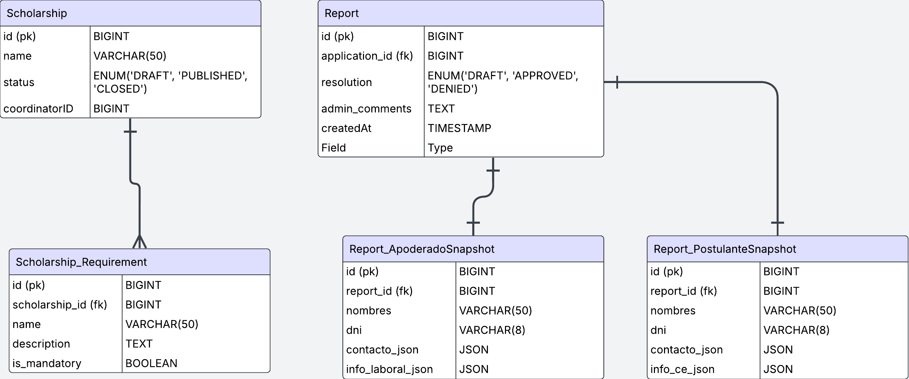 

## Capítulo V: Solution UI/UX Design

### 5.1. Product Design

#### 5.1.1. Style Guidelines
##### 5.1.1.1. General Style Guidelines
La app móvil Scholr ha sido pensada para inspirar confianza, profesionalismo y tranquilidad desde el primer momento. Sabemos que nuestros usuarios —padres, madres y representantes de instituciones privadas— toman decisiones importantes para el futuro de sus hijos, y queremos acompañarlos con una experiencia clara, amigable y segura.

Por eso, apostamos por un diseño visual limpio y moderno, usando como color principal un dorado cálido (#F4C542) que simboliza el éxito, la motivación y las oportunidades. Lo acompañamos con un azul profundo (#2A3D66) que transmite seriedad y confianza, ideal para una app que busca conectar familias con oportunidades educativas reales. Las letras son fáciles de leer, los espacios están bien organizados y todo está pensado para que cada paso —desde la búsqueda hasta la postulación a una beca— sea sencillo y claro.

**Brand Overview**

En Aventis, creamos Scholr con la convicción de que el acceso a una educación de calidad no debería depender de la suerte, sino de las oportunidades adecuadas. Al ver cómo muchas familias en el Perú aún enfrentan barreras para encontrar y postular a becas educativas, decidimos desarrollar una solución que acerque a los apoderados a empresas privadas dispuestas a apoyar el talento joven.

Con Scholr, no solo facilitamos ese encuentro, sino que también ayudamos a las instituciones a gestionar de forma más eficiente todo el proceso de postulación. Queremos que cada familia sienta que tiene en sus manos una herramienta confiable, clara y útil para tomar decisiones importantes sobre el futuro académico de sus hijos.

**Brand Name**

Elegimos el nombre Scholr como una forma moderna de decir “scholar” (estudiante). Esta elección refleja nuestra identidad: una plataforma innovadora, centrada en la educación, pero con un enfoque digital y accesible.

Nuestro logo, en tono dorado, representa la idea de avance, logro y esperanza. Para nosotros, cada beca no es solo un apoyo económico: es una puerta abierta, una historia de superación que empieza con un clic. Con Scholr, queremos ser ese primer paso que acompañe a las familias hacia un futuro más prometedor.

Nuestro logo es un elefante con la trompa hacia arriba, un símbolo universal de buena suerte, sabiduría y fuerza. Lo elegimos porque representa muy bien lo que queremos transmitir con Scholr: confianza, estabilidad y progreso. Así como el elefante cuida de su manada, nosotros queremos acompañar a las familias en un camino lleno de decisiones importantes, brindándoles una herramienta sólida que los ayude a avanzar con seguridad hacia nuevas oportunidades educativas.

 

**Colores**

En Scholr, hemos seleccionado una paleta de colores que refleja nuestros valores de confianza, profesionalismo y accesibilidad, brindando una experiencia visual clara y armónica para los usuarios. Cada color ha sido elegido cuidadosamente para facilitar la navegación, transmitir seguridad y resaltar las funciones clave de la aplicación.

Colores primarios: Los colores primarios son fundamentales para la identidad visual de la aplicación, destacando elementos cruciales de la interfaz y asegurando que la marca se perciba de manera coherente en todo momento.

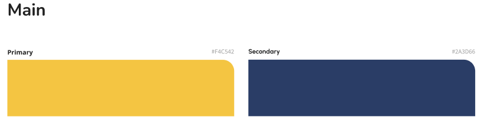 

Colores secundarios: Los colores secundarios complementan los primarios, ayudando a resaltar ciertos estados y funcionalidades dentro de la aplicación. Estos colores se emplean principalmente en alertas, mensajes de estado y botones secundarios.

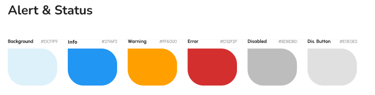 

**Tipografia**

En Scholr, hemos seleccionado la tipografía Nunito por su equilibrio entre modernidad y legibilidad, lo que permite una experiencia de lectura cómoda y fluida en dispositivos móviles. Nunito es una fuente sans-serif con líneas suaves que transmite confianza, claridad y accesibilidad, alineándose perfectamente con los valores de nuestra plataforma.

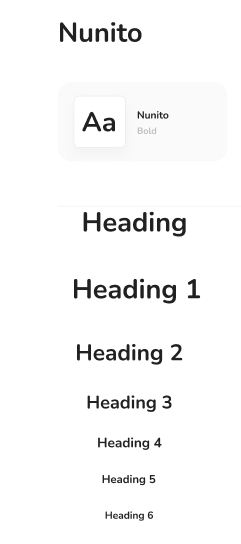 

La tipografía Nunito es utilizada en toda la aplicación, desde los títulos hasta el contenido del cuerpo, garantizando que la lectura sea agradable tanto en pantallas pequeñas como grandes. Su diseño moderno y amigable se adapta a la estética limpia y profesional que buscamos para Scholr, permitiendo que los usuarios se enfoquen en el contenido sin distracciones visuales innecesarias.

ANEXO I  

#### 5.1.2. Information Architecture

En esta sección, vamos a describir cómo organizamos la información en Scholr para responder a las necesidades de nuestros dos segmentos principales: padres trabajadores y coordinadores de bienestar laboral/RSE. A través de una estructura clara y eficiente, buscamos que tanto los padres como los coordinadores puedan encontrar y gestionar las becas educativas de manera sencilla, rápida y sin complicaciones.

##### 5.1.2.1. Organization Systems

En esta sección, describimos cómo organizamos la información dentro de Scholr para satisfacer las necesidades de los dos segmentos clave: padres trabajadores y coordinadores de bienestar laboral/RSE. Los sistemas de organización utilizados facilitan la navegación y optimizan la búsqueda de información relevante para cada grupo.

**Segmento: Padres trabajadores**

Jerárquica:

- Lista de becas disponibles: Los padres podrán visualizar todas las becas disponibles para sus hijos, organizadas por categorías como tipo de beca, nivel educativo, y requisitos. Esto les permitirá encontrar de manera rápida y fácil las becas más relevantes para ellos.

- Lista de postulación: Los padres podrán ver su historial de postulaciones y el estado de cada una, facilitando un seguimiento claro y organizado de sus trámites.

Secuencial:

- Proceso de postulación: Este sistema guía a los padres a través de los pasos necesarios para postular a una beca: seleccionar la beca, completar los formularios, cargar los documentos requeridos y enviar la solicitud.

Matricial:

- Calendario de fechas y plazos: Los padres tendrán acceso a un calendario donde se mostrarán los plazos importantes para cada beca, con la opción de añadir recordatorios personalizados.

**Segmento: Coordinadores de bienestar laboral/RSE**

Jerárquica:

- Gestión de becas para empleados: Los coordinadores podrán visualizar las becas disponibles para los empleados, organizadas por tipo de beca, número de aplicaciones y estado actual (aprobada, pendiente, etc.).

- Reporte de impacto: Un sistema jerárquico les permitirá ver estadísticas sobre el uso de las becas, como número de empleados beneficiados, ahorro total y evaluación de la satisfacción.

Secuencial:

- Aprobación de solicitudes: Los coordinadores podrán aprobar o rechazar las postulaciones de los padres, siguiendo un proceso secuencial que incluye la revisión de la documentación y la validación de la elegibilidad.

Matricial:

- Panel de métricas y resultados: Los coordinadores tendrán acceso a un panel donde se presentan los datos clave sobre el programa de becas, como el número de becas otorgadas, las áreas de mayor demanda y la distribución geográfica.

**Funcionalidades comunes a ambos segmentos**

Jerárquica:

- Landing Page: En esta sección, los usuarios podrán acceder a toda la información relevante sobre las becas, con detalles organizados por categorías como tipo de beca, requisitos y plazos. Esto facilitará la navegación tanto a los padres como a los coordinadores.

Matricial:

- Menú de opciones: El menú de la aplicación presentará las distintas funciones disponibles, con un diseño modular que se adapta al tipo de usuario (padre trabajador o coordinador de bienestar). La disposición será simple y flexible para facilitar el acceso a todas las funcionalidades clave.

##### 5.1.2.2. Labelling Systems

En esta sección presentamos el sistema de etiquetado que define de manera clara y accesible la organización de la información dentro de nuestra aplicación y la landing page. Nuestro objetivo es que cada usuario —ya sea visitante, postulante, empresa o coordinador— pueda navegar intuitivamente, comprendiendo en todo momento dónde se encuentra y qué puede hacer.

**Etiquetado de la Landing Page**

Hemos organizado la landing page en secciones que comunican de forma directa el propósito de la plataforma y facilitan el acceso a sus contenidos clave. Los encabezados son:

- Inicio / Home: Página principal seleccionada por defecto. Aquí mostramos el logo y una frase representativa que resume la esencia de Scholr.

- Sobre nosotros / About Us: Presentamos quiénes somos, nuestra misión, visión y el propósito que nos mueve como equipo.

- Funcionalidades / Services: Sección dividida por tipo de usuario donde explicamos las funcionalidades que ofrece Scholr para cada segmento.

- Contáctanos / Contact Us: Mostramos nuestros canales de comunicación para recibir consultas o solicitudes.

**Etiquetado por tipo de usuario en la aplicación movil**

Reconociendo que diferentes usuarios tienen necesidades distintas, hemos definido etiquetas específicas para cada uno de ellos:

- Para padres y trabajadores:

  - Mis Postulaciones / My Applications: Sección donde pueden revisar el estado de sus solicitudes (en revisión, aprobadas, rechazadas).

  - Subir Documentos / Upload Documents: Funcionalidad que permite cargar credenciales laborales y notas escolares desde la app.

  - Borradores / Drafts: Permite guardar una postulación incompleta para continuarla luego.

  - Notificaciones / Notifications: Envío de alertas push cuando hay cambios de estado en la postulación.

  - Recursos / Resources: Incluye tutoriales en video y cartillas en PDF para guiar el proceso de postulación.

- Para coordinadores de bienestar:

  - Panel de Postulaciones / Applications Dashboard: Visualización general de solicitudes filtrables por tipo de beca o estado.

  - Revisión / Review & Respond: Permite aprobar o rechazar postulaciones incluyendo comentarios personalizados.

  - Becas Disponibles / Scholarships: Publicación de nuevas becas, requisitos y fechas límite desde la aplicación.

##### 5.1.2.3. SEO Tags and Meta Tags

En esta sección detallamos las etiquetas SEO y Meta Tags que utilizamos para mejorar la visibilidad de Scholr en buscadores y app stores. Esto nos permitirá llegar a más usuarios interesados en acceder a becas escolares a través de una plataforma digital ágil y confiable. Hemos definido títulos, descripciones y palabras clave para cada entorno: landing page, aplicación web y aplicación móvil.

**Para el sitio web estático (Landing Page)**

- Tittle: Scholr - Encuentra la beca que buscas

- Description: Scholr facilita la postulación a becas escolares de trabajadores mediante una plataforma digital integrada con RRHH.

- Keywords: scholarship application, employee benefits, school grants, online scholarship platform, HR integration

- Authors: Aventis team

**Para la aplicación web**

- Tittle: Scholr - Plataforma de Postulación a Becas para Trabajadores

- Description: Scholr te permite gestionar tu postulación a becas de manera digital, eliminando los trámites presenciales y acelerando tu acceso a beneficios educativos.

- Keywords: digital scholarship, HR benefits, employee scholarships, grant management system, scholarship tracking

- Authors: Aventis team

**Para la aplicación móvil**

- Tittle: Scholr - Postula a Becas de Forma Rápida y Fácil

- Description: Scholr te ayuda a encontrar y postular a becas escolares desde tu móvil de manera rápida y sencilla, con integración directa a tu sistema de RRHH.

- Keywords: mobile scholarship app, school grants, employee education benefits, online application, HR-linked scholarship

- Authors: Aventis team

##### 5.1.2.4. Searching Systems

En esta sección explicamos los sistemas de búsqueda que implementaremos en Scholr, tanto en la landing page como en la aplicación móvil. Nuestro objetivo es facilitar al máximo la experiencia de los usuarios al buscar la información que necesitan sobre becas, requisitos, procesos y seguimiento de postulaciones.

**En el sitio web estático (Landing Page)**

A través de la navegación principal, los visitantes podrán acceder rápidamente a información relevante sobre Scholr: qué ofrecemos, cómo funciona y por qué es una solución útil para padres de familia y colaboradores. Incorporaremos un botón interactivo que permitirá alternar entre los perfiles de “Trabajador” y “Encargado de RSE”, mostrando contenido personalizado según su rol. Además, contaremos con una sección de preguntas frecuentes (FAQ) con búsqueda por palabra clave.

**En la aplicación móvil**

- Perfil: Colaboradores que desean postular a becas para sus hijos

  - Explorar becas: Permitiremos buscar becas disponibles según nivel educativo, institución, ubicación o tipo de beneficio. Este buscador incluirá filtros dinámicos que ayuden a precisar los resultados.

  - Mis postulaciones: En esta sección, los usuarios podrán hacer seguimiento a sus solicitudes. Incorporaremos una barra de búsqueda para ubicar una postulación específica por nombre del menor, institución o estado (pendiente, aprobada, rechazada).

  - Historial de becas: Aquí se podrá buscar entre las becas pasadas postuladas, facilitando la comparación o repetición de procesos en futuras convocatorias.

- Perfil: Empresas que otorgan becas a sus colaboradores

  - Buscar colaboradores: El área de RRHH podrá buscar y revisar las solicitudes de sus empleados por nombre, DNI o estado de la postulación.

  - Gestión de beneficios: Se habilitará una búsqueda filtrada para revisar qué tipo de becas se han otorgado por sede, área o fecha, ayudando a la toma de decisiones y elaboración de reportes.

##### 5.1.2.5. Navigation Systems

A continuación, presentamos los sistemas de navegación que implementaremos en Scholr para asegurar que nuestros usuarios puedan desplazarse de manera rápida, clara y sin fricciones dentro de la plataforma, ya sea desde la landing page o desde la aplicación móvil.

**En la Landing Page**

Nuestra landing page contará con un menú principal ubicado en la parte superior de la pantalla, con enlaces ancla que dirigirán al usuario directamente a secciones como Inicio, Acerca de Scholr, Beneficios, Para colaboradores, Para empresas, y Contacto. Este menú estará siempre visible mientras el usuario se desplace por la página, lo que permitirá un acceso ágil a la información sin necesidad de hacer scroll manual extensivo. También incluiremos botones destacados en cada bloque que faciliten el contacto o la descarga de la app, según el interés del visitante.

**En la aplicación móvil**

En la app de Scholr, la navegación estará pensada para adaptarse al tipo de usuario (trabajador o encargado de RSE) mediante un bottom navigation bar que permitirá cambiar entre las secciones principales: Inicio, Becas, Postulaciones, Notificaciones y Perfil. El acceso a información será inmediato con un diseño centrado en el usuario, mostrando banners dinámicos y carruseles en la pantalla de inicio que faciliten la exploración de nuevas becas y convocatorias activas. En ciertas pantallas, como la de búsqueda o historial, se implementarán filtros y secciones plegables para organizar mejor la navegación vertical.

**Personalización según rol**

Dependiendo del tipo de usuario que inicie sesión (trabajador o encargado de RSE), el contenido de la navegación variará ligeramente para mostrar funciones específicas:

- A los trabajadores, les mostraremos accesos rápidos a becas, estados de postulación, alertas importantes y beneficios disponibles.

- A las encargados de RSE, les permitiremos gestionar solicitudes, revisar estadísticas y mantener comunicación con sus colaboradores.

Gracias a estos sistemas, aseguramos una navegación fluida, contextualizada y centrada en las necesidades específicas de quienes buscan o gestionan oportunidades de beca en Scholr.

#### 5.1.3. Landing Page UI Design

Link de los Wireframes y Mockups en Figma: ANEXO J

##### 5.1.3.1. Landing Page Wireframe

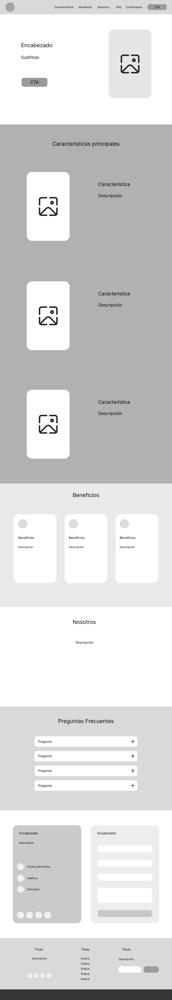

 

Vista móvil

 

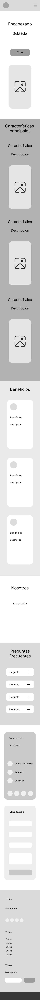

 

Menu hamburguesa

 

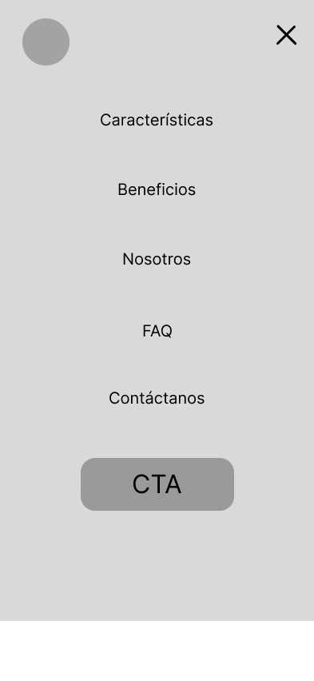

 

##### 5.1.3.2. Landing Page Mock-up

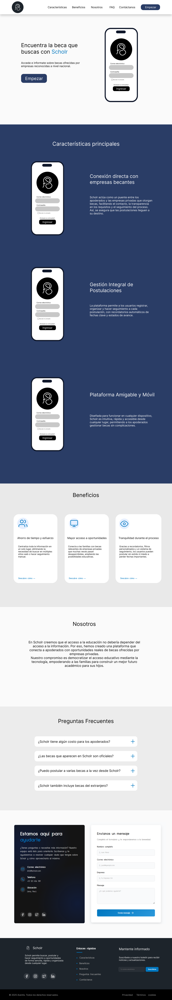

 

Vista móvil

 

 

Menu hamburguesa

 

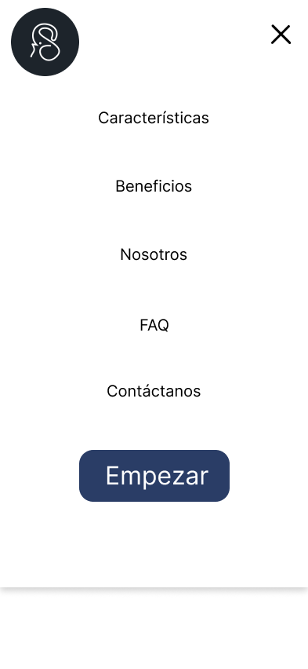

 

#### 5.1.4. Mobile Applications UX/UI Design
##### 5.1.4.1. Mobile Applications Wireframes

###### Vista de colaborador
---

- Login
  - 

- Registro
  - 

- Confirmación de Registro
  - 

- Selección de Compañía
  - 

- Drawer
  - 

- Bandeja Vacía
  - 

- Bandeja con Postulación
  - 

- Mensaje de Administrador
  - 

- Tutorial
  - 

- Postulación
  - 

- Formulario datos del Colaborador
  - 

- Lista de Postulantes Vacía
  - 

- Formulario datos del Postulante
  - 

- Formulario Editar Postulante
  - 

###### Vista de Administrador
---

- Drawer Administrador
  - 

- Bandeja Administrador
  - 

- Vista de Beca Administrador
  - 

- Vista de Colaborador Administrador
  - 

- Lista de Postulantes de Colaborador Administrador
  - 

- Vista de Postulante Administrador
  - 

- Rechazo de Solicitud
  - 

- Rechazo Enviado
  - 

##### 5.1.4.2. Mobile Applications Wireflow Diagrams

- User Goal: Registrarse
  - 

- User Goal: Iniciar Sesión
  - 

- User Goal: Ver Tutoriales
  - 

- User Goal: Crear Postulación
  - 

- User Goal: Editar Postulación Rechazada
  - 

- User Goal: Ver Postulación como Administrador
  - 

- User Goal: Rechazar postulación como Administrador
  - 

##### 5.1.4.3. Mobile Applications Mock-ups

- Login
  - 

- Selección de Empresa
  - 

- Registro
  - 

- Bandeja Vacía - Colaborador
  - 

- Bandeja con Postulación - Colaborador
  - 
  
- Drawer
  - 

- Tutorial
  - 

- Menu Postulación
  - 

- Formulario Datos del Colaborador
  - 

- Formulario Datos del Postulante
  - 

- Confirmación de Formulario Postulante
  - 

- Bandeja - Administrador
  - 

- Vista de Beca - Administrador
  - 

- Vista de Colaborador - Administrador
  - 

- Lista de Postulantes - Administrador
  - 

- Vista de Postulante - Administrador
  - 

- Rechazo de Postulante - Administrador
  - 

##### 5.1.4.4. Mobile Applications User Flow Diagrams

Link a los User Flow Diagrams en Lucidchart: ANEXO K

- User Goal: Registrarse
  - 
  - Happy path: Los datos ingresados son correctos y el código de colaborador coincide con la compañía.

- User Goal: Iniciar Sesión
  - 
  - Happy path: Los datos ingresados son correctos. La pantalla a la que se ingresa depende del rol de la cuenta.

- User Goal: Establecer Datos de Colaborador
  - 
  - Happy path: Todos los campos están completos.

- User Goal: Crear Postulación
  - 
  - Happy path: Todos los campos están completos.

- User Goal: Ver Tutorial
  - 

- User Goal: Editar Postulación después de Rechazo
  - 
  - Happy path: Todos los campos están completos y son diferentes a los anteriores.

- User Goal: Rechazar Postulación como Administrador
  - 

##### 5.1.4.5. Mobile Applications Prototyping

Link al video en Microsoft Stream: ANEXO L

[https://drive.google.com/file/d/12c-wkU0GFZEksaZxkmVYf3qiUFZXQRxy/view?usp=sharing](https://drive.google.com/file/d/12c-wkU0GFZEksaZxkmVYf3qiUFZXQRxy/view?usp=sharing)

## Capítulo VI: Product Implementation, Validation & Deployment  
### 6.1. Software Configuration Management  
La gestión de la configuración del software es fundamental para nuestro trabajo, ya que nos ayuda a controlar de manera exacta los componentes de nuestro proyecto, como el código fuente, los documentos de diseño y los recursos digitales. De esta manera, aseguramos que todos los miembros del equipo utilicen la misma versión de los archivos, lo que facilita la cooperación entre desarrolladores, diseñadores y otros profesionales involucrados.

#### 6.1.1. Software Development Environment Configuration

  * ### Project Management
    * ### Meet
    Una herramienta de videoconferencias que posibilita la comunicación en tiempo real del grupo para reuniones de coordinación.
  
    Imagen de evidencia de uso
  
    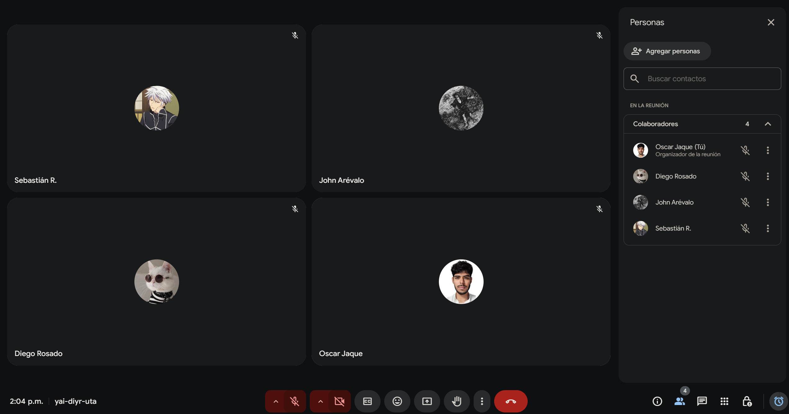
  
  * ### Requirement Management
    * ### Structurizr
    Se trata de una suite de herramientas que posibilita la creación colaborativa de modelos C4 para representar de forma gráfica nuestros productos.
    
    Imagen de evidencia de uso
  
    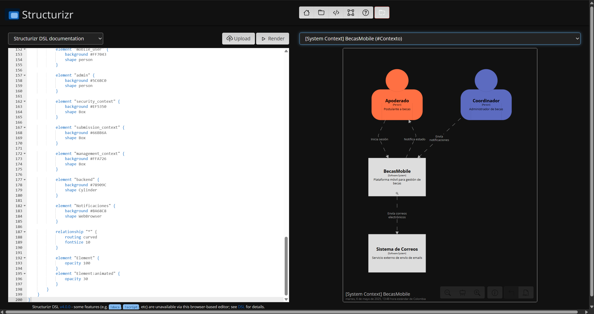
  
  * ### Product UX/UI Design
    * ### Figma
    Herramienta visual que facilita la creación de wireframes y mockups.
  
    Imagen de evidencia de uso
  
    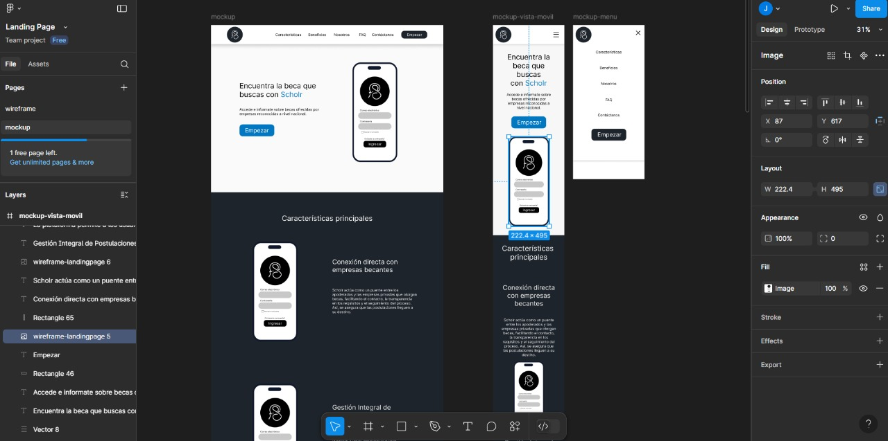
  
  * ### Software Development
    * ### HTML5
    Lenguaje de etiquetado orientado a crear páginas web.
  
    Imagen de evidencia de uso
  
    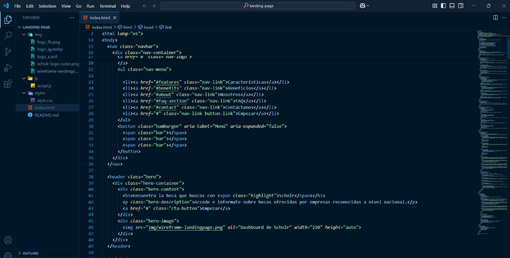
  
    * ### CSS
    Lenguaje de diseño gráfico utilizado para dar formato al código escrito en HTML.
  
    Imagen de evidencia de uso
  
    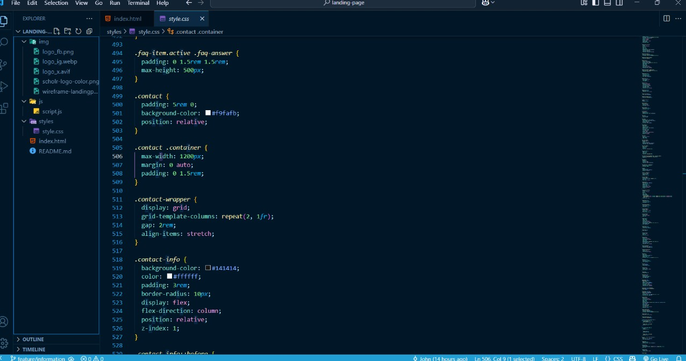
  
    * ### Javascript
    Lenguaje de programación orientado a objetos dinámico que utilizamos para implementar funcionalidades en un documento HTML.
  
    Imagen de evidencia de uso
  
    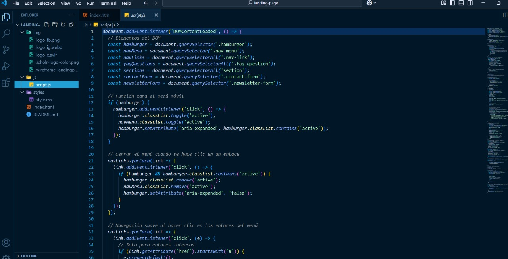
  
  * ### Software Documentation
    * ### Github
    Plataforma utilizada para el alojamiento de versiones del código fuente de un proyecto. Es una herramienta ampliamente popular en el trabajo colaborativo de programadores.  

    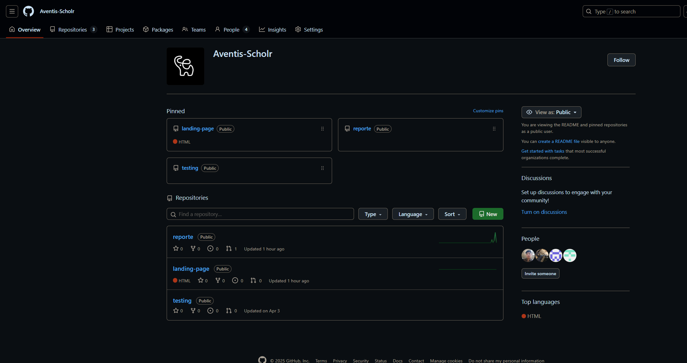
  
  * ### Software Documentation
    * ### Github Pages
    Una plataforma que posibilita la realización de despliegues simples directamente desde un repositorio de GitHub.  

    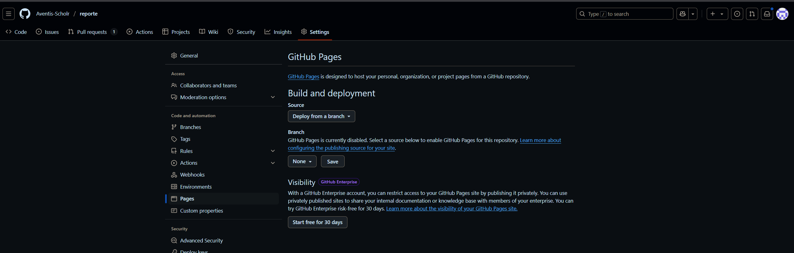

#### 6.1.2. Source Code Management  

* ### **Gitflow Implementation:**
Implementamos el flujo de trabajo gitflow para el control de versiones con branches(ramas) para trabajar paralelamente.

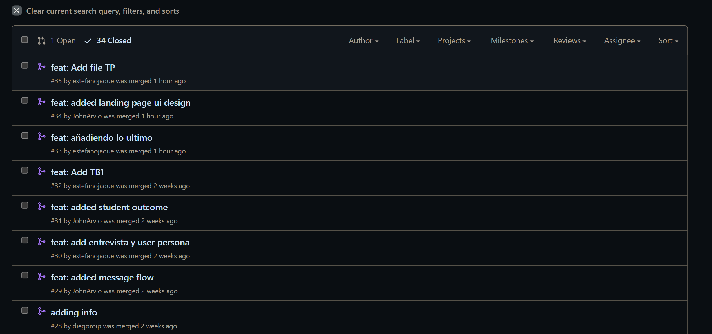  

### **Master o Main branch**
La rama principal de desarrollo del proyecto es la Master branch. En esta rama reside el código que actualmente se encuentra en producción.
#### Notación: master o main

### **Conventional Commits**
"Conventional Commits" es una convención para estructurar los mensajes de confirmación (commits) en un formato estándar y semántico. Este formato ayuda a comunicar claramente los cambios realizados en el código y facilita la generación de registros de cambios automáticos. Los "Conventional Commits" suelen seguir un formato que incluye un encabezado, un cuerpo opcional y un pie de página opcional, y se utilizan para describir de manera sucinta y clara los cambios realizados en el código, lo que facilita su seguimiento y comprensión por parte de los desarrolladores y otros miembros del equipo.
 
La estructura de un commit debe seguir las siguientes pautas:
~~~
git commit -m “<type>[optional scope]: <title>“ -m “<description”
~~~
**Tipos De Conventional Commits**
~~~
1. feat: Used to describe a new feature or functionality added to the code.
2. fix: Indicates a bug fix or solution to a problem.
3. docs: Employed for changes or improvements in code documentation.
4. style: Describes changes related to the code's formatting, such as whitespace, indentation, etc., that do not affect its functionality.
5. refactor: Used for modifications to the code that do not fix bugs or add new features, but rather improve its structure or readability.
6. test: Indicates the addition or modification of unit tests or functional tests.
7. chore: Used for changes in the build process or maintenance tasks that are not directly related to the code itself.
8. perf: Describes performance improvements in the code.
~~~

#### 6.1.3. Source Code Style Guide & Conventions

- ### HTML 
    - #### Use Lowercase Element Names:
        Es recomendable utilizar minúsculas o lowercase para los nombres de los elementos HTML.
        ~~~ 
      <body>
            
This is a paragraph

      <body>
       ~~~
    - #### Close All HTML Elements:
        Es recomendable cerrar todos los elementos HTML correctamente.
        ~~~ 
      <body>
            
This is a paragraph

            
This is another paragraph

      <body>
       ~~~
    - #### Use Lowercase Attribute Names:
        Es recomendable utilizar minúsculas para los nombres de los atributos HTML.
      ~~~ 
      <a href="https://www.w3schools.com/html/">Visit our HTMLtutorial</a>
       ~~~
    - #### Always Specify alt, width, and height for Images:
      Es recomendable seguir estas convenciones en caso de que la imagen no se pueda mostrar, lo que ayuda a mejorar la accesibilidad del contenido.
      ~~~ 
      
      ~~~ 
    - #### Spaces and Equal Signs:
      Se recomienda no utilizar espacios en blanco entre las entidades para mejorar la legibilidad.
      ~~~ 
      <link rel="stylesheet" href="styles.css">
      ~~~ 
- ### CSS
    - #### ID and Class Naming
      Es recomendable utilizar nombres de clases e id's significativos que expresen claramente el propósito del elemento.
      ~~~ 
      #gallery {}
      #login {}
      .video {}
       ~~~
    - #### ID and Class Name Style
      Se recomienda utilizar nombres cortos para nombrar ids o clases, pero lo suficientemente descriptivos para entender su propósito.
      ~~~ 
      #nav {}
      .author {}
      ~~~
    - #### Shorthand Properties
      Se recomienda utilizar propiedades CSS de forma abreviada siempre que sea posible para hacer el código más eficiente y comprensible.
       ~~~ 
       border-top: 0;
       font: 100%/1.6 palatino, georgia, serif;
       padding: 0 1em 2em;
       ~~~ 
    - #### 0 and Units
      Es recomendable evitar especificar la unidad después del valor 0 en propiedades que lo permitan, ya que esto ayuda a reducir el tamaño del código y mejora su legibilidad.
       ~~~ 
       margin: 0;
       padding: 0;
       ~~~
     - #### Declaration Order
       Se recomienda ordenar las declaraciones en orden alfabético para facilitar el mantenimiento y la recordación del código.
       ~~~ 
        background: fuchsia;
        border: 1px solid;
        border-radius: 4px;
        color: black;
        text-align: center;
        text-indent: 2em;
       ~~~
- ### JAVASCRIPT
     - #### Use expanded syntax
       Cada línea de JavaScript debería estar en una nueva línea, con la llave de apertura en la misma línea de su declaración y la llave de cierre en una nueva línea al final.
       ~~~ 
       function myFunc() {
        console.log('Hello!');
       };
       ~~~
     - #### Variable naming
       Para el nombre de las variables, se recomienda utilizar lowerCamelCase. 
       ~~~ 
       let playerScore = 0;
       let speed = distance / time;
       ~~~  
     - #### Declaring variables
       Para la declaración de variables, es recomendable utilizar las palabras reservadas let y const en lugar de var.
       ~~~ 
       const myName = 'Chris';
       console.log(myName);
       let myAge = '40';
       myAge++;
       console.log('Happy birthday!');
       ~~~ 
     - #### Function naming
       Para el nombre de las funciones, se recomienda utilizar lowerCamelCase.
       ~~~ 
       function sayHello() {
       alert('Hello!');
       };
       ~~~
- ### LENGUAJE GHERKIN
    - #### Descriptive and concise titles for scenarios
      Utilizar títulos descriptivos y concisos para los escenarios.
      ~~~ 
      Feature: Login
        Scenario: Successful login
          Given a user is on the login page     
          When they enter valid credentials     
          Then they should be logged in successfully      
      ~~~
    - #### Follow the Given-When-Then structure consistently.
      Seguir la estructura de Given-When-Then de manera consistente.
      ~~~ 
      Scenario: Adding items to the shopping cart
        Given the user is on the shopping page
        When they add an item to the cart
        Then the item should appear in the cart 
      ~~~
    - #### Focus on business-readable language
      Centrarse en un lenguaje legible para el negocio, evitando detalles técnicos de implementación.
      ~~~ 
      Scenario: Changing user settingst
        Given the user is logged in
        When they navigate to the settings page
        Then they should be able to update their profile
      ~~~
    - ####  Utilize Scenario Outline for scenarios with multiple similar cases.
      Utilizar Scenario Outline para escenarios con múltiples casos similares.
      ~~~ 
      Scenario Outline: Searching for products
        Given the user is on the search page
        When they search for "<product>"
        Then they should see search results for "<product>"
      
      Examples:
        | product  |
        | Laptop   |
        | Smartphone |
      ~~~
    - #### Add comments to provide additional context
      Agregar comentarios para proporcionar contexto adicional o explicaciones cuando sea necesario.
      ~~~ 
      # This scenario checks the functionality of the logout feature
      Scenario: User logout
        Given the user is logged in
        When they click on the logout button
        Then they should be redirected to the login page      
      ~~~
### 6.1.4 Software Deployment Condiguration

### 6.2 Landing Page & Mobile Application Implementation

### 6.2.1. Sprint 1

El primer sprint es una etapa importante en nuestro marco de gestión de proyectos de metodología ágil Scrum. En este periodo, agendamos reuniones con el objetivo de conocer mejor las características de cada integrante, y delegamos tareas para materializar el diseño y funcionalidades ya establecidas, para transformarlos en un landing page funcional y que cumple las heurísticas.  

### 6.2.1.1. Sprint Planning 1
El sprint planning es una reunion antes de cada sprint en la metodologia Scrum donde el equipo elige las user stories que va a transformar en un producto tangible. Tambien define que como se van a separar los trabajos y quien sera responsable. Nuestro objetivo sera construir un plan resolubre en un tiempo determinado que sera lo que dure el sprint, para crearlo fomentaremos la colaboracion para que todos sepan y entiendas los objetivos y prioridades.  

| Sprint #| Sprint 1|
| -- | -- |
| **Sprint Planning Background**||
| **Date**| 06/09/2024|
| **Time**| 12:00 AM|
| **Location**| Discord (Reunión virtual)|
| **Prepared By**| Jaque Peña, Estefano Oscar|
| **Attendees (to planning meeting)** | John Telesforo Arevalo Meza ,Diego Alonso Rosado Iporre,Sebastian Omar Real Calderón, Estefano Oscar Jaque Peña|
| **Sprint Goal & User Stories**||
| **Sprint 1 Goal**| Nuestro enfoque está en finalizar el informe , desplegar nuestra Landing Page desde el repositorio de GitHub y avanzar bounded context del aplicativo (Tanto IAM como applications). Creemos que esto entrega una experiencia de usuario optimizada a nuestros clientes. Esto se confirmará cuando todas las tareas se muevan a la columna "Terminado" en Trello. |
| **Sprint 1 Velocity**| ------ |
| **Sum of Story Points**| 19 |  

### 6.2.1.2. Sprint Backlog 1  

Para el primer sprint backlog, recopilamos historias de usuario relacionadas con la página de inicio (landing page) . Para organizar y administrar estas historias de usuario, las dividimos en tareas fáciles de realizar y las asignamos a los miembros del equipo de manera efectiva, utilizamos la herramienta Trello. Nos concentramos en completar las historias de usuario durante este sprint, con el objetivo principal de crear una landing page completa con un diseño atractivo y fácil de usar.Ademas de terminar el informe para la entrega y realizar el desarrollo de Front y back de los bounded context IAM y Applications. Gracias a Trello, pudimos colaborar efectivamente y seguir el progreso de las tareas, lo que nos permitió abordar y resolver.

[FOTO TRELLO]

| Sprint # | Sprint 1 | | | | | | |
|---------|---------|--|--|--|--|--|--|
| **User Story** | | **Work-Item / Task** | | | | | |
| **ID** | **Title** | **ID** | **Title** | **Description** | **Estimation (Hours)** | **Assigned To** | **Status** |
| US01 | Selección de empresa durante el registro | TA001 | Implementar campo de subida de documentos | Crear componente para subir credencial laboral y notas con validación de formatos (PDF, JPG, PNG) | 3 | [Nombre Asignado] | To-do |
| | | TA002 | Integración con API de verificación | Conectar formulario con backend para habilitar botón "Continuar" tras validación básica | 2 | Estefano Oscar Jaque Peña | Done |
| US02 | Validación automática de datos laborales | TA003 | Desarrollo de integración con API Backus | Implementar servicio para verificar códigos de colaborador en base de datos empresa | 4 | Estefano Oscar Jaque Peña | Done |
| | | TA004 | Sistema de notificaciones por email | Configurar envío automático de correo con credenciales tras verificación exitosa | 2 | [Nombre Asignado] | Done |
| US16 | Visualización de información clave | TA005 | Diseño de tarjetas interactivas | Crear 3 tarjetas con iconos + texto responsive para sección "Cómo funciona" | 3 | John Telesforo Arevalo Meza | Done |
| | | TA006 | Implementación de video explicativo | Integrar video de 30s con autoplay (sin audio) y estadísticas dinámicas | 2 | [Nombre Asignado] |Done |
| US18 | Formulario de contacto para empresas | TA007 | Desarrollo de formulario sin autenticación | Crear formulario con campos: Nombre, Empresa, Email, Consulta | 2 | John Telesforo Arevalo Meza | Done |
| | | TA008 | Validación en tiempo real | Implementar verificación de formato email y resaltado de campos obligatorios | 2 | [Nombre Asignado] | Done |
| US19 | Adaptabilidad móvil | TA009 | Implementación de menú hamburguesa | Crear menú responsive con animación y overlay oscuro para móviles | 3 | John Telesforo Arevalo Meza | Done |
| | | TA010 | Ajustes de viewport | Optimizar todos los componentes para pantallas <768px con media queries | 4 |John Telesforo Arevalo Meza | Done |

Link de Trello: ANEXO M

### 6.2.1.3. Development Evidence for Sprint Review

| Commit Id (ejemplo) | Commit Message                          | Commit Message Body                                      | Date       |
|---------------------|----------------------------------------|---------------------------------------------------------|------------|
| 2a4b6c8d           | feat(header): Add logo and navigation  | Implemented header with Scholr logo, main nav items and CTA button "Empezar" | 04/05/2025 |
| 1e3f5g7h           | feat(hero): Create main banner         | Added hero section with headline, subheadline and primary CTA | 04/05/2025 |
| 9i2k4m6o           | feat(features): Add características section | Implemented 3-column feature cards with icons         | 04/05/2025 |
| 8p1q3r5t           | feat(benefits): Create benefits module | Added benefits section with 3 cards (Ahorro de tiempo, Tranquilidad, Oportunidades) | 04/05/2025 |
| 7s2u4w6y           | feat(about): Add "Nosotros" section    | Implemented company info section with team photos       | 05/05/2025 |
| 5v1x3z9b           | feat(faq): Create FAQ accordion        | Added interactive FAQ section with 4 questions (costos, becas oficiales, etc.) | 05/05/2025 |
| 4c6d8e0f           | feat(contact): Add contact information | Implemented contact section with email, phone and location (Lima, Perú) | 05/05/2025 |
| 3g5h7j9k           | feat(form): Create contact form        | Added form with fields (Nombre, Email, Empresa, Mensaje) and submit button | 05/05/2025 |
| 2l4n6p8r           | style: Add responsive design           | Implemented mobile-first responsive layout for all sections | 05/05/2025 |
| 1m3o5q7s           | fix(form): Validate email field        | Added email validation and error messages to contact form | 05/05/2025 |
| 9t1v3x5z           | feat(animations): Add scroll effects   | Implemented subtle animations on scroll for engagement  | 05/05/2025 |
| 8y2b4d6f           | perf: Optimize images                  | Compressed all images without losing quality            | 05/05/2025 |

### 6.2.1.4. Execution Evidence for Sprint Review

En este Sprint, los miembros del equipo de desarrollo de software de Aventis han completado y desplegado la Landing Page. A continuación, mostramos imágenes que demuestran cómo nuestra página presenta de manera clara e intuitiva la información sobre nuestro producto y nuestra empresa.

 

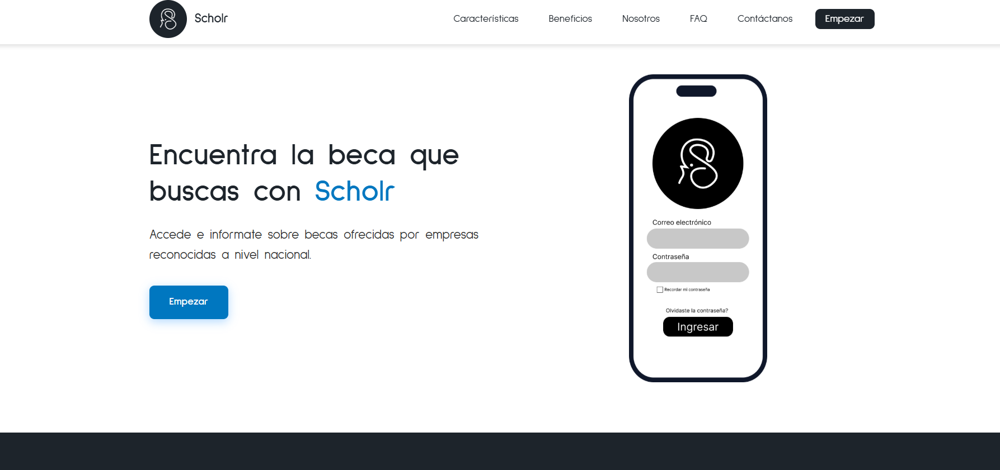
 

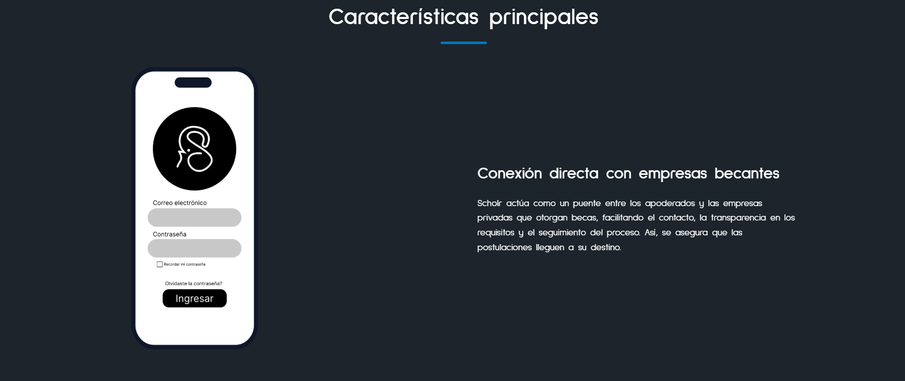
 

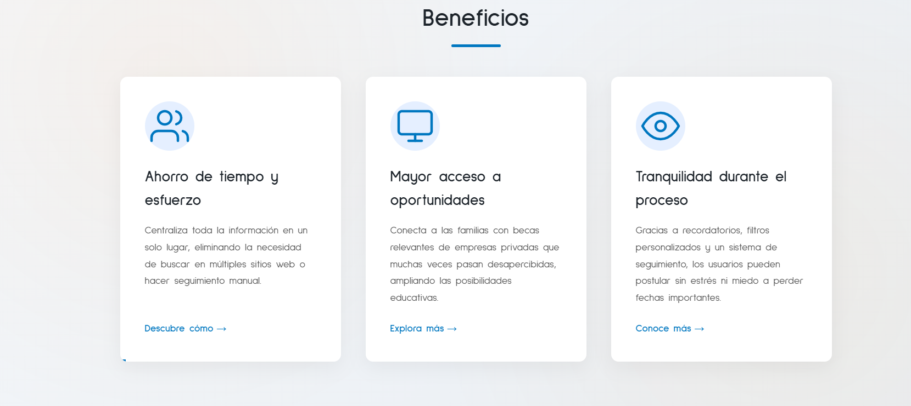
 

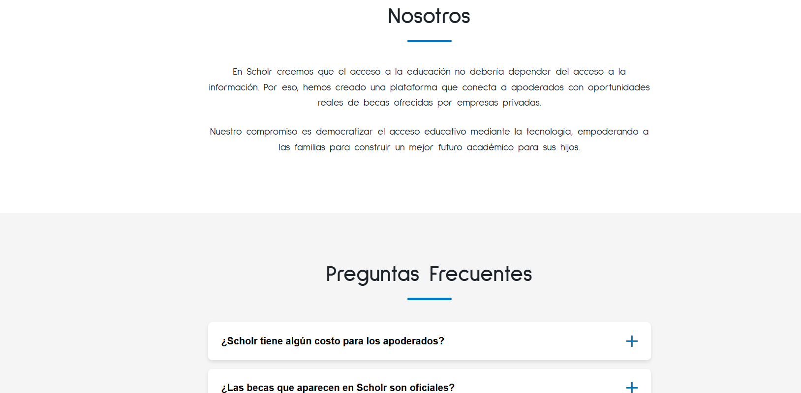
 

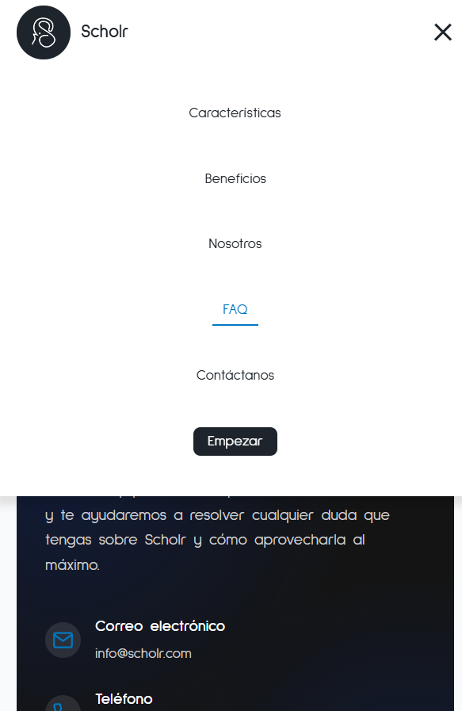
 

En segundo lugar ,se avanzo el bounded context IAM tanto en backend como en frontend :

### 6.2.1.5. Services Documentation Evidence for Sprint Review

### 6.2.1.6. Software Deployment Evidence for Sprint Review  

**Resumen**
Durante este Sprint, nos hemos enfocado en el despliegue de la landing page. Las actividades realizadas incluyen la configuración del entorno de desarrollo y el despliegue inicial del sitio. A continuación, se detalla el proceso seguido para el despliegue de la landing page.

**Actividades Realizadas**

- Creación de Cuentas y Configuración de Recursos:

Proveedor de Hosting: Selección y configuración de la cuenta en el proveedor de hosting para desplegar la landing page.
Configuración del Entorno: Establecimiento del entorno de desarrollo y producción para la landing page.

- Configuración de Proyectos para Integración:

Repositorio de Código: Configuración del repositorio en GitHub para la integración continua y despliegue automático.
Automatización: Configuración de scripts y herramientas para la automatización del despliegue.

- Despliegue de la Landing Page:

Subida de Archivos: Transferencia de archivos y recursos al servidor de hosting.
Verificación: Comprobación de que la landing page se despliega correctamente y está accesible en la web.

**Deploy del Landing Page**
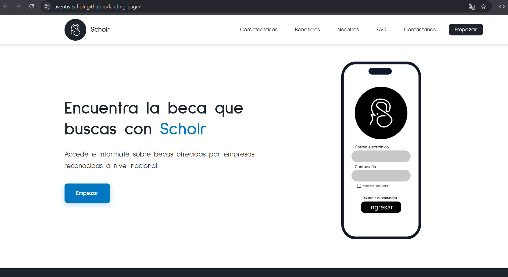
 

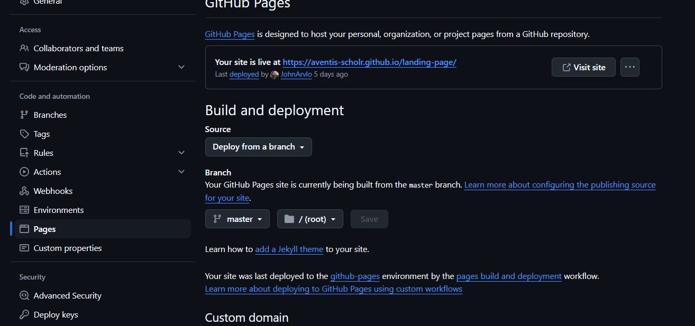
**Capturas de Pantalla**

- Repositorio de Landing Page:
  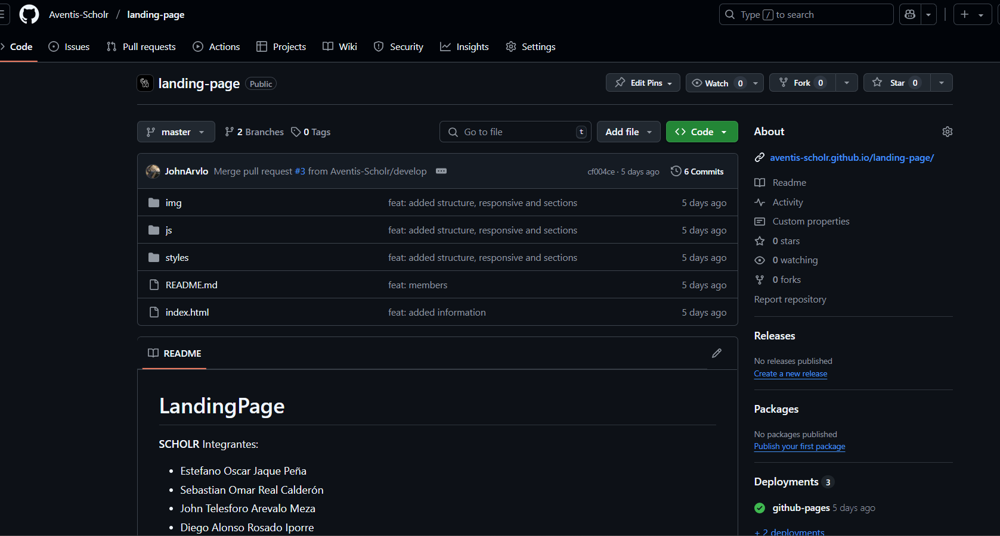

**Enlace al Repositorio**: https://aventis-scholr.github.io/landing-page/ 

### 6.2.1.7. Team Collaboration Insights during Sprint 1 

En esta sección, se presenta un análisis detallado de la colaboración del equipo durante el Sprint. Durante este sprint, las actividades de implementación se organizaron siguiendo una metodología ágil, garantizando una colaboración fluida entre los miembros del equipo. Se exponen capturas de los analíticos de colaboración y de los commits realizados en GitHub, lo que permite visualizar la contribución individual de cada miembro del equipo.

- Diseño y Desarrollo:
  Diseño de la Landing Page: Desarrollo y diseño completo de la landing page, incluyendo la creación de secciones y funcionalidad.
  Implementación: Realización de las tareas de codificación, pruebas y ajustes necesarios para completar la página.
- Documentación y Despliegue:
  Documentación: Creación de documentación relevante para la landing page, incluyendo capturas de pantalla y descripciones.
  Despliegue: Configuración del entorno de despliegue y transferencia de archivos al servidor.

**Landing Page**

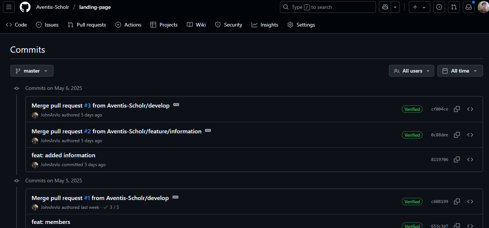

- John Telesforo Arevalo Meza: 6

**Report:**

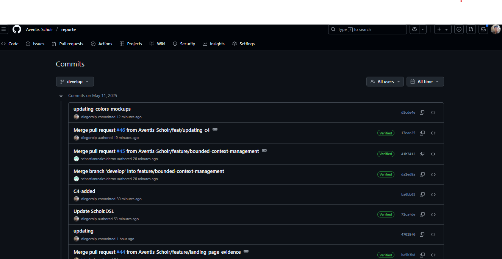

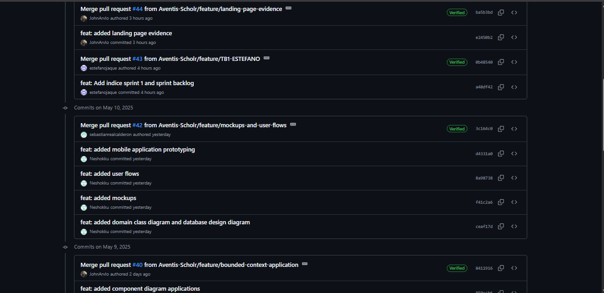

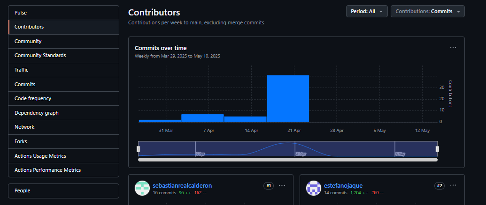

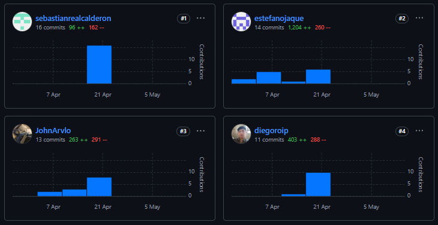

- Estefano Oscar Jaque Peña: 14
- John Telesforo Arevalo Meza: 13
- Sebastian Real Calderon: 16
- Diego Alonso Rosado Iporre: 11

## Conclusiones

En esta entrega, aplicamos diversas técnicas de análisis y diseño como entrevistas, mapeo de escenarios, EventStorming y wireframes para comprender el dominio del problema y proponer una solución coherente. Modelamos la arquitectura del sistema utilizando context maps y diagramas estructurados, lo que nos permitió visualizar los límites y responsabilidades de cada módulo. Este proceso fortaleció nuestras habilidades en diseño centrado en el usuario y resaltó la importancia del aprendizaje continuo en el desarrollo de soluciones de software efectivas.

## Bibliografia

- Biblioteca UPC. (2024). _Biblioteca virtual de la Universidad Peruana de Ciencias Aplicadas_. https://biblioteca.upc.edu.pe
- Miro. (2024). _Miro_. Miro Corporation. https://miro.com
- Cohn, M. (2006). Historias de usuario: Un enfoque ágil. Pearson Educación.https://www.scrummanager.com/files/scrum_manager_historias_usuario.pdf
- Pressman, R. S. (2010). Ingeniería de Software: Un enfoque práctico. McGraw-Hill.https://www.javier8a.com/itc/bd1/ld-Ingenieria.de.software.enfoque.practico.7ed.Pressman.PDF
- The C4 model for visualising software architecture. (2024). https://c4model.com/
- Structurizr. (2024). https://www.structurizr.com/
- mURAL (2024). https://www.mural.co/

## Anexos
ANEXO A : User Personas--> [https://app.mural.co/t/estudiando0947/m/estudiando0947/1745390656723/0835c036e3645e7898d5d12592570047f4e910c5?sender=uc4343c08b6b097f4a42e5558 ](https://app.mural.co/t/estudiando0947/m/estudiando0947/1745390656723/0835c036e3645e7898d5d12592570047f4e910c5?sender=uc4343c08b6b097f4a42e5558 )

ANEXO B : Product Backlog--> [https://www.pivotaltracker.com/n/projects/2740632](https://www.pivotaltracker.com/n/projects/2740632)

ANEXO C : EventStorming--> [https://miro.com/app/board/uXjVI_MtKqA=/?share_link_id=604688149286](https://miro.com/app/board/uXjVI_MtKqA=/?share_link_id=604688149286)

ANEXO D: Domain Message Flows Modeling--> [https://miro.com/app/board/uXjVI_S5wR4=/?share_link_id=431433146229](https://miro.com/app/board/uXjVI_S5wR4=/?share_link_id=431433146229)

ANEXO E : Bounded Context Canvases y Context Mapping --> [https://miro.com/app/board/uXjVI_R_wiU=/?share_link_id=439952899853](https://miro.com/app/board/uXjVI_R_wiU=/?share_link_id=439952899853)

ANEXO F: El codigo se encuentra en la carpeta assets>Structurizr

ANEXO G: Bounded Context Domain Layer Class Diagrams --> [https://lucid.app/lucidchart/a8f4f0b0-3ac8-4eb9-949f-53d55de9cf59/edit?view_items=WgKdBRZRehE_&invitationId=inv_e4354b3b-6041-4a50-b6da-1995114c8abb](https://lucid.app/lucidchart/a8f4f0b0-3ac8-4eb9-949f-53d55de9cf59/edit?view_items=WgKdBRZRehE_&invitationId=inv_e4354b3b-6041-4a50-b6da-1995114c8abb)

ANEXO H: DATABASE DIAGRAM

ANEXO I: Style Guidelines -->  [https://www.figma.com/design/vKwCm8pF30AgFNQorLOMnf/Style-Guide-for-Mobile-App-design?node-id=1-542&t=lGJGdO2KcM6LceWm-1](https://www.figma.com/design/vKwCm8pF30AgFNQorLOMnf/Style-Guide-for-Mobile-App-design?node-id=1-542&t=lGJGdO2KcM6LceWm-1)

ANEXO J: Wireframes y Mockups --> [https://www.figma.com/design/R3ID29IJXbwS6b2I2Je17Y/Mobile-App?node-id=45-50&t=rSRzKmIDeavdXcrd-1](https://www.figma.com/design/R3ID29IJXbwS6b2I2Je17Y/Mobile-App?node-id=45-50&t=rSRzKmIDeavdXcrd-1)

ANEXO K: User Flow Diagrams--> [https://lucid.app/lucidchart/34550ef2-7748-4f51-9aa8-626038c97334/edit?viewport_loc=-9239%2C-4725%2C24000%2C12666%2C0_0&invitationId=inv_afce5755-4963-40b5-a79a-d2cbcef93060](https://lucid.app/lucidchart/34550ef2-7748-4f51-9aa8-626038c97334/edit?viewport_loc=-9239%2C-4725%2C24000%2C12666%2C0_0&invitationId=inv_afce5755-4963-40b5-a79a-d2cbcef93060) 

ANEXO L: Mobile Applications Prototyping --> [https://drive.google.com/file/d/12c-wkU0GFZEksaZxkmVYf3qiUFZXQRxy/view?usp=sharing](https://drive.google.com/file/d/12c-wkU0GFZEksaZxkmVYf3qiUFZXQRxy/view?usp=sharing)

ANEXO M: Trello--> 