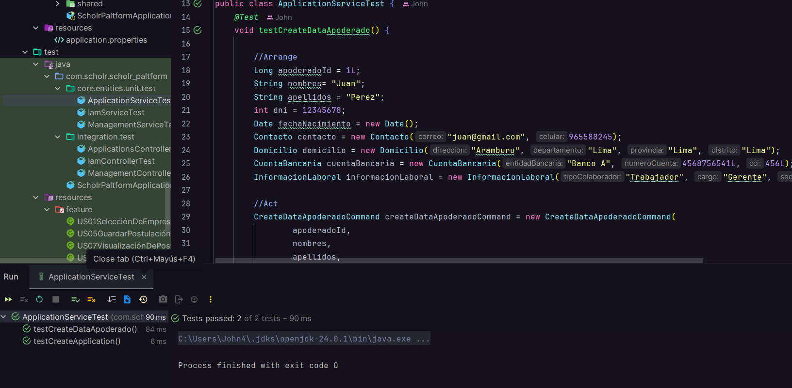
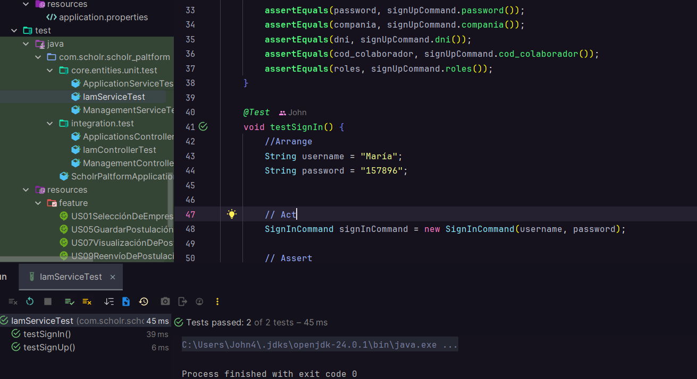
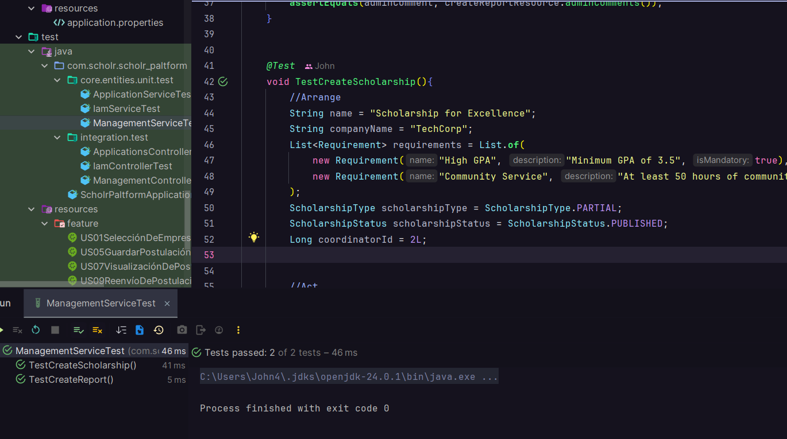
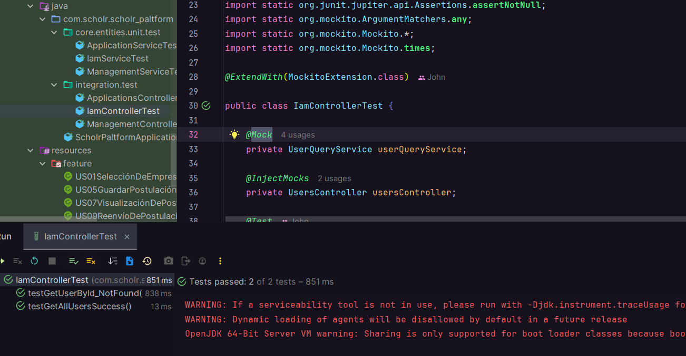
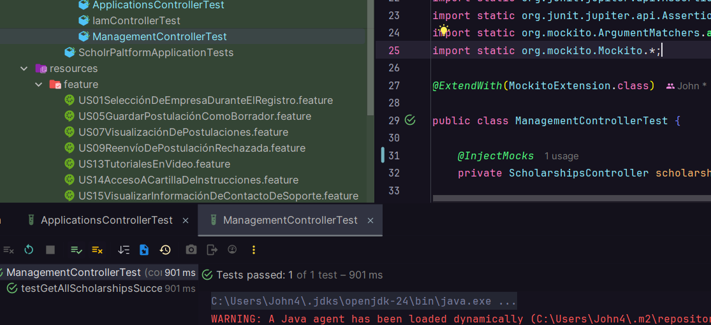
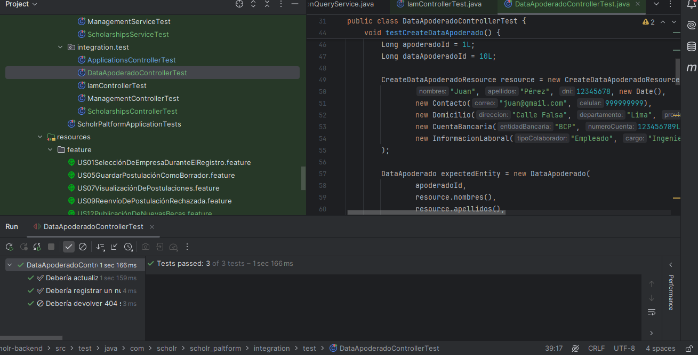

### 6.2.2.4. Testing Suite Evidence for Sprint Review

**Core Entities Unit Tests**

Los Core Entities Unit Tests son esenciales en el desarrollo de software, ya que garantizan la calidad y correcto funcionamiento de las entidades centrales, previniendo errores y facilitando el mantenimiento del código.

Applications Service Test  
    

IAM Service Test  
    

Management Service Test  
    

Scholarships Service Test  
    

Data Apoderado Service Test  
    

**Core Integration Tests**

Las Core Integration Tests son fundamentales para asegurar que los controladores interactúen correctamente con otros componentes del sistema, como servicios y bases de datos. Al evaluar escenarios de error, estas pruebas garantizan que el sistema maneje adecuadamente situaciones inesperadas y responda con los códigos de estado correctos. Esto mejora la experiencia del usuario, facilita la depuración y contribuye a desarrollar un software confiable y de alta calidad.

Applications Controller Test Actualizado
    

IAM Controller Test  
    

Management Controller Test  
    

Scholarships Controller Test  
    

Data Apoderado Controller Test  
    

**Core Behavior-Driven Development (BDD)**

Las pruebas BDD aseguran que el comportamiento del sistema esté alineado con las historias de usuario priorizadas, simulando flujos de uso reales desde la perspectiva del usuario final.

    

#### US03 Confirmación de verificación exitosa
   

#### US04 Subir documentos de postulación
   

#### US10 Listado de postulaciones para coordinador
   

#### US11 Aprobar/rechazar con comentarios
   

#### US12 Publicacion de nuevas becas

#### US20 Vista de becas disponibles de la empresa

#### US22 Vista de postulaciones por colaborador

