### 6.2.2.4. Testing Suite Evidence for Sprint Review

## Heurística Resuelta #1: Falta de guías iniciales para nuevos usuarios

**Escala de severidad:** 2  
**Heurística violada:** Ayuda y documentación (Nielsen)

### Descripción del problema

Durante las sesiones de evaluación con usuarios, se identificó que los nuevos usuarios no contaban con una guía clara sobre cómo empezar a utilizar la plataforma. Esto generaba incertidumbre respecto al proceso de postulación a becas, los requisitos necesarios, y los pasos a seguir.

### Solución implementada

Se agregó una nueva sección en el **sidebar principal**, accesible después del inicio de sesión, titulada **"Tutorial"**. Dentro de esta sección, los usuarios pueden acceder a la opción **"Ver Cartilla de Instrucciones"**, que proporciona orientación paso a paso sobre:

- Cómo completar correctamente los requisitos para una postulación.
- Qué documentos son necesarios y cómo subirlos.
- Fechas clave y cronograma de las próximas convocatorias de becas.
- Buenas prácticas para asegurar que la postulación no sea rechazada.

Esta mejora guía al usuario desde su primer ingreso y reduce las dudas sobre el proceso de postulación.

### Captura de pantalla

> Sección "Tutorial" con acceso a la **Cartilla de Instrucciones**, ofreciendo guía completa para nuevos usuarios.

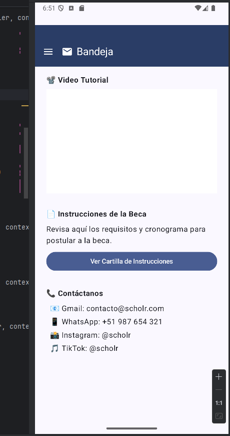

### Impacto

- Mejora la tasa de finalización de postulaciones.
- Reduce errores comunes por falta de conocimiento del proceso.
- Aumenta la confianza del usuario desde su primer ingreso a la plataforma.

## Heurística resuelta #2: Filtros por número de postulaciones y avance de procesamiento

**Escala de severidad:** 2  
**Heurística violada:** Arquitectura de Información: *Is it findable?*

### Descripción del problema

Los entrevistados indicaron que no existía una forma clara de identificar cuáles postulaciones estaban en estado pendiente, aprobado o rechazado, dificultando el seguimiento del proceso por parte de los apoderados.

### Solución implementada

Se creó un endpoint específico que devuelve únicamente las postulaciones en estado **pendiente** para un apoderado:

``GET /api/v1/applications/pendingapplications/{apoderadoId}``

Este endpoint permite filtrar las aplicaciones por su estado (`Status.PENDIENTE`), mejorando la **localización de información relevante** y facilitando la carga de trabajo de los responsables del seguimiento.

### Evidencia funcional

> Test automatizado validando que el endpoint devuelve únicamente las postulaciones pendientes:

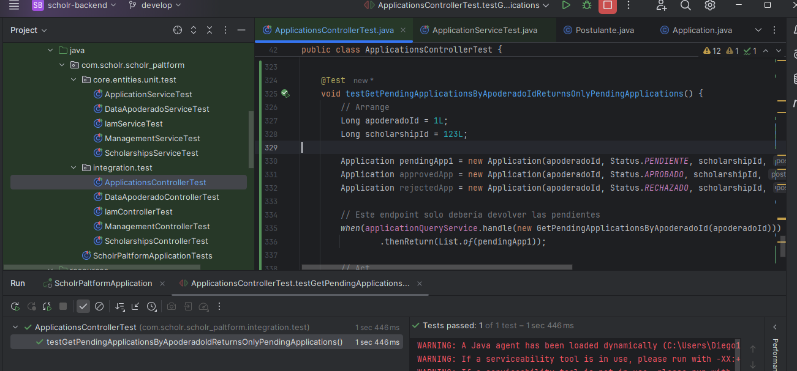

### Impacto

- Mejora la visibilidad del estado actual de las solicitudes.
- Permite a los apoderados enfocarse en las postulaciones aún en proceso.
- Reduce errores y tiempos de revisión en tareas administrativas.

## Heurística Resuelta #3: Cambiar el estado de una postulación resulta confuso

**Escala de severidad:** 3  
**Heurística violada:** Claridad del sistema / Prevención de errores (Nielsen)

### Descripción del problema

Durante las entrevistas se identificó que los usuarios (evaluadores) no sabían si al seleccionar un estado como **Aprobado**, **Rechazado** o **Pendiente**, este cambio se realizaba correctamente. Tampoco se mostraba una confirmación visual clara, lo que generaba dudas e intentos múltiples que podían causar errores.

### Solución implementada

Se implementó una mejora en el flujo de cambio de estado desde el panel de administración:

- Se habilitó una acción clara para cambiar el estado (menú desplegable o botón).
- Al hacer el cambio, el sistema muestra una confirmación visual (mensaje de éxito).
- Se restringieron las acciones inválidas o redundantes.
- Se utilizó el endpoint:
  
``PUT /api/v1/applications/{id}/status``

### Validación por prueba unitaria

Se implementó un test automatizado que valida que, al cambiar el estado de una postulación, la aplicación responde correctamente con código `200 OK` y actualiza el estado esperado.

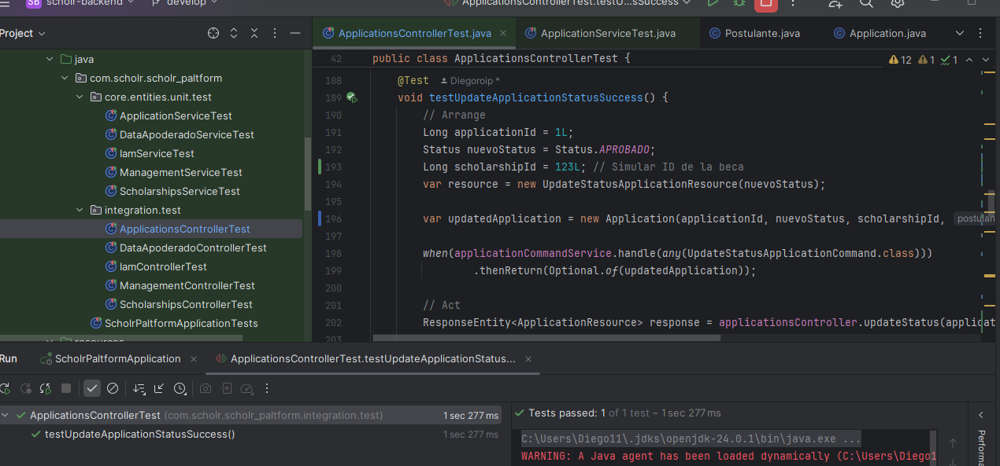

### Impacto

- Disminuye errores al cambiar el estado de postulaciones.
- Mejora la transparencia del sistema para evaluadores.
- Refuerza la confianza del usuario en que su acción fue registrada correctamente.

## Heurística resuelta #4: No se pueden previsualizar archivos sin descargarlos

**Escala de severidad:** 3  
**Heurística violada:** Flexibilidad y eficiencia de uso (Nielsen)

### Descripción del problema

Durante las sesiones de evaluación, los entrevistados indicaron que al revisar los documentos subidos (como el DNI, libreta de notas o constancia de logros), era necesario descargarlos para poder visualizarlos. Esto ralentizaba la validación de postulaciones, especialmente en dispositivos móviles o con conectividad limitada.

### Solución implementada

Se modificó la plataforma para que, una vez subidos los archivos, estos se guarden como URLs accesibles desde el frontend. Ahora, en la interfaz, los documentos se muestran como enlaces visualizables en una nueva pestaña del navegador, sin necesidad de descarga manual.

Esto se logró utilizando el siguiente endpoint:

``POST /api/v1/applications/{applicationId}/files``

Este endpoint almacena los archivos y retorna sus URLs, las cuales son utilizadas para mostrar vistas previas directamente desde la interfaz.

### Prueba unitaria que valida la carga y visualización de archivos

> El siguiente test asegura que los archivos subidos retornan sus URLs correctamente, lo cual permite su visualización sin necesidad de descarga:

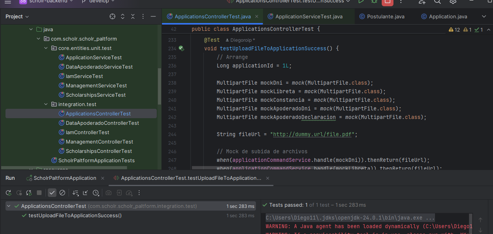

### Impacto

- Mejora la experiencia en dispositivos móviles.
- Facilita la revisión de múltiples postulaciones en menos tiempo.

## Heurística Resuelta #5: Mejorar mensajes de rechazo con orientación para corrección

**Escala de severidad:** 1  
**Heurística violada:** Usabilidad - Feedback del sistema / Ayuda para corrección (Nielsen)

### Descripción del problema

El sistema actual de mensajes de rechazo para postulaciones es útil, pero los usuarios manifestaron que podría ser más claro y brindar indicaciones específicas sobre cómo corregir los errores para volver a postular.

### Solución implementada

Se aprovechó el endpoint existente para reportes de postulación:

``PUT /api/v1/applications/{id}/reporte``

Este endpoint permite enviar mensajes detallados de rechazo que se muestran a los postulantes, orientándolos claramente sobre los errores a corregir y los pasos a seguir para mejorar su postulación.

### Prueba unitaria que valida la actualización del reporte con mensajes personalizados

> El siguiente test asegura que el sistema actualiza correctamente el mensaje de rechazo y retorna una respuesta exitosa:

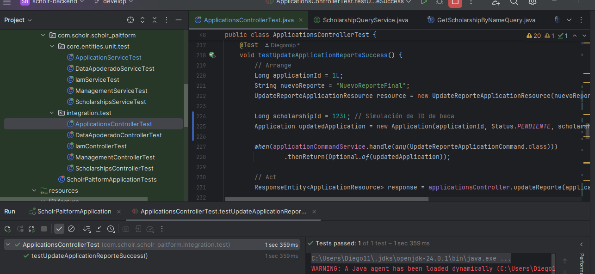

### Impacto

- Aumenta la claridad sobre las causas del rechazo.
- Facilita la corrección de errores por parte del postulante.
- Reduce tiempo perdido en envíos repetidos sin cambios.
- Mejora la comunicación entre evaluadores y postulantes.

# Documentación del uso de Firebase App Distribution y Firebase Analytics

Este documento describe el proceso seguido para integrar **Firebase** en la aplicación Android `com.example.aventurape_androidmobile`, incluyendo el uso de **Firebase App Distribution** y **Firebase Analytics** con DebugView.

## 1. Creación del proyecto en Firebase

Se creó un proyecto llamado **Scholr** en la consola de Firebase. Se añadió una app Android con el nombre de paquete:

``com.example.aventurape_androidmobile``


---

## 2. Descarga e integración de `google-services.json`

Se descargó el archivo de configuración `google-services.json` desde la consola de Firebase y se colocó en el directorio:

``app/google-services.json``


Este archivo contiene la configuración necesaria para que Firebase funcione correctamente con nuestra app.

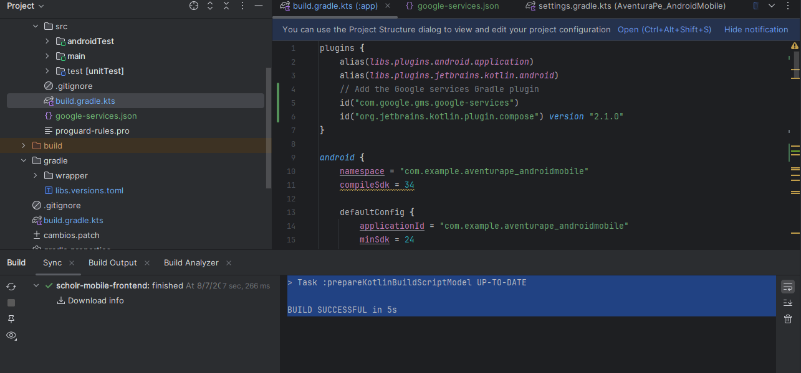

## 3. Configuración del SDK de Firebase

Se agregaron las dependencias necesarias al archivo `build.gradle.kts`:

```kotlin
// Plugin
id("com.google.gms.google-services")

// Firebase Analytics
implementation(platform("com.google.firebase:firebase-bom:33.16.0"))
implementation("com.google.firebase:firebase-analytics")
```

Esto permite la recolección de datos analíticos desde la app.

## 4. Generación e instalación del APK en el emulador

Generamos el APK 

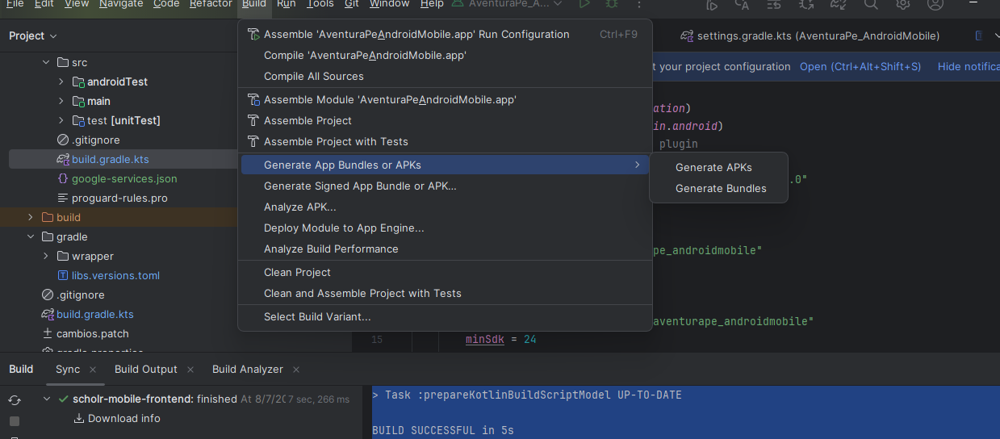

Lo que seguiría es arrastrar el APK generado al emulador del Android Studio para que Firebase pueda analizar la app

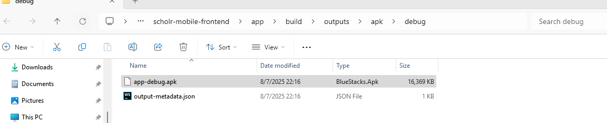

## 5. Visualización de eventos en Firebase DebugView

Una vez iniciada la app, los eventos comenzaron a reflejarse en la sección DebugView de Firebase Analytics.

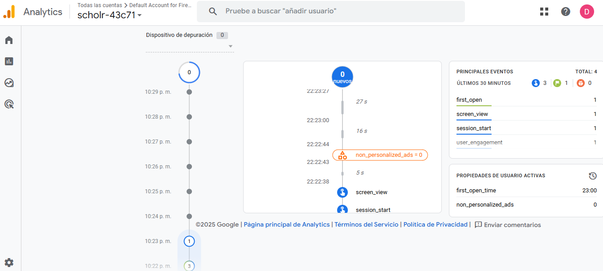

## 6. Publicación del APK en App Distribution

Se subió el archivo APK directamente desde Firebase App Distribution.

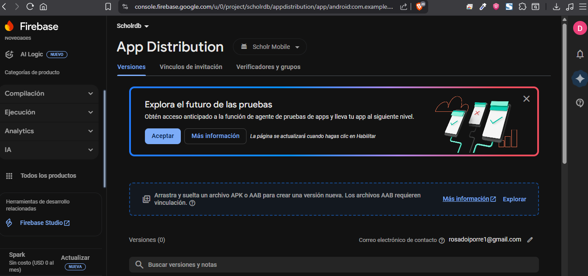

Visualizamos el APK agregado al firebase


Podemos agregar un tester para enviarle nuestro apk

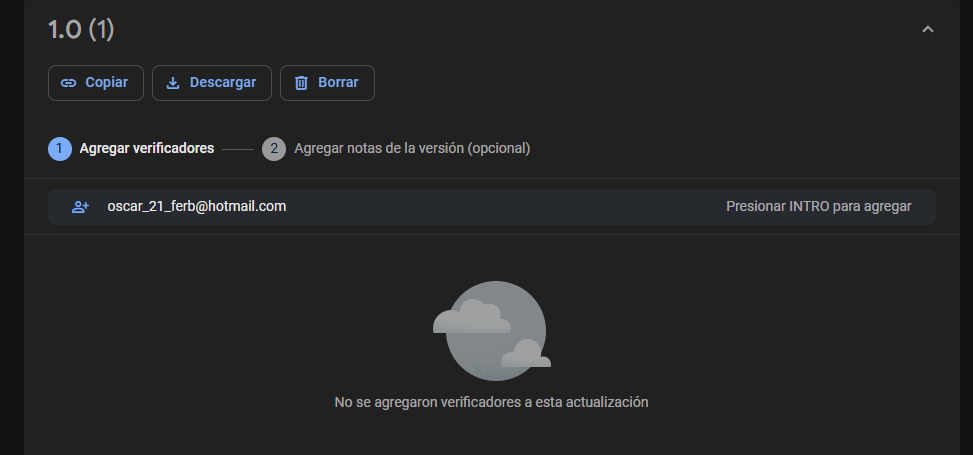

Y visualizar cuando haya llegado nuestro email


